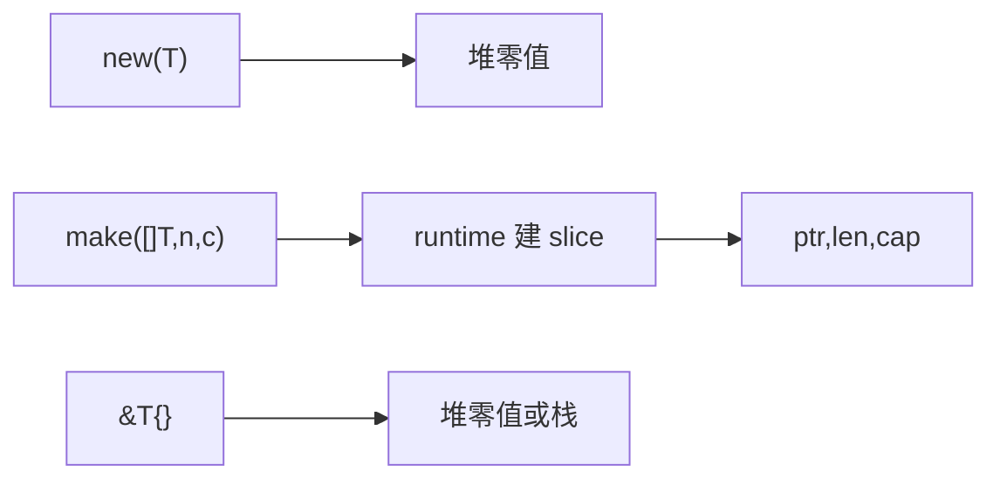

# new/make 在资深面试中的升维回答

## 30 秒版（开场）

> **`new(T)`** 分配零值 T 的堆内存，返回 `*T`；**`make`** 仅用于 **slice、map、channel**，初始化内部结构并返回 **T 本身（非指针）**。资深答法要接上 **逃逸、nil 语义、与 composite literal 对比**。生产关键词：**make 带 cap、new 很少手写**。

## 3 分钟版（一面深度）

1. **是什么**：两者都是内置函数，非 `runtime.new` 的普通函数；编译器特殊处理。
2. **为什么**：slice/map/chan 需 runtime 建 hmap/bucket、底层数组、chan 结构；`new` 是通用零值堆分配语法糖。
3. **怎么做**：slice/map 用 `make` 或 `var`+append；`*T` 零值用 `new(T)` 或更常见的 `&T{}`；channel 必须 `make` 才能用。

## 10 分钟版（原理 + 图示）

**对比表**

| | new(T) | make(T, args) |
|---|--------|---------------|
| 适用类型 | 任意 | slice, map, chan |
| 返回值 | *T | T（已初始化） |
| 零值 | 堆上零值 | 可用结构 |
| nil 语义 | 指针非 nil，指向零值 | make 后非 nil |



**与 composite literal**

- `&T{}` 与 `new(T)` 等价语义；习惯上 struct 用 `&Config{}` 可读更好。
- `[]int{}` vs `make([]int, 0)`：前者非 nil 空 slice，后者也可；`var s []int` 是 nil slice，JSON 序列化为 `null`。

**逃逸**：`new` 结果若未逃逸，可能被优化到栈；面试提一句即可。

**常见 follow-up**

- `make(map[K]V)` vs `make(map[K]V, hint)`：后者减扩容。
- `make(chan T, 0)` 无缓冲 vs 省略 buffer 同义。

## 生产场景

- **配置加载**：`cfg := &Config{}` 比 `new(Config)` 团队风格统一。
- **缓冲 channel**：`make(chan Event, 1024)` 背压；忘记 make 的 nil chan 永久阻塞。
- **可观测**：nil map 写 panic；nil slice `append` 合法。

## 排查与工具

| 场景 | 处理 |
|------|------|
| nil map panic | 改 make 或判 nil |
| nil chan 死锁 | 必须 make |
| JSON null vs [] | 区分 nil slice 与 make([]T,0) |

## 架构取舍

| 写法 | 适用 | 不适用 |
|------|------|--------|
| `&T{}` | struct 指针 | 需要强调零值指针语义时 |
| `make(..., cap)` | 已知规模 | 未知小量 |
| `var m map` 延迟 make | 可选 map | 确定会用应直接 make |

## 追问链

1. **new 返回指针为何不是 nil？** → 指向已分配零值。
2. **make slice len 与 cap？** → len 可索引范围，cap 可扩上限。
3. **new([]int) 合法吗？** → 合法但得到 `*[]int` 指向 nil slice，少见。
4. **和 malloc 区别？** → Go 受 GC 管理，类型安全零值。
5. **零值可用设计？** → sync.Mutex、bytes.Buffer 等零值即用，无需 new。

## 反模式与事故

- `var ch chan T` 直接 `<-ch` 死锁。
- `new(sync.Mutex)` 取址传参，多余；零值 Mutex 即可。
- 以为 `make` 返回指针——类型题经典坑。

## 代码示例

```go
// slice：nil vs empty vs make
var a []int           // nil, json "null"
b := []int{}          // empty, json "[]"
c := make([]int, 0)   // empty non-nil
d := make([]int, 0, 64) // 预 cap

// map 必须 make 再写
m := make(map[string]int, 128)

// chan
events := make(chan Event, 256)

// struct 指针：惯用写法
cfg := &Config{Timeout: 3 * time.Second}
```

## 延伸阅读

- [Go spec: Built-in functions](https://go.dev/ref/spec#Built-in_functions)
- [Effective Go: new](https://go.dev/doc/effective_go#allocation_new)
- [Nil slices and maps](https://go.dev/doc/effective_go#initialization)
