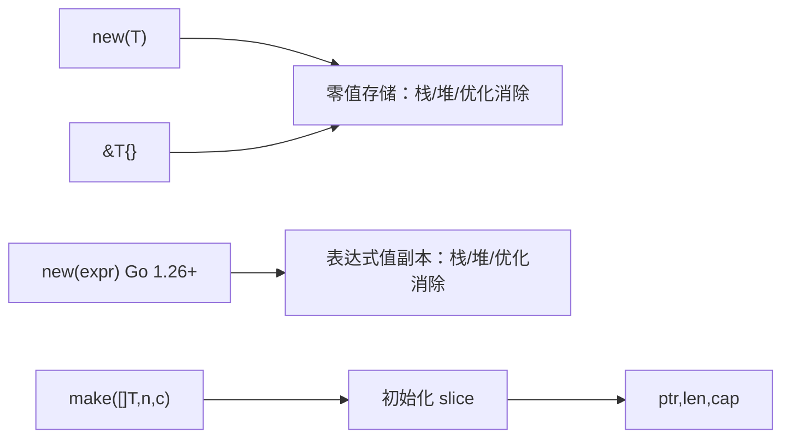

# new/make 在资深面试中的升维回答

## 30 秒版（开场）

> 传统 **`new(T)`** 为 T 提供零值存储并返回 `*T`；Go 1.26 又允许 **`new(expr)`**，返回指向该表达式值副本的指针。两者最终在栈、堆还是被优化掉仍由编译器决定。**`make`** 仅用于 **slice、map、channel**，初始化其可用内部状态并返回 **T 本身（非指针）**。

## 3 分钟版（一面深度）

1. **是什么**：两者都是内置函数，非 `runtime.new` 的普通函数；编译器特殊处理。Go 1.26 以前 `new` 的操作数只能是类型；1.26 起也可以是表达式，用表达式结果初始化新变量。
2. **为什么**：slice/map/chan 的零值或仅是描述符，或代表不可用状态，需要初始化内部结构；`new` 只是取得一个指向零值 T 的指针，不承诺上堆。
3. **怎么做**：slice/map 用 `make` 或 `var`+append；`*T` 零值用 `new(T)` 或更常见的 `&T{}`；Go 1.26 的可选标量字段可用 `new(valueExpr)`；channel 必须 `make` 才能用。

## 10 分钟版（原理 + 图示）

**对比表**

| | `new(T)` | `new(expr)`（Go 1.26+） | `make(T, args)` |
|---|---|---|---|
| 操作数 | 类型 | 表达式 | slice、map 或 chan 类型及参数 |
| 返回值 | `*T` | 指向表达式结果类型的指针 | T（已初始化） |
| 结果状态 | 指向零值 T | 指向表达式值的副本 | 已初始化的 slice/map/chan |
| nil 语义 | 返回的指针非 nil | 返回的指针非 nil | make 后值非 nil |


```mermaid
flowchart LR
  newT["new(T)"] --> Storage[零值存储：栈/堆/优化消除]
  newExpr["new(expr) Go 1.26+"] --> Initialized[表达式值副本：栈/堆/优化消除]
  makeS["make([]T,n,c)"] --> Runtime[初始化 slice]
  Runtime --> Header[ptr,len,cap]
  lit["&T{}"] --> Storage
```

**与 composite literal**

- `&T{}` 与 `new(T)` 等价语义；习惯上 struct 用 `&Config{}` 可读更好。
- Go 1.26 的 `new(expr)` 类似先求值 `v := expr` 再取 `&v` 的结果语义，适合 JSON/Protobuf 中用指针表达“可选标量”；不要误说成 `new(T, value)`。
- `[]int{}` vs `make([]int, 0)`：两者都是非 nil 空 slice；`var s []int` 是 nil slice。以 `encoding/json` 默认行为为例，前者编码为 `[]`，nil slice 编码为 `null`。

**逃逸**：`new` 结果若未逃逸，可能被优化到栈；面试提一句即可。

**常见 follow-up**

- `make(map[K]V)` vs `make(map[K]V, hint)`：后者减扩容。
- `make(chan T, 0)` 无缓冲 vs 省略 buffer 同义。

## 生产场景

- **配置加载**：`cfg := &Config{}` 比 `new(Config)` 团队风格统一。
- **缓冲 channel**：`make(chan Event, 1024)` 背压；忘记 make 的 nil chan 永久阻塞。
- **可观测**：nil map 写 panic；nil slice `append` 合法。

## 排查与工具

| 场景 | 处理 |
|------|------|
| nil map panic | 改 make 或判 nil |
| nil chan 死锁 | 必须 make |
| JSON null vs [] | 区分 nil slice 与 make([]T,0) |

## 架构取舍

| 写法 | 适用 | 不适用 |
|------|------|--------|
| `&T{}` | struct 指针 | 需要强调零值指针语义时 |
| `make(..., cap)` | 已知规模 | 未知小量 |
| `var m map` 延迟 make | 可选 map | 确定会用应直接 make |

## 追问链

1. **new 返回指针为何不是 nil？** → 指向已分配零值。
2. **make slice len 与 cap？** → len 可索引范围，cap 可扩上限。
3. **new([]int) 合法吗？** → 合法但得到 `*[]int` 指向 nil slice，少见。
4. **Go 1.26 的 `new(42)` 返回什么？** → `*int`，指向值为 42 的新变量；不是把 42 当容量，也不是新的构造器语法。
5. **和 malloc 区别？** → Go 受 GC 管理，类型安全，且分配位置由逃逸分析决定。
6. **零值可用设计？** → sync.Mutex、bytes.Buffer 等零值即用，无需 new。

## 反模式与事故

- `var ch chan T` 直接 `<-ch` 死锁。
- `new(sync.Mutex)` 取址传参，多余；零值 Mutex 即可。
- 以为 `make` 返回指针——类型题经典坑。

## 代码示例

```go
// slice：nil vs empty vs make
var a []int           // nil, json "null"
b := []int{}          // empty, json "[]"
c := make([]int, 0)   // empty non-nil
d := make([]int, 0, 64) // 预 cap

// map 必须 make 再写
m := make(map[string]int, 128)

// chan
events := make(chan Event, 256)

// struct 指针：惯用写法
cfg := &Config{Timeout: 3 * time.Second}

// Go 1.26+：为可选标量直接创建已初始化指针
retries := new(3) // *int，值为 3
```

## 延伸阅读

- [Go spec: Built-in functions](https://go.dev/ref/spec#Built-in_functions)
- [Go 1.26 Release Notes - new(expr)](https://go.dev/doc/go1.26)
- [Effective Go: new](https://go.dev/doc/effective_go#allocation_new)
- [Nil slices and maps](https://go.dev/doc/effective_go#initialization)
