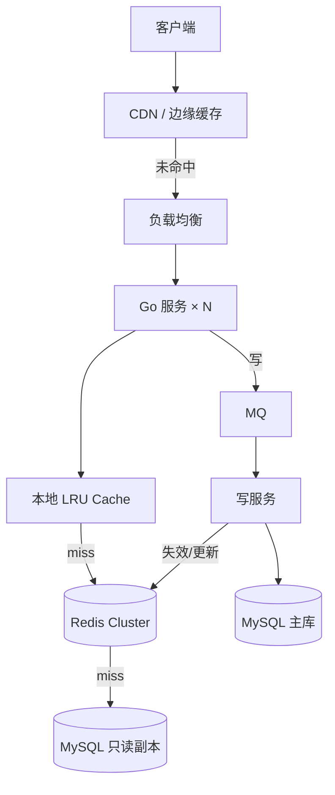

# 设计支撑 10 万 QPS 的读多写少 API

## 30 秒版（开场）

> 10 万 QPS 读多写少 API 的核心是 **CDN + 多级缓存 + 读写分离 + 水平扩展**，把 95%+ 流量挡在 DB 之外。生产关键词：**缓存命中率 > 95%、P99 < 50ms、写路径异步化**。

## 3 分钟版（一面深度）

1. **是什么**：面向 C 端或 B 端的高频查询接口（商品详情、配置、Feed），读写比通常 > 100:1，峰值 QPS 10 万+。
2. **为什么**：DB 单机读上限约 1~2 万 QPS（简单索引查询），10 万 QPS 必须分层削峰，否则连接池耗尽、P99 爆炸。
3. **怎么做**：接入层 CDN/边缘缓存 → 网关限流 → 应用本地缓存 + Redis 集群 → 只读副本/分库分表 → 写走 MQ 异步刷新缓存。

## 10 分钟版（原理 + 图示）

**容量估算（面试必讲）**

| 维度 | 估算 |
|------|------|
| 总 QPS | 100,000 |
| 单 Pod 能力 | 5,000 QPS（8C16G，P99<50ms） |
| 应用实例 | 100,000 / 5,000 × 1.5（冗余）≈ **30 Pod** |
| 缓存命中率 | 95% → DB 实际 5,000 QPS |
| Redis 集群 | 3 主 3 从，单分片 3~5 万 QPS 足够 |
| 带宽 | 响应 2KB × 100k ≈ **1.6 Gbps**（需 CDN 分担 80%+） |



**关键设计点**

- **Cache-Aside**：读 miss 回源 DB 并回填；写先更 DB 再删缓存（或延迟双删）。
- **热点 Key**：本地缓存 + Redis 分片前缀打散；超大热点用 singleflight 合并回源。
- **连接池**：每 Pod DB 连接 ≤ 50，总连接 30×50=1500，需 PgBouncer/ProxySQL 或只读副本分流。
- **Go 侧**：`sync.Pool` 复用 buffer；`singleflight` 防击穿；`GOMAXPROCS` 对齐 CPU limit。

## 生产场景

- **电商商品详情**：大促峰值 10 万+ QPS，CDN 缓存静态字段，动态库存单独接口。
- **配置中心/字典**：变更频率低，TTL 长 + 推送失效。
- **可观测指标**：QPS、缓存命中率、回源率、P50/P99、Redis 慢查询、DB 连接池使用率。

## 排查与工具

| 工具 | 用途 |
|------|------|
| Prometheus + Grafana | QPS、延迟、命中率 |
| Redis `INFO stats` | keyspace hits/misses |
| `pprof` / trace | 热点 handler、GC 压力 |
| 慢查询日志 | 回源 SQL 优化 |

路径：P99 飙升 → 看命中率是否下降 → Redis/DB 慢 → 热点 Key 或连接池耗尽 → singleflight / 扩容 / 加本地缓存。

## 架构取舍

| 方案 | 适用 | 不适用 |
|------|------|--------|
| CDN + Redis | 读多写少、可容忍秒级延迟 | 强一致读（库存扣减） |
| 本地缓存 | 超热点、微秒级 | 多实例一致性要求高 |
| 分库分表 | 单表 > 5000 万行 | 数据量小、JOIN 多 |
| 全量内存 | 数据 < 100GB | 成本敏感、持久化要求高 |

## 追问链

1. **如何保证缓存与 DB 一致？** → 写删缓存 + TTL 兜底；强一致场景用订阅 binlog 异步刷新。
2. **10 万 QPS 单机 Redis 够吗？** → 集群模式水平扩展；热点 Key 需本地缓存或拆分。
3. **CDN 缓存什么？** → 静态/半静态 JSON；带用户态的走 `Cache-Control: private` 或 bypass。
4. **如何压测验证？** → 阶梯加压到 120% 峰值，观察 P99 与错误率，留 30% 冗余。
5. **Go 服务如何水平扩展？** → 无状态 + K8s HPA 按 CPU/QPS 扩缩；会话放 Redis。

## 反模式与事故

- 缓存不设 TTL，DB 变更后长期脏读。
- 所有请求打主库「保证最新」，10 万 QPS 直接打穿。
- 本地缓存无上限，OOM 或 GC 毛刺。
- 大促前未压测，连接池默认值（如 10）导致排队超时。

## 代码示例

```go
// Cache-Aside + singleflight 防击穿
type ProductCache struct {
    rdb *redis.Client
    db  ProductRepo
    sf  singleflight.Group
}

func (c *ProductCache) Get(ctx context.Context, id int64) (*Product, error) {
    key := fmt.Sprintf("product:%d", id)
    if b, err := c.rdb.Get(ctx, key).Bytes(); err == nil {
        var p Product
        _ = json.Unmarshal(b, &p)
        return &p, nil
    }
    v, err, _ := c.sf.Do(key, func() (any, error) {
        p, err := c.db.FindByID(ctx, id)
        if err != nil {
            return nil, err
        }
        b, _ := json.Marshal(p)
        c.rdb.Set(ctx, key, b, 5*time.Minute)
        return p, nil
    })
    if err != nil {
        return nil, err
    }
    return v.(*Product), nil
}
```

## 延伸阅读

- [AWS Well-Architected - Performance Efficiency](https://aws.amazon.com/architecture/well-architected/)
- [Redis 缓存模式](https://redis.io/docs/latest/develop/use-cases/)
- [Google SRE Book - Handling Overload](https://sre.google/sre-book/handling-overload/)
