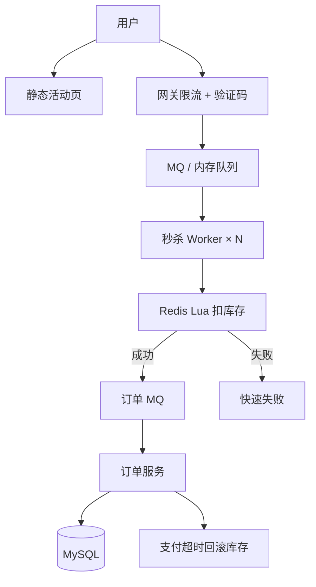

# 秒杀：库存、超卖、热点 Key

## 30 秒版（开场）

> 秒杀本质是 **有限库存 + 瞬时超高并发**，核心用 **预减库存（Redis Lua）+ 异步下单 + 热点隔离** 防超卖与打穿。生产关键词：**库存扣减原子性、排队削峰、热点 Key 分片**。

## 3 分钟版（一面深度）

1. **是什么**：限时限量促销，峰值 QPS 可达平时 100~1000 倍，库存通常几百~几万件，参与用户百万级。
2. **为什么**：DB 行锁无法支撑 10 万+ 并发扣库存；热点 SKU 成为 Redis/DB 单点；超卖一次即信任危机。
3. **怎么做**：活动页静态化 + CDN；秒杀请求先进 MQ/令牌桶排队；Redis 预扣库存（Lua 原子 DECR）；成功后再异步创建订单；失败快速返回。

## 10 分钟版（原理 + 图示）

**容量估算**

| 维度 | 典型值 |
|------|--------|
| 峰值 QPS | 50,000~200,000（按钮点击） |
| 实际库存 | 1,000 件 |
| 有效成交 | ≤ 1,000（+ 少量待支付超时释放） |
| Redis 单 Key QPS 上限 | ~10 万（需分片或本地预扣） |
| 异步订单写入 | 1,000 TPS 足够 |



**防超卖三板斧**

1. **Redis Lua 原子扣减**：`if stock > 0 then decr; return 1 else return 0 end`，避免 read-modify-write 竞态。
2. **DB 最终校验**：订单落库时用 `UPDATE stock SET n=n-1 WHERE id=? AND n>0`，影响行数=0 则回滚 Redis。
3. **幂等**：用户+活动维度幂等键，防重复下单。

**热点 Key 治理**

- **库存分片**：`stock:{sku}:0` ~ `stock:{sku}:9` 各存 1/10，扣减随机选片。
- **请求合并**：网关层令牌桶，每秒只放行库存数倍请求。
- **页面分层**：按钮置灰 + 排队页，减少无效请求。

## 生产场景

- **电商大促秒杀**：iPhone 限量 500 台，500 万 UV，峰值 20 万 QPS。
- **可观测**：Redis 扣减成功率、MQ 堆积、订单创建 TPS、超卖告警（DB stock < 0）。

## 排查与工具

| 工具 | 用途 |
|------|------|
| Redis MONITOR / 慢日志 | Lua 脚本耗时 |
| MQ 消费 lag | 订单积压 |
| 业务对账 | Redis 扣减量 vs DB 订单量 |
| 压测 | 模拟 10 万并发验证不超卖 |

路径：用户反馈「抢到了没订单」→ 查 MQ 是否堆积 → Redis 成功但订单失败 → 补偿/回滚库存。

## 架构取舍

| 方案 | 适用 | 不适用 |
|------|------|--------|
| Redis 预扣 + 异步订单 | 高并发秒杀 | 强同步确认（需轮询/WebSocket） |
| DB 悲观锁 | 低并发、强一致 | 万级 QPS |
| 令牌桶排队 | 削峰 | 用户体验要求即时反馈 |
| 分片库存 Key | 单 SKU 热点 | 库存极少（如 10 件）难均分 |

## 追问链

1. **Redis 扣了 DB 失败怎么办？** → 定时对账 + 补偿队列；或 TCC 预留库存。
2. **如何防黄牛？** → 验证码、设备指纹、限购、风控规则引擎。
3. **支付超时库存怎么释放？** → 延迟 MQ 检查订单状态，未支付则 INCR 回库存。
4. **Lua 脚本有什么坑？** → 脚本过长阻塞 Redis；大 Key 用分片。
5. **Go Worker 如何扩缩？** → 消费组水平扩展；Redis 集群避免单分片热点。

## 反模式与事故

- 先查库存再扣减（非原子），经典超卖。
- 全量请求直达 DB「保证准确」，DB 宕机。
- 库存 Key 无 TTL，活动结束后 Key 永久残留。
- 未做幂等，用户连点产生多笔订单。

## 代码示例

```go
// Redis Lua 原子扣库存
const decrStockLua = `
local stock = tonumber(redis.call('GET', KEYS[1]) or '0')
if stock > 0 then
  redis.call('DECR', KEYS[1])
  return 1
end
return 0
`

func (s *SeckillService) TryDeduct(ctx context.Context, skuID string, userID int64) (bool, error) {
    key := "seckill:stock:" + skuID
    res, err := s.rdb.Eval(ctx, decrStockLua, []string{key}).Int()
    if err != nil {
        return false, err
    }
    if res == 1 {
        _ = s.orderMQ.Publish(ctx, OrderEvent{SkuID: skuID, UserID: userID})
        return true, nil
    }
    return false, nil
}
```

## 延伸阅读

- [Redis 原子操作与 Lua](https://redis.io/docs/latest/develop/use-cases/fraud/)
- [阿里秒杀架构演进（公开分享）](https://developer.aliyun.com/article/759799)
