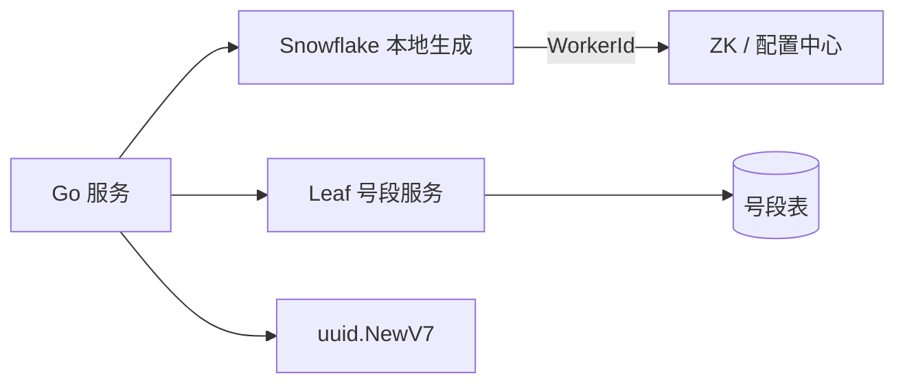

# 分布式 ID：雪花、号段、UUID 取舍

## 30 秒版（开场）

> 分布式 ID 要在 **全局唯一、趋势递增、高性能、可运维** 之间取舍：订单用 **雪花/号段**（索引友好），日志追踪用 **UUID v7**。生产关键词：**时钟回拨、WorkerId 分配、号段双 Buffer**。

## 3 分钟版（一面深度）

1. **是什么**：多节点无协调或轻协调下生成全局唯一标识，用于主键、订单号、TraceId。
2. **为什么**：DB 自增无法水平扩展；UUID v4 随机导致 B+ 树页分裂；业务需要可读、有序、分库分表路由。
3. **怎么做**：高 QPS 订单 → 号段（Leaf/Baidu）或雪花；跨系统关联 → UUID v7；简单场景 → DB `AUTO_INCREMENT` + 分库偏移。

## 10 分钟版（原理 + 图示）

**方案对比**

| 方案 | QPS | 有序性 | 长度 | 依赖 | 典型场景 |
|------|-----|--------|------|------|----------|
| 雪花 Snowflake | 400万+/节点 | 趋势递增 | 64bit | 时钟、WorkerId | 订单、流水 |
| 号段 Segment | 百万+ | 严格递增 | 64bit | DB/Redis | 超高 QPS 写 |
| UUID v4 | 极高 | 随机 | 128bit | 无 | 不推荐做主键 |
| UUID v7 | 高 | 时间有序 | 128bit | 无 | 日志、外部 ID |
| Redis INCR | 10万+ | 递增 | 可变 | Redis | 中小规模 |

**雪花结构（64 bit）**

```
0 | timestamp(41) | datacenter(5) | worker(5) | sequence(12)
```

- 41 bit 时间 ≈ 69 年；12 bit 序列 = 4096/ms/节点。
- **时钟回拨**：拒绝发号或借用未来序列位；NTP 同步监控告警。



**号段双 Buffer（美团 Leaf 思路）**

- 从 DB 批量取 `[max_id, max_id+step)`，内存发号。
- 当前号段用到 90% 时异步加载下一号段，避免 DB 抖动。
- step 默认 1000~10000，DB 访问 QPS = 业务 QPS / step。

**容量估算**

- 雪花：单节点 409.6 万 ID/秒（4096×1000），订单 1 万 TPS 绰绰有余。
- 号段 step=5000，10 万 TPS 写 → DB 20 QPS 取号，可接受。

## 生产场景

- **订单号**：雪花，便于按时间范围查询与分库（`order_id % 1024`）。
- **支付流水**：号段，严格递增便于对账。
- **OpenAPI 外部 ID**：UUID v7，不暴露业务量。

## 排查与工具

| 现象 | 排查 |
|------|------|
| 主键冲突 | WorkerId 重复分配 |
| ID 跳变/重复 | 时钟回拨、序列溢出 |
| 号段服务慢 | DB 锁竞争、step 过小 |
| B+ 树插入慢 | 是否用了 UUID v4 |

## 架构取舍

| 方案 | 适用 | 不适用 |
|------|------|--------|
| 雪花 | 分布式、高 QPS、需时间序 | 强依赖单调、无法接受回拨处理 |
| 号段 | 超高写、可容忍 DB 依赖 | 完全无 DB 环境 |
| UUID v7 | 跨系统、无中心 | 需要纯数字短 ID |
| DB 自增 | 单库、低 QPS | 分库分表 |

## 追问链

1. **雪花 WorkerId 怎么分配？** → ZK 临时节点、K8s StatefulSet 序号、或配置中心手动段。
2. **时钟回拨怎么处理？** → 等待追平、备用 WorkerId、或切换号段模式。
3. **号段模式 DB 挂了？** → 双 Buffer 有缓存可撑；长期需多副本或 Redis 号段。
4. **为什么不用 UUID v4 做主键？** → 随机插入导致 InnoDB 页分裂，写放大。
5. **Go 里用什么库？** → `github.com/bwmarrin/snowflake`；UUID 用 `google/uuid` v7。

## 反模式与事故

- 多实例硬编码 `workerId=1`，偶发冲突。
- 忽略 NTP 回拨，生成重复 ID。
- 号段 step=100，10 万 TPS 把 DB 打挂。
- 把订单号暴露给前端当连续数字，被爬取。

## 代码示例

```go
import "github.com/bwmarrin/snowflake"

func NewSnowflake(nodeID int64) (*snowflake.Node, error) {
    return snowflake.NewNode(nodeID) // nodeID 0~1023
}

func GenOrderID(node *snowflake.Node) int64 {
    return node.Generate().Int64()
}

// UUID v7 — 日志/外部关联
import "github.com/google/uuid"

func GenTraceID() string {
    id, _ := uuid.NewV7()
    return id.String()
}
```

## 延伸阅读

- [Twitter Snowflake（归档）](https://github.com/twitter-archive/snowflake)
- [bwmarrin/snowflake Go 实现](https://github.com/bwmarrin/snowflake)
- [RFC 9562 UUID v7](https://www.rfc-editor.org/rfc/rfc9562.html)
