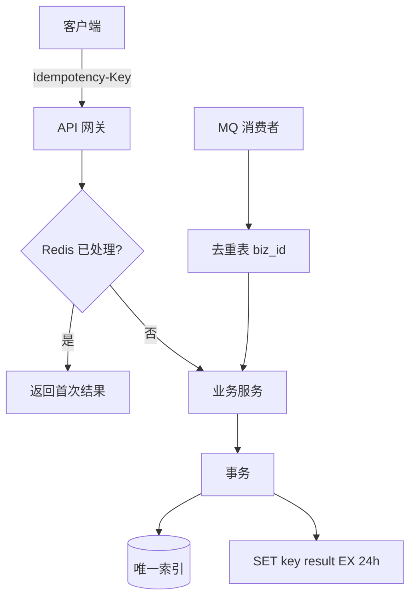

# 幂等设计：接口、消息、数据库层

## 30 秒版（开场）

> 幂等 = **同一业务操作执行多次，结果与执行一次相同**。在至少一次投递的网络里，必须在 **API 幂等键、MQ 去重、DB 唯一约束** 三层落地。生产关键词：**Idempotency-Key、状态机、唯一索引**。

## 3 分钟版（一面深度）

1. **是什么**：客户端重试、MQ 重复消费、网关超时重放都不会产生重复订单/重复扣款。
2. **为什么**：TCP 不保证 exactly-once；用户双击、前端 retry、负载均衡重试都会重复请求。
3. **怎么做**：API 层 `Idempotency-Key` + Redis/DB 记录；MQ 层 `biz_id` 去重表；DB 层唯一索引 + 状态机只允许合法迁移。

## 10 分钟版（原理 + 图示）



**三层幂等策略**

| 层级 | 机制 | TTL/范围 |
|------|------|----------|
| API | Header `Idempotency-Key` + Redis SETNX | 24h~7d |
| MQ | 消费前查 `processed_messages(biz_id)` | 永久或 30d |
| DB | `UNIQUE(order_no)` + `UPDATE ... WHERE status='PENDING'` | 永久 |

**容量估算**

- 幂等 Key 存储：10 万 TPS × 平均 200B × 86400s ≈ **1.7 TB/天**（不可全存 Redis）。
- 实践：只存 24h 热 Key；冷数据靠 DB 唯一约束；Key 用 `(user_id, client_key)` 复合。

**状态机幂等**

- 支付回调：`PAID` 状态再次收到 `SUCCESS` 直接返回 OK，不重复加权益。
- 非法迁移：`PENDING → PAID` 可以，`PAID → PENDING` 拒绝。

## 生产场景

- **创建订单**：客户端生成 UUID 作为幂等键，网络超时重试不双扣库存。
- **支付回调**：微信/支付宝可能回调多次，按 `transaction_id` 去重。
- **MQ 消费**：至少一次投递，消费端 `INSERT IGNORE` 或 Redis SETNX。

## 排查与工具

| 现象 | 排查 |
|------|------|
| 重复订单 | 幂等键是否透传、Redis 是否过期 |
| 幂等误拦 | Key 粒度太粗（全局共用） |
| 重复扣款 | 支付层无幂等、状态机缺失 |
| Redis 内存爆 | TTL 过长、未清理 |

路径：用户投诉重复扣费 → 查两条订单幂等键 → 是否不同 Key 或 Key 未传 → 补唯一约束。

## 架构取舍

| 方案 | 适用 | 不适用 |
|------|------|--------|
| Redis SETNX | 高 QPS、需快速返回 | 强持久、Redis 故障窗口 |
| DB 唯一索引 | 最终兜底 | 高冲突时的错误处理 |
| Token 预占 | 两阶段提交 | 简单 CRUD |
| 天然幂等 GET | 查询类 | 写操作 |

## 追问链

1. **幂等键谁生成？** → 客户端生成 UUID（推荐）；服务端生成则重试拿不到同一 Key。
2. **Redis 挂了怎么办？** → DB 唯一约束兜底；或降级拒绝写。
3. **MQ 如何保证不重复消费？** → 业务去重表 + 消费成功后 ack；Kafka 幂等 producer 只保证不重复发，不保证消费端。
4. **返回什么给重试请求？** → 返回**首次成功结果**（含 order_id），HTTP 200 相同 body。
5. **Go 实现注意点？** → 先 SETNX 再执行业务会误占；应用 **先占位 processing，完成后改 done** 或 DB 事务内插入幂等记录。

## 反模式与事故

- 只用 Redis 无 DB 唯一索引，Redis 过期后 DB 重复插入。
- 幂等键用 `user_id`  alone，用户两笔不同订单被误拦。
- 消费端先 ack 再处理，消息丢失且无幂等。
- `DELETE + INSERT` 绕过唯一约束。

## 代码示例

```go
func (s *OrderService) Create(ctx context.Context, req CreateReq) (*Order, error) {
    key := "idem:" + req.IdempotencyKey
    // 查已完成
    if cached, err := s.rdb.Get(ctx, key).Bytes(); err == nil {
        var o Order
        _ = json.Unmarshal(cached, &o)
        return &o, nil
    }
    // 占位
    ok, err := s.rdb.SetNX(ctx, key+":lock", "1", 30*time.Second).Result()
    if err != nil || !ok {
        return nil, ErrDuplicateRequest
    }
    defer s.rdb.Del(ctx, key+":lock")

    order, err := s.repo.Insert(ctx, req) // UNIQUE(client_key)
    if err != nil {
        return nil, err
    }
    b, _ := json.Marshal(order)
    s.rdb.Set(ctx, key, b, 24*time.Hour)
    return order, nil
}
```

## 延伸阅读

- [Stripe Idempotent Requests](https://stripe.com/docs/api/idempotent_requests)
- [AWS API 幂等性设计](https://aws.amazon.com/builders-library/making-retries-safe-with-idempotent-APIs/)
