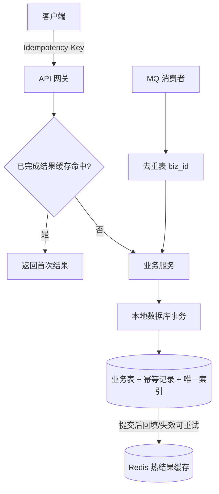

# 幂等设计：接口、消息、数据库层

## 30 秒版（开场）

> 幂等 = **同一业务操作执行多次，结果与执行一次相同**。在至少一次投递的网络里，必须在 **API 幂等键、MQ 去重、DB 唯一约束** 三层落地。生产关键词：**Idempotency-Key、状态机、唯一索引**。

## 3 分钟版（一面深度）

1. **是什么**：客户端重试、MQ 重复消费、网关超时重放都不会产生重复订单/重复扣款。
2. **为什么**：TCP 不保证 exactly-once；用户双击、前端 retry、负载均衡重试都会重复请求。
3. **怎么做**：API 层记录 `Idempotency-Key + 请求指纹 + 状态 + 首次响应`；MQ 层把去重记录与业务变更放进同一数据库事务；DB 层用唯一约束和状态机兜底。

## 10 分钟版（原理 + 图示）


```mermaid
flowchart TB
  Client[客户端] -->|Idempotency-Key| API[API 网关]
  API --> Check{已完成结果缓存命中?}
  Check -->|是| Return[返回首次结果]
  Check -->|否| Svc[业务服务]
  Svc --> TX[本地数据库事务]
  TX --> DB[(业务表 + 幂等记录 + 唯一索引)]
  DB -->|提交后回填/失效可重试| Cache[(Redis 热结果缓存)]
  MQ[MQ 消费者] --> Dedup[去重表 biz_id]
  Dedup --> Svc
```

Redis 缓存不属于数据库本地事务。缓存写失败只影响加速路径，不能改变已经提交的业务事实；
后续请求仍应回源持久幂等记录，并通过重试或失效机制修复缓存。

**三层幂等策略**

| 层级 | 机制 | TTL/范围 |
|------|------|----------|
| API | Header `Idempotency-Key` + Redis SETNX | 24h~7d |
| MQ | 消费前查 `processed_messages(biz_id)` | 永久或 30d |
| DB | `UNIQUE(order_no)` + `UPDATE ... WHERE status='PENDING'` | 永久 |

同一个幂等键若携带了不同请求体，必须拒绝并返回冲突；否则旧响应可能被错误复用于另一笔业务。幂等记录通常至少有 `PROCESSING/SUCCEEDED/FAILED`、请求指纹、结果和租约/过期时间。

**容量估算**

- 幂等 Key 存储：10 万 TPS × 平均 200B × 86400s ≈ **1.7 TB/天**（不可全存 Redis）。
- 实践：只存 24h 热 Key；冷数据靠 DB 唯一约束；Key 用 `(user_id, client_key)` 复合。

**状态机幂等**

- 支付回调：`PAID` 状态再次收到 `SUCCESS` 直接返回 OK，不重复加权益。
- 非法迁移：`PENDING → PAID` 可以，`PAID → PENDING` 拒绝。

## 生产场景

- **创建订单**：客户端生成 UUID 作为幂等键，网络超时重试不双扣库存。
- **支付回调**：微信/支付宝可能回调多次，按 `transaction_id` 去重。
- **MQ 消费**：至少一次投递时，去重行与业务写需在同一本地事务提交；若副作用在外部系统，则继续依赖对方幂等键、状态机或 outbox，而不是单独先写一个 Redis Key。

## 排查与工具

| 现象 | 排查 |
|------|------|
| 重复订单 | 幂等键是否透传、Redis 是否过期 |
| 幂等误拦 | Key 粒度太粗（全局共用） |
| 重复扣款 | 支付层无幂等、状态机缺失 |
| Redis 内存爆 | TTL 过长、未清理 |

路径：用户投诉重复扣费 → 查两条订单幂等键 → 是否不同 Key 或 Key 未传 → 补唯一约束。

## 架构取舍

| 方案 | 适用 | 不适用 |
|------|------|--------|
| Redis SETNX | 高 QPS、需快速返回 | 强持久、Redis 故障窗口 |
| DB 唯一索引 | 最终兜底 | 高冲突时的错误处理 |
| Token 预占 | 两阶段提交 | 简单 CRUD |
| 天然幂等 GET | 查询类 | 写操作 |

## 追问链

1. **幂等键谁生成？** → 客户端生成 UUID（推荐）；服务端生成则重试拿不到同一 Key。
2. **Redis 挂了怎么办？** → DB 唯一约束兜底；或降级拒绝写。
3. **MQ 如何保证不重复消费？** → 去重记录与业务变更同事务，提交后再 ack；Kafka 幂等 producer 不会替外部 DB 副作用去重。
4. **返回什么给重试请求？** → 返回首次完成时保存的状态码与结果；处理中可返回 409/202 等明确状态，不能把另一请求体误判成重试。
5. **Go 实现注意点？** → 先 SETNX 再执行业务会误占；应用 **先占位 processing，完成后改 done** 或 DB 事务内插入幂等记录。

## 反模式与事故

- 只用 Redis 无 DB 唯一索引，Redis 过期后 DB 重复插入。
- 幂等键用 `user_id`  alone，用户两笔不同订单被误拦。
- 消费端先 ack 再处理，消息丢失且无幂等。
- `DELETE + INSERT` 绕过唯一约束。

## 代码示例

```go
func (s *OrderService) Create(ctx context.Context, req CreateReq) (*Order, error) {
    fingerprint := hashCreateReq(req)
    var result *Order

    err := s.repo.WithTx(ctx, func(tx OrderTx) error {
        rec, created, err := tx.GetOrCreateIdempotency(
            req.IdempotencyKey, fingerprint,
        )
        if err != nil {
            return err
        }
        if rec.RequestFingerprint != fingerprint {
            return ErrIdempotencyKeyConflict
        }
        if !created {
            result = rec.OrderResult
            return nil
        }

        order, err := tx.InsertOrder(req) // client_key 仍有 UNIQUE 兜底
        if err != nil {
            return err
        }
        if err := tx.MarkIdempotencySucceeded(
            req.IdempotencyKey, order,
        ); err != nil {
            return err
        }
        result = order
        return nil
    })
    return result, err
}
```

Redis 可作为已完成结果的加速缓存，但不能用一个会过期的短锁替代数据库事务：锁租约到期、进程崩溃或缓存丢失时，唯一约束与持久幂等记录仍必须成立。

## 延伸阅读

- [Stripe Idempotent Requests](https://stripe.com/docs/api/idempotent_requests)
- [AWS API 幂等性设计](https://aws.amazon.com/builders-library/making-retries-safe-with-idempotent-APIs/)
