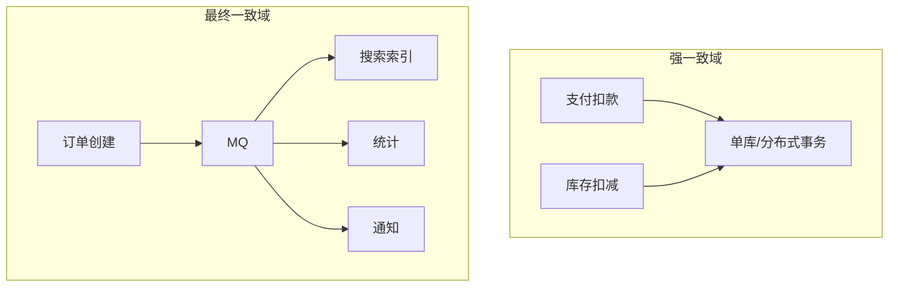

# 最终一致 vs 强一致：业务怎么选

## 30 秒版（开场）

> **强一致**用在对的钱/库存/权限；**最终一致**用在 Feed、计数、搜索索引。面试要讲清 **CAP 在分区时的选择** 和 **业务可接受的延迟窗口**。生产关键词：**Saga、Outbox、读己之写**。

## 3 分钟版（一面深度）

1. **是什么**：强一致 = 读总能看到最新写；最终一致 = 允许短暂不一致，Eventually 会收敛。
2. **为什么**：分布式下网络分区不可避免；全局强一致（2PC/XA）性能差、可用性低。
3. **怎么做**：单库事务保强一致边界；跨服务用 Saga/TCC + 补偿；读路径用 **版本号/读主/等待复制** 处理读己之写。

## 10 分钟版（原理 + 图示）

**CAP 与 PACELC**

- 分区 (P) 时：CP（Consul/ZK） vs AP（Cassandra/Dynamo）。
- 正常 (E) 时：延迟 (L) vs 一致 (C)——多数系统可调 Quorum。



**业务选型矩阵**

| 场景 | 推荐 | 不一致窗口 | 手段 |
|------|------|------------|------|
| 账户余额 | 强一致 | 0 | 单库事务 / 悲观锁 |
| 库存扣减 | 强一致 | 0 | Redis Lua + DB 条件更新 |
| 订单列表 | 最终一致 | 1~3s | MQ 同步、CQRS |
| 点赞数 | 最终一致 | 秒级 | 异步聚合 |
| 配置下发 | 最终一致 | 分钟级 | 配置中心推送 |

**跨服务一致模式**

1. **Transactional Outbox**：业务与 outbox 同库事务，CDC 投递 MQ，避免双写不一致。
2. **Saga**：正向步骤 + 补偿；失败回滚已完成的步骤。
3. **TCC**：Try-Confirm-Cancel，资源预留。

**容量与延迟**

- 2PC/XA：RT 增加 2~5 倍，TPS 通常 < 1000/集群。
- 异步最终一致：写路径 10 万+ TPS，读延迟取决于消费 lag（目标 < 1s）。

## 生产场景

- **下单扣库存**：订单服务与库存服务——库存强一致（Redis+DB），订单状态可异步通知仓库。
- **用户改昵称**：主库写成功后，搜索/缓存 1~2s 内旧昵称仍可搜到——可接受。
- **可观测**：MQ lag、对账差异率、Saga 补偿次数。

## 排查与工具

| 现象 | 排查 |
|------|------|
| 用户看不到刚下的单 | 读从库延迟、缓存未失效 |
| 双扣库存 | 缺少强一致边界 |
| 索引长期不一致 | MQ 消费失败无 DLQ |
| 对账不平 | Saga 补偿未执行 |

## 架构取舍

| 方案 | 适用 | 不适用 |
|------|------|--------|
| 单库事务 | 单体、强一致核心 | 已分库分表 |
| Saga | 长流程、可补偿 | 不可补偿（已发货） |
| 2PC/XA | 金融强一致、低 TPS | 高并发互联网 |
| CRDT | 协作编辑 | 账户余额 |

## 追问链

1. **读己之写怎么保证？** → 写后读主库、带 `version` 客户端轮询、或 session stickiness。
2. **Outbox 和双写有什么区别？** → Outbox 与业务同事务，MQ 异步发，避免「DB 成功 MQ 失败」。
3. **最终一致如何对账？** → 定时全量/增量对账 + 修复任务 + 告警阈值。
4. **Redis 和 MySQL 一致吗？** → 通常最终一致；强一致需 Redlock+事务或放弃 Redis 作 SoT。
5. **Go 里 Saga 怎么实现？** → 状态机 + MQ + 补偿 handler；或用 Temporal/Cadence。

## 反模式与事故

- 所有表都走 XA，性能崩溃。
- 把「评论数」当强一致，过度设计。
- 无对账的最终一致，差异累积数月才发现。
- 缓存删了就算一致，未考虑从库延迟。

## 代码示例

```go
// Transactional Outbox 伪代码
func (s *OrderService) Create(ctx context.Context, req CreateReq) error {
    return s.db.Transaction(func(tx *gorm.DB) error {
        order := &Order{...}
        if err := tx.Create(order).Error; err != nil {
            return err
        }
        outbox := &Outbox{
            Topic:   "order.created",
            Payload: mustJSON(order),
        }
        return tx.Create(outbox).Error
    })
}
// 独立 poller 读 outbox 发 MQ 并标记 sent
```

## 延伸阅读

- [AWS Builders' Library - Avoiding Fallback](https://aws.amazon.com/builders-library/avoiding-fallback-in-distributed-systems/)
- [Microservices.io - Saga Pattern](https://microservices.io/patterns/data/saga.html)
