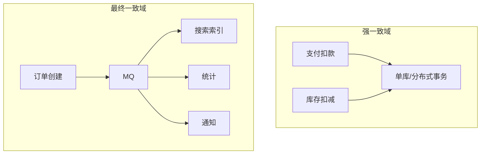

# 最终一致 vs 强一致：业务怎么选

<a id="oral-card"></a>

## 要点卡

[返回 P0 知识图谱](../_meta/p0-knowledge-graph.md)

!!! abstract "30 秒回答"

    一致性选型不能只按“钱用强一致、列表用最终一致”贴标签。先明确要保护的不变量和一致性模型：
    资金、库存、权限的**权威决策点**通常需要事务隔离、线性一致访问或单写者等可证明边界；
    搜索、统计和通知等派生视图可以异步收敛。CAP 只讨论发生网络分区时一致性与可用性的取舍，
    还必须定义读己之写、允许陈旧度、补偿和对账。

**3 分钟展开**

1. **是什么**：“强一致”是宽泛叫法，讲解时最好明确是否指**线性一致**、串行化事务或读己之写；最终一致允许副本短暂分歧，但在没有新更新且故障恢复后应收敛。
2. **为什么**：网络分区、跨服务提交边界和副本延迟会让“一致”与“可用”发生场景化冲突；
   2PC/XA、共识复制、Saga 等方案的保证和故障行为不同，不能统一概括成“强一致一定慢或不可用”。
3. **怎么做**：优先把不变量收缩到单一权威写入点，用原子条件更新、约束、事务或单写者保护；
   跨服务再按可补偿性选择 Saga/TCC、outbox 或协调事务。读路径用 **版本号/读主/等待复制**
   处理读己之写。

| 记忆槽 | 内容 |
|--------|------|
| 三个不变量 | 先命名一致性模型；权威决策点保护业务不变量；派生视图可异步；CAP 只讨论分区时的取舍 |
| 手画图 | `command → authoritative state/transaction → outbox → projections`，读路径补版本水位/回源 |
| 项目落点 | 用实际订单、支付、余额与搜索/统计说明哪些是事实源、哪些只是可重建投影；只引用本人实际参与部分和可解释指标 |
| 一个取舍 | 同步边界简化读写语义但提高延迟和故障耦合；异步提升解耦却需要幂等、监控和对账 |

**错误表达**

- ❌ “钱和库存必须全局强一致；用了 MQ 就只能接受数据不正确。”
- ✅ “只在最小权威边界保护不变量，派生链路允许受 SLO 约束的陈旧并可重放校正。”

**自测追问**：线性一致、可串行化和读己之写有什么区别？网络分区时一次具体操作如何定义 C/A 选择？

## 10 分钟版（原理 + 图示）

**CAP 与 PACELC**

- CAP 讨论出现网络分区时，一次具体读写是否选择保持单一一致结果，还是继续接受可能分歧的操作；
  不能只给整个产品永久贴上 CP/AP 标签。
- PACELC 提醒正常无分区时也存在延迟与一致性取舍；实际保证还取决于读写 quorum、leader、
  会话语义和故障检测配置。


```mermaid
flowchart TB
  subgraph strong[强一致域]
    Pay[支付扣款]
    Stock[库存扣减]
    Pay --> TX[单库/分布式事务]
    Stock --> TX
  end
  subgraph eventual[最终一致域]
    Order[订单创建] --> MQ
    MQ --> ES[搜索索引]
    MQ --> Stats[统计]
    MQ --> Notify[通知]
  end
```

**业务选型矩阵**

| 场景 | 推荐 | 不一致窗口 | 手段 |
|------|------|------------|------|
| 账户余额 | 权威写入保护余额不变量 | 由账务 SLO 定义 | 单库原子事务、串行化或单写者 |
| 库存扣减 | 权威扣减点保护不超卖 | 由售卖策略定义 | 条件更新、reservation store 或串行化库存服务 |
| 订单列表 | 可异步派生，但需读己之写策略 | 产品 SLO | Outbox/MQ、版本水位、必要时回源 |
| 点赞数 | 通常允许近似或异步聚合 | 产品 SLO | 异步聚合与校正 |
| 配置下发 | 取决于配置风险，安全开关可能要求更强确认 | 运维 SLO | 版本号、ACK、回滚与收敛监控 |

**跨服务一致模式**

1. **Transactional Outbox**：业务与 outbox 同库事务，CDC 投递 MQ，避免双写不一致。
2. **Saga**：正向步骤 + 补偿；失败回滚已完成的步骤。
3. **TCC**：Try-Confirm-Cancel，资源预留。

**容量与延迟**

- 2PC/XA 会增加协调、锁持有时间与故障恢复复杂度，但没有通用“慢几倍/TPS 小于多少”的常数，必须按参与者和故障模型压测。
- 异步最终一致可以缩短同步链路，但吞吐和收敛窗口仍取决于 broker、消费者、分区键与下游写入能力。

## 生产场景

- **下单扣库存**：在单一权威库存存储中用条件更新或 reservation 保护“不超卖”；Redis
  若只是缓存或独立扣减点，必须说明与数据库的事实边界、幂等和校正，不能把 `Redis+DB`
  两套写入直接称为原子强一致。
- **用户改昵称**：主库写成功后，搜索/缓存短时仍是旧昵称；允许窗口必须由产品 SLO 定义。
- **可观测**：MQ lag、对账差异率、Saga 补偿次数。

## 排查与工具

| 现象 | 排查 |
|------|------|
| 用户看不到刚下的单 | 读从库延迟、缓存未失效 |
| 双扣库存 | 缺少强一致边界 |
| 索引长期不一致 | MQ 消费失败无 DLQ |
| 对账不平 | Saga 补偿未执行 |

## 架构取舍

| 方案 | 适用 | 不适用 |
|------|------|--------|
| 单库事务 | 不变量可收缩到同一数据库 | 跨库后不能假装仍是单事务 |
| Saga | 长流程、步骤可补偿或可前向恢复 | 必须原子可见且没有可接受补偿的步骤 |
| 2PC/XA | 参与者支持协议，且原子提交收益高于协调与恢复成本 | 长事务、参与者不兼容或可用性目标无法接受协调阻塞 |
| CRDT | 协作编辑 | 账户余额 |

## 深挖问答

1. **读己之写怎么保证？** → 写后读 leader/主库，或携带版本/LSN 等因果 token 并等待副本追上；仅“粘到某个从库”本身不保证读到刚才的写。
2. **Outbox 和双写有什么区别？** → Outbox 与业务同事务，MQ 异步发，避免「DB 成功 MQ 失败」。
3. **最终一致如何对账？** → 定时全量/增量对账 + 修复任务 + 告警阈值。
4. **Redis 和 MySQL 一致吗？** → 两套独立系统通常只能做到最终一致与补偿；Redlock 不能把 Redis 操作和 MySQL 事务合成原子提交。要求强一致时应收缩到单一权威存储/事务边界。
5. **Go 里 Saga 怎么实现？** → 状态机 + MQ + 补偿 handler；或用 Temporal/Cadence。

## 反模式与事故

- 不区分不变量和事务边界，所有跨服务写入都机械套 XA，导致锁持有、恢复与可用性成本失控。
- 把「评论数」当强一致，过度设计。
- 无对账的最终一致，差异累积数月才发现。
- 缓存删了就算一致，未考虑从库延迟。

## 代码示例

```go
// Transactional Outbox 伪代码
func (s *OrderService) Create(ctx context.Context, req CreateReq) error {
    return s.db.Transaction(func(tx *gorm.DB) error {
        order := &Order{...}
        if err := tx.Create(order).Error; err != nil {
            return err
        }
        outbox := &Outbox{
            Topic:   "order.created",
            Payload: mustJSON(order),
        }
        return tx.Create(outbox).Error
    })
}
// 独立 poller 读 outbox 发 MQ 并标记 sent
```

## 延伸阅读

- [AWS Builders' Library - Avoiding Fallback](https://aws.amazon.com/builders-library/avoiding-fallback-in-distributed-systems/)
- [Microservices.io - Saga Pattern](https://microservices.io/patterns/data/saga.html)
