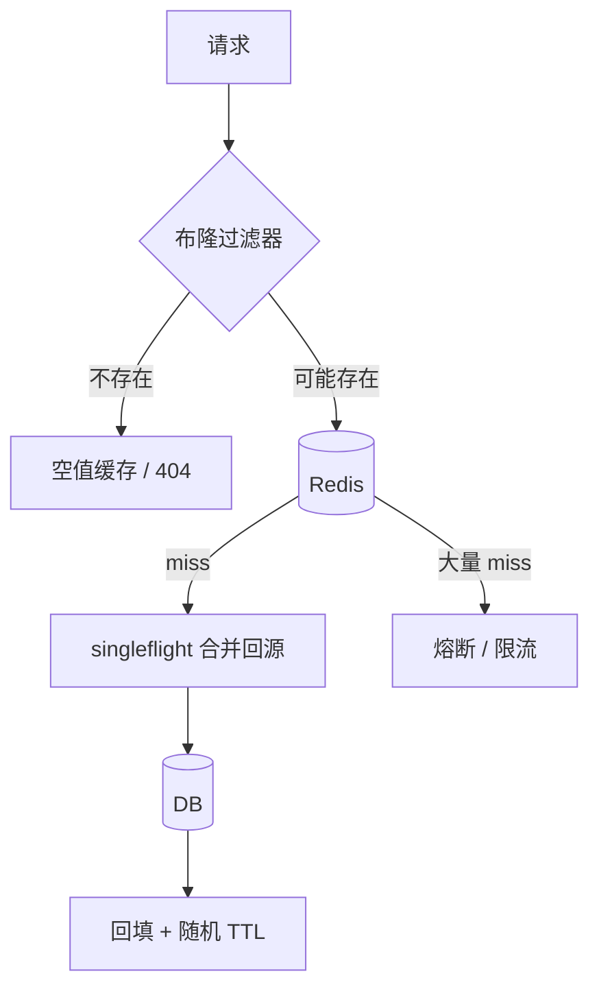

# 缓存穿透、击穿、雪崩治理体系

## 30 秒版（开场）

> **穿透**查不存在的数据、**击穿**热点 Key 过期、**雪崩**大量 Key 同时失效——三板斧分别是 **布隆过滤器/空值缓存、互斥锁/singleflight、随机 TTL/多级缓存**。生产关键词：**回源率、热点隔离、熔断降级**。

## 3 分钟版（一面深度）

1. **是什么**：穿透 = miss 打穿到 DB；击穿 = 热点 miss 并发回源；雪崩 = 缓存层集体失效 DB 承压。
2. **为什么**：恶意扫描随机 ID、热点 Key TTL 到点、批量缓存同一 TTL 重启/过期。
3. **怎么做**：穿透 → 布隆 + 空值短 TTL；击穿 → singleflight + 逻辑过期；雪崩 → TTL jitter + 永不过期异步更新 + 限流熔断。

## 10 分钟版（原理 + 图示）



**三类问题对照**

| 问题 | 成因 | 治理 | 容量参考 |
|------|------|------|----------|
| 穿透 | 恶意/业务不存在 ID | 布隆 1% 误判、空值 TTL 60s | 1 亿 ID 布隆 ~120MB |
| 击穿 | 热点 Key 过期 | singleflight、热点永不过期 | 热点 QPS 10 万需本地缓存 |
| 雪崩 | 同时过期/Redis 宕 | TTL ±20% jitter、集群多 AZ | DB 需扛 5% 回源 = 5000 QPS |

**容量估算（10 万 QPS 读服务）**

- 命中率 95% → Redis 10 万 QPS。
- 若雪崩命中率跌至 50% → DB 5 万 QPS，多数 MySQL 集群扛不住 → **必须熔断**。
- 空值缓存：恶意 1 万随机 ID/s × 100B ≈ 1MB/s 内存增长，需限长 LRU。

## 生产场景

- **商品详情**：爬虫扫 `-1, 999999999` 等非法 ID → 布隆 + WAF。
- **明星热搜**：热点 Key 1s TTL 到期 → 逻辑过期（值带 `expire_at`，异步刷新）。
- **Redis 集群故障**：本地缓存 + 降级读 DB 限流 10% QPS。

## 排查与工具

| 工具 | 指标 |
|------|------|
| Redis `keyspace_hits/misses` | 命中率 |
| 应用 `cache_miss_total` | 回源 QPS |
| DB 连接数/QPS | 是否被打穿 |
| 布隆误判率监控 | 假阳性导致多余回源 |

路径：DB QPS 突增 → 命中率下降 → 区分穿透（大量不存在 Key）vs 雪崩（时间相关）vs 击穿（单 Key）。

## 架构取舍

| 方案 | 适用 | 不适用 |
|------|------|--------|
| 布隆过滤器 | 海量 Key 存在性 | 需要删除/精确成员 |
| 空值缓存 | 低频不存在 ID | 恶意海量随机 Key |
| singleflight | 热点 miss | 已命中路径 |
| 永不过期 + 异步更新 | 超级热点 | 数据实时性要求高 |

## 追问链

1. **布隆能删元素吗？** → 标准不能；用 Counting Bloom 或定期重建。
2. **singleflight 和 Mutex 区别？** → singleflight 合并同 Key 并发请求，只回源一次。
3. **逻辑过期怎么实现？** → 值内嵌 `logical_expire`，过期仍返回旧值，后台 goroutine 刷新。
4. **Redis 挂了怎么办？** → 本地缓存 + 熔断 + 限流读 DB；快速恢复 Redis。
5. **Go 用哪个库？** → `golang.org/x/sync/singleflight`；布隆 `bits-and-blooms/bloom/v3`。

## 反模式与事故

- 空值缓存 TTL 7 天，攻击者扫满内存。
- 所有 Key 固定 TTL=3600，整点集体过期。
- 无熔断，Redis 故障后 DB 同步宕机（经典雪崩）。
- 布隆未预热，冷启动全穿透。

## 代码示例

```go
type Cache struct {
    rdb *redis.Client
    db  Repo
    sf  singleflight.Group
}

func (c *Cache) Get(ctx context.Context, id int64) (*Item, error) {
    key := fmt.Sprintf("item:%d", id)
    if b, err := c.rdb.Get(ctx, key).Bytes(); err == nil {
        if string(b) == "NULL" {
            return nil, ErrNotFound
        }
        var item Item
        _ = json.Unmarshal(b, &item)
        return &item, nil
    }
    v, err, _ := c.sf.Do(key, func() (any, error) {
        item, err := c.db.Find(ctx, id)
        if errors.Is(err, ErrNotFound) {
            ttl := time.Duration(30+rand.Intn(30)) * time.Second // jitter
            c.rdb.Set(ctx, key, "NULL", ttl)
            return nil, ErrNotFound
        }
        b, _ := json.Marshal(item)
        ttl := 300*time.Second + time.Duration(rand.Intn(60))*time.Second
        c.rdb.Set(ctx, key, b, ttl)
        return item, nil
    })
    // ...
    return v.(*Item), err
}
```

## 延伸阅读

- [Redis Cache Patterns](https://redis.io/docs/latest/develop/reference/patterns/)
- [Google SRE - Cache Strategies](https://sre.google/sre-book/load-balancing-frontend/)
