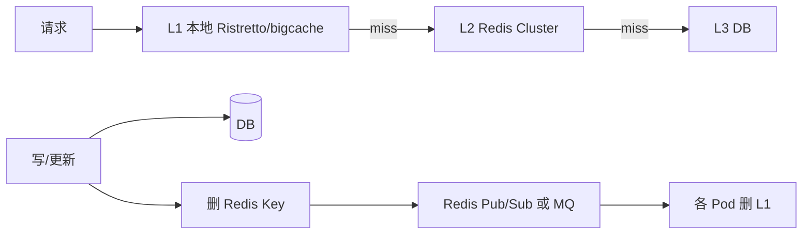

# 多级缓存与本地缓存一致性

## 30 秒版（开场）

> 多级缓存 = **L1 进程内 + L2 Redis + L3 DB/CDN**，用延迟换 QPS；一致性靠 **TTL + 主动失效（Pub/Sub、MQ）+ 版本号**。生产关键词：**本地缓存命中率、失效风暴、内存上限**。

## 3 分钟版（一面深度）

1. **是什么**：请求先查本地 LRU/LFU，再查 Redis，最后 DB；典型 L1 延迟 <1μs，L2 <1ms。
2. **为什么**：10 万 QPS 热点 Key 单 Redis 分片仍可能瓶颈；本地缓存可扛 50 万+ QPS/核。
3. **怎么做**：写路径删 Redis + 广播失效 L1；读路径带 `version` 校验；L1 必须设容量与 TTL 双限制。

## 10 分钟版（原理 + 图示）



**一致性策略**

| 策略 | 延迟 | 复杂度 | 适用 |
|------|------|--------|------|
| TTL only | 秒~分钟 | 低 | 配置、字典 |
| Delete + Pub/Sub | 百 ms | 中 | 商品信息 |
| 版本号比对 | 实时 | 高 | 库存近似 |
| Can not | — | — | 强一致库存（勿用 L1） |

**容量估算**

| 层级 | 单 Pod | 30 Pod 集群 |
|------|--------|-------------|
| L1 条目 | 1 万条 × 2KB = 20MB | 各 Pod 独立，总内存 600MB |
| L2 Redis | 100GB 集群 | 共享 |
| L1 命中率目标 | 60~80%（热点集中时） | 减轻 Redis 30~50% QPS |

- 30 Pod × 10 万 QPS = 300 万总 QPS；L1 命中 70% → Redis 90 万 QPS → 仍可能需要 CDN。

## 生产场景

- **商品 SKU 基础信息**：变更少，L1 TTL 5min + 变更消息失效。
- **用户权限**：登录时加载到 L1，权限变更 Pub/Sub 踢掉。
- **Feed 时间线**：不适合 L1（个性化太强），仅 L2+CDN。

## 排查与工具

| 现象 | 排查 |
|------|------|
| 部分 Pod 数据旧 | Pub/Sub 丢消息、Pod 未订阅 |
| 内存 OOM | L1 无 MaxCost |
| 不一致投诉 | TTL 过长、写未删缓存 |
| Redis QPS 仍高 | 热点分散、L1 太小 |

## 架构取舍

| 方案 | 适用 | 不适用 |
|------|------|--------|
| Ristretto/bigcache | Go 本地缓存 | 需要精确 LRU 遍历 |
| Redis Pub/Sub | 轻量失效广播 | 要求可靠投递 |
| MQ 广播失效 | 可靠、可重试 | 延迟略高 |
| 不用 L1 | 强一致、低 QPS | 超热点读 |

## 追问链

1. **Pub/Sub 丢消息怎么办？** → TTL 兜底 + 版本号；或改用 MQ。
2. **L1 和 L2 同时 miss 怎么办？** → singleflight 合并回源，只打一次 DB。
3. **多机房 L1 怎么失效？** → 跨机房 MQ / Redis Streams 广播。
4. **bigcache vs Ristretto？** → Ristretto 并发更好、支持 TinyLFU；bigcache 零 GC 压力。
5. **Go GC 和本地缓存？** → 存 []byte 而非大 struct 指针，减少扫描压力。

## 反模式与事故

- L1 无上限，大促 OOM Kill Pod。
- 写 DB 忘删 Redis，L1 更不会被失效。
- Pub/Sub 当可靠队列，消息丢失长期脏读。
- 库存放 L1，超卖。

## 代码示例

```go
import "github.com/dgraph-io/ristretto"

type TwoLevelCache struct {
    l1  *ristretto.Cache
    l2  *redis.Client
    db  Repo
    sub *redis.PubSub
}

func (c *TwoLevelCache) initInvalidation(ctx context.Context) {
    c.sub = c.l2.Subscribe(ctx, "cache:invalidate")
    go func() {
        for msg := range c.sub.Channel() {
            c.l1.Del(msg.Payload) // key name
        }
    }()
}

func (c *TwoLevelCache) Invalidate(ctx context.Context, key string) error {
    if err := c.l2.Del(ctx, key).Err(); err != nil {
        return err
    }
    return c.l2.Publish(ctx, "cache:invalidate", key).Err()
}
```

## 延伸阅读

- [Ristretto 高性能本地缓存](https://github.com/dgraph-io/ristretto)
- [bigcache - 零 GC 开销](https://github.com/allegro/bigcache)
