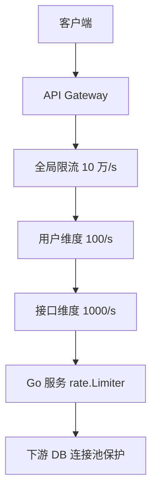

# 限流：令牌桶、漏桶、分布式限流

## 30 秒版（开场）

> **令牌桶**允许突发、**漏桶**平滑输出；生产网关常用 **令牌桶 + 分布式 Redis/Envoy** 按用户/IP/接口维度限流。生产关键词：**429、配额、Warm-up、分级限流**。

## 3 分钟版（一面深度）

1. **是什么**：限制单位时间请求数，保护下游 DB/第三方 API，保证公平性。
2. **为什么**：秒杀、爬虫、故障重试放大流量；无界并发导致级联故障。
3. **怎么做**：单机 `golang.org/x/time/rate`；集群 Redis Lua 滑动窗口；网关 Sentinel/Envoy 全局限流；超限返回 429 + Retry-After。

## 10 分钟版（原理 + 图示）

**算法对比**

| 算法 | 突发 | 平滑 | 实现 |
|------|------|------|------|
| 固定窗口 | 窗口边界双倍 | 差 | counter + TTL |
| 滑动窗口 | 较好 | 好 | Redis ZSET 或 Lua |
| 令牌桶 | 允许 burst | 可配置 | rate.Limiter |
| 漏桶 | 不允许 | 严格恒定 | 队列 + 固定速率 |



**容量估算**

- API 集群容量 10 万 QPS，限流设 **80% = 8 万** 留冗余。
- 单用户 100 QPS：100 万 DAU 同时在线 1% = 1 万用户 → 峰值 100 万 QPS 理论，需 **登录态 + 验证码** 补充。
- Redis 限流：Lua 脚本 ~0.1ms，单分片 5 万 ops/s → 热点限流 Key 需 **本地聚合** 或分片。

**分布式限流 Redis Lua（滑动窗口简化）**

```
KEYS[1] = rate:{user}:{window}
INCR + EXPIRE 或 ZSET 滑动
```

## 生产场景

- **开放 API**：按 AppKey 配额 1000 次/分钟，超限 429。
- **登录接口**：5 次/分钟/IP，防暴力破解。
- **下游短信网关**：全集群 500 QPS 硬限，漏桶平滑。

## 排查与工具

| 工具 | 用途 |
|------|------|
| Sentinel Dashboard | 实时 QPS、拒绝数 |
| Prometheus `rate_limit_rejected_total` | 告警 |
| 访问日志 429 比例 | 误杀 vs 攻击 |
| Redis 慢查询 | 限流脚本热点 |

## 架构取舍

| 方案 | 适用 | 不适用 |
|------|------|--------|
| 本地 rate.Limiter | 单实例保护 | 集群公平配额 |
| Redis 全局限流 | 精确集群配额 | 超高 QPS 热点 Key |
| 网关限流 | 统一策略 | 细粒度业务规则 |
| 排队（MQ） | 秒杀削峰 | 同步 API |

## 追问链

1. **令牌桶和漏桶区别？** → 令牌桶可攒 burst；漏桶输出恒定，输入可突发但会排队/丢弃。
2. **固定窗口有什么问题？** → 边界 1s 内可能 2 倍流量（0.9s 和 1.1s 各打满）。
3. **Redis 限流单 Key 热点？** → 本地预限流 + Redis 粗粒度；或 Envoy 分布式 rate limit service。
4. **被限流后客户端怎么做？** → 指数退避 + jitter；读 Retry-After。
5. **Go 默认 limiter 线程安全吗？** → `rate.Limiter` 是，可多 goroutine Wait。

## 反模式与事故

- 只限入口不限 DB 连接池，内部仍被打挂。
- 限流阈值=容量上限，无冗余，正常抖动即 429。
- 全站单一限流 Key，Redis 单点热点。
- 限流后无监控，用户投诉才发现。

## 代码示例

```go
import "golang.org/x/time/rate"

// 单机：100 QPS，burst 200
var limiter = rate.NewLimiter(100, 200)

func RateLimitMiddleware(next http.Handler) http.Handler {
    return http.HandlerFunc(func(w http.ResponseWriter, r *http.Request) {
        if !limiter.Allow() {
            w.Header().Set("Retry-After", "1")
            http.Error(w, "too many requests", http.StatusTooManyRequests)
            return
        }
        next.ServeHTTP(w, r)
    })
}

// 按用户维度 map[string]*rate.Limiter — 生产用 LRU 淘汰 + 定期清理
```

## 延伸阅读

- [golang.org/x/time/rate](https://pkg.go.dev/golang.org/x/time/rate)
- [Sentinel Golang](https://github.com/alibaba/sentinel-golang)
- [Envoy Rate Limit Service](https://www.envoyproxy.io/docs/envoy/latest/configuration/other_features/rate_limit)
