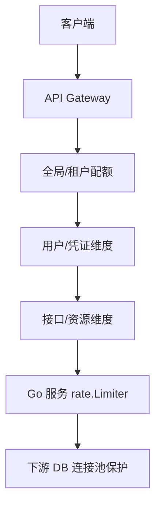

# 限流：令牌桶、漏桶、分布式限流

<a id="oral-card"></a>

## 口述卡（高频必背）

[返回 P0 知识图谱](../_meta/p0-knowledge-graph.md)

!!! abstract "30 秒回答"

    限流控制单位时间的进入量，令牌桶允许受控 burst；并发限制控制同时占用的资源，两者必须
    配合才能保护慢下游。阈值从压测容量、SLO、故障冗余和上游配额倒推；本地 limiter 保护单实例，
    全局配额才考虑 Redis 或集中式 rate-limit service，并明确存储/网络故障时按接口风险
    fail-open 还是 fail-closed。

**3 分钟展开**

1. 选择维度时组合 tenant/app/user/resource，而不是只按 IP；IP 受 NAT、代理和分布式攻击影响。
2. 本地预限流与有界并发保护进程，全局层保证租户配额；副本数变化会改变纯本地限额的总量。
3. 同步接口超限返回 429，并在能计算时给 `Retry-After`；客户端在总 deadline 内退避加 jitter。
4. 排队不是无限缓冲：队列必须有长度、等待 deadline 和丢弃/降级策略，否则把过载变成长尾。

| 记忆槽 | 内容 |
|--------|------|
| 三个不变量 | rate 与 concurrency 分开；阈值有容量证据；分布式失败策略按业务风险定义 |
| 手画图 | `gateway global quota → instance limiter → concurrency pool → dependency` |
| 项目落点 | Agent Platform 可讲 tenant/token/tool 配额；钱包签名或发布写操作采用更严格 fail-closed |
| 一个取舍 | 本地限流低延迟但不保证集群公平；集中式更一致却引入网络依赖和热点 |

**错误表达**

- ❌ “做了 QPS 限流就不会压垮下游；每个实例 100 QPS 等于集群 100 QPS。”
- ✅ “慢请求还要并发/队列边界；纯本地配额会随副本数和流量分布变化。”

**自测追问**：Redis 不可用时，登录、只读搜索和签名接口分别选择 fail-open 还是 fail-closed？

## 10 分钟版（原理 + 图示）

**算法对比**

| 算法 | 突发 | 平滑 | 实现 |
|------|------|------|------|
| 固定窗口 | 窗口边界双倍 | 差 | counter + TTL |
| 滑动窗口 | 边界更精确 | 不负责平滑输出 | Redis ZSET、分桶计数或 Lua |
| 令牌桶 | 允许 burst | 可配置 | rate.Limiter |
| 漏桶 | 取决于 meter/queue 变体 | 平滑速率 | 队列/计量器；必须有容量和丢弃策略 |


```mermaid
flowchart TB
  Client[客户端] --> GW[API Gateway]
  GW --> Global[全局/租户配额]
  Global --> User[用户/凭证维度]
  User --> API[接口/资源维度]
  API --> Svc[Go 服务 rate.Limiter]
  Svc --> Down[下游 DB 连接池保护]
```

**容量估算**

- 限流阈值应低于已压测的安全容量，并给故障副本、发布和流量抖动留余量；“80%”只能作为示例。
- 容量模型至少包含请求类型、服务时间、并发、依赖连接池、故障副本和突发系数，不能用
  `DAU × 单用户上限` 代替真实 workload。
- Redis/Lua 的延迟与吞吐取决于网络、脚本、key 分布和实例规格；热点 key 要通过本地预限流、
  分层配额或可扩展的集中式服务压测验证，不能背固定 ops/s。

**分布式限流 Redis Lua（滑动窗口简化）**

```
KEYS[1] = rate:{user}:{window}
INCR + EXPIRE 或 ZSET 滑动
```

## 生产场景

- **开放 API**：按 AppKey 配额 1000 次/分钟，超限 429。
- **登录接口**：按账号、设备/风险信号与 IP 分层限速，配合 MFA/验证码；单独按 IP 会误伤 NAT 用户，也挡不住分布式攻击。
- **下游短信网关**：全集群 500 QPS 硬限，漏桶平滑。

## 排查与工具

| 工具 | 用途 |
|------|------|
| Sentinel Dashboard | 实时 QPS、拒绝数 |
| Prometheus `rate_limit_rejected_total` | 告警 |
| 访问日志 429 比例 | 误杀 vs 攻击 |
| Redis 慢查询 | 限流脚本热点 |

## 架构取舍

| 方案 | 适用 | 不适用 |
|------|------|--------|
| 本地 rate.Limiter | 单实例保护 | 集群公平配额 |
| Redis 全局限流 | 精确集群配额 | 超高 QPS 热点 Key |
| 网关限流 | 统一策略 | 细粒度业务规则 |
| 排队（MQ） | 秒杀削峰 | 同步 API |

## 追问链

1. **令牌桶和漏桶区别？** → 令牌桶可攒 burst；漏桶输出恒定，输入可突发但会排队/丢弃。
2. **固定窗口有什么问题？** → 边界 1s 内可能 2 倍流量（0.9s 和 1.1s 各打满）。
3. **Redis 限流单 Key 热点？** → 本地预限流 + Redis 粗粒度；或 Envoy 分布式 rate limit service。
4. **被限流后客户端怎么做？** → 指数退避 + jitter；读 Retry-After。
5. **Go limiter 线程安全吗？** → `rate.Limiter` 可被多个 goroutine 并发使用；`Allow` 立即决策，
   `Wait/WaitN` 会预留 token 并等待，必须传有界 context，不能让请求无限排队。

## 反模式与事故

- 只限入口不限 DB 连接池，内部仍被打挂。
- 限流阈值=容量上限，无冗余，正常抖动即 429。
- 全站单一限流 Key，Redis 单点热点。
- 限流后无监控，用户投诉才发现。

## 代码示例

```go
import "golang.org/x/time/rate"

// 单机：100 QPS，burst 200
var limiter = rate.NewLimiter(100, 200)

func RateLimitMiddleware(next http.Handler) http.Handler {
    return http.HandlerFunc(func(w http.ResponseWriter, r *http.Request) {
        if !limiter.Allow() {
            w.Header().Set("Retry-After", "1")
            http.Error(w, "too many requests", http.StatusTooManyRequests)
            return
        }
        next.ServeHTTP(w, r)
    })
}

// 按用户维度 map[string]*rate.Limiter — 生产用 LRU 淘汰 + 定期清理
```

## 延伸阅读

- [golang.org/x/time/rate](https://pkg.go.dev/golang.org/x/time/rate)
- [Sentinel Golang](https://github.com/alibaba/sentinel-golang)
- [Envoy Rate Limit Service](https://www.envoyproxy.io/docs/envoy/latest/configuration/other_features/rate_limit)
