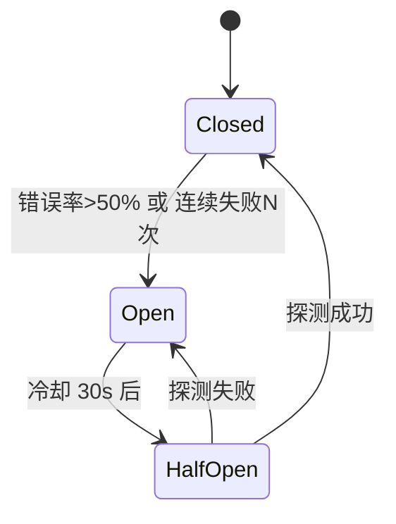
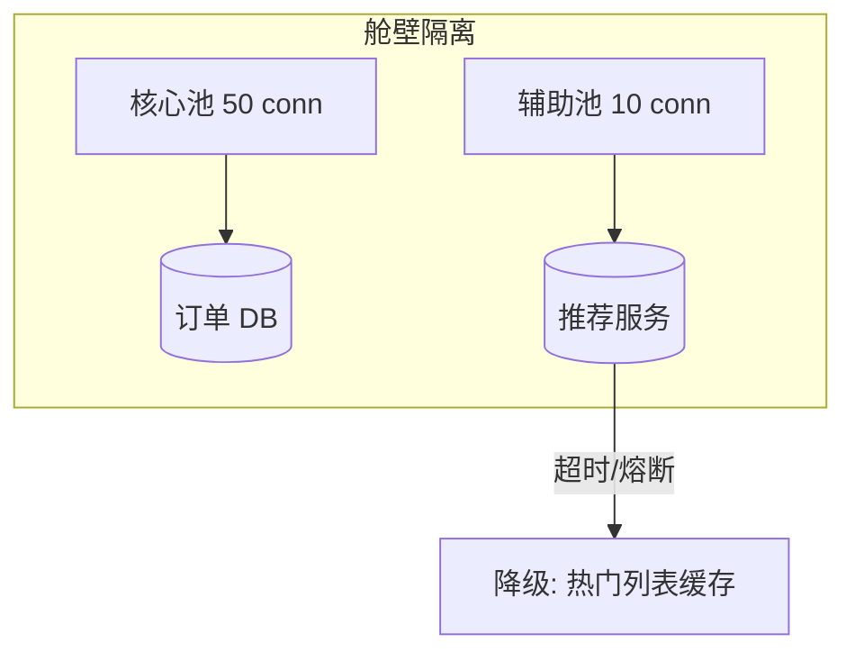

# 熔断、降级、舱壁

## 30 秒版（开场）

> **熔断**在下游故障时快速失败避免拖死线程；**降级**返回兜底数据；**舱壁**隔离资源池防扩散。生产关键词：**半开探测、错误率阈值、超时**。

## 3 分钟版（一面深度）

1. **是什么**：熔断器三态 Closed → Open → Half-Open；降级牺牲非核心功能保核心；舱壁为不同依赖独立 goroutine/连接池配额。
2. **为什么**：慢调用占满 worker，上游排队超时，级联雪崩（Metastable failure）。
3. **怎么做**：Hystrix/gobreaker 按错误率熔断；超时 + 有限并发；降级缓存/默认值；核心与非核心线程池分离。

## 10 分钟版（原理 + 图示）





**参数建议（面试可背）**

| 参数 | 典型值 | 说明 |
|------|--------|------|
| 错误率阈值 | 50% / 10s 窗口 | 低于此易误熔断 |
| 最小请求数 | 20 | 避免样本过少 |
| Open 持续时间 | 30~60s | 给下游恢复时间 |
| Half-Open 探测 | 1~3 个请求 | 渐进恢复 |
| 超时 | P99 × 1.5 或 固定 500ms | 必须小于客户端 timeout |

**容量估算**

- 服务 1000 goroutine worker，下游慢 10s → 100 QPS 即占满 → **必须超时 200ms + 熔断**。
- 舱壁：推荐服务最多占 10% 连接，故障时不拖订单主路径。

## 生产场景

- **推荐服务超时**：商品详情页降级为「暂无推荐」，核心下单不受影响。
- **第三方支付**：熔断后提示「支付通道繁忙」，订单保持待支付。
- **可观测**：熔断状态 gauge、降级 QPS、舱壁队列深度。

## 排查与工具

| 工具 | 用途 |
|------|------|
| gobreaker / sentinel | 熔断状态机 |
| trace 慢 span | 定位慢依赖 |
| 连接池 metrics | 是否耗尽 |
| 混沌工程 | 验证降级路径 |

路径：P99 飙升 → trace 看哪个依赖慢 → 连接池满 → 加超时/熔断/舱壁。

## 架构取舍

| 方案 | 适用 | 不适用 |
|------|------|--------|
| 熔断 | 可选依赖、可失败 | 金融强一致必成功 |
| 降级 | 有缓存兜底 | 无兜底且用户敏感 |
| 舱壁 | 多依赖共享进程 | 依赖已独立部署 |
| 重试 | 瞬时故障 | 下游已过载（加重） |

## 追问链

1. **熔断和限流区别？** → 限流主动控入口；熔断被动响应下游故障。
2. **Half-Open 放多少流量？** → 少量探测，成功则 Closed 全量，失败回 Open。
3. **错误率还是连续失败？** → 高 QPS 用错误率；低 QPS 用连续失败 + 最小样本。
4. **Go 怎么实现舱壁？** → 带 buffer 的 channel 限并发；或独立 `http.Transport` MaxConnsPerHost。
5. **降级数据多旧可接受？** → 业务定 SLA，如推荐 5 分钟、配置 1 小时。

## 反模式与事故

- 无超时的 HTTP Client，一个慢依赖拖死全服务。
- 熔断阈值过严，下游恢复后 Half-Open 失败反复抖动。
- 降级路径从未测试，熔断后 500 比超时更糟。
- 重试 × 熔断未配合，Open 期间仍疯狂重试。

## 代码示例

```go
import "github.com/sony/gobreaker"

var cb = gobreaker.NewCircuitBreaker(gobreaker.Settings{
    Name:        "recommend-service",
    MaxRequests: 3,              // Half-Open 最多 3 次
    Interval:    10 * time.Second,
    Timeout:     30 * time.Second,
    ReadyToTrip: func(counts gobreaker.Counts) bool {
        if counts.Requests < 20 {
            return false
        }
        return float64(counts.TotalFailures)/float64(counts.Requests) > 0.5
    },
})

func CallRecommend(ctx context.Context) ([]Item, error) {
    v, err := cb.Execute(func() (any, error) {
        ctx, cancel := context.WithTimeout(ctx, 200*time.Millisecond)
        defer cancel()
        return fetchRecommend(ctx)
    })
    if err != nil {
        return getCachedHotItems(), nil // 降级
    }
    return v.([]Item), nil
}
```

## 延伸阅读

- [Circuit Breaker Pattern - Azure](https://learn.microsoft.com/en-us/azure/architecture/patterns/circuit-breaker)
- [sony/gobreaker](https://github.com/sony/gobreaker)
- [Google SRE - Addressing Cascading Failures](https://sre.google/sre-book/addressing-cascading-failures/)
