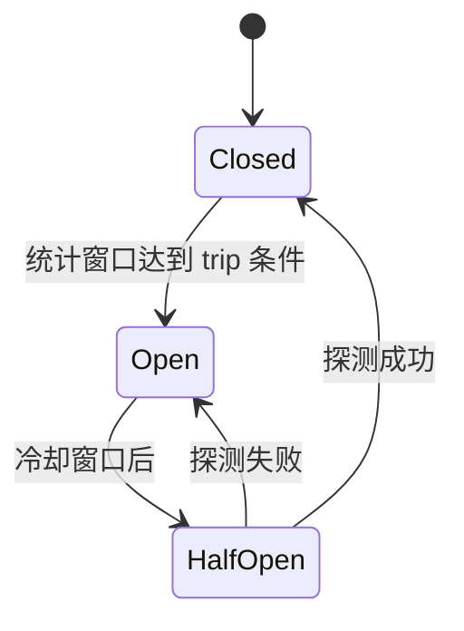
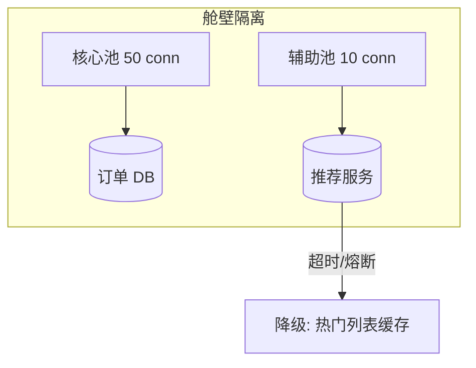

# 熔断、降级、舱壁

<a id="oral-card"></a>

## 口述卡（高频必背）

[返回 P0 知识图谱](../_meta/p0-knowledge-graph.md)

!!! abstract "30 秒回答"

    熔断器根据选定的技术失败信号在 Closed、Open、Half-Open 间切换，避免继续打已故障依赖；
    舱壁限制每个依赖可占用的并发、连接和队列；降级则定义业务上可接受的替代结果。它们都不能
    替代端到端 deadline。业务拒绝不应计入熔断失败，重试要受预算和幂等约束，Half-Open 探针也要限量。

**3 分钟展开**

1. 从 SLO 和依赖错误语义选择统计窗口、最小样本与 trip 条件；固定阈值只是示例，低流量还要避免样本噪声。
2. 本地 breaker 通常是每实例状态，切流/扩容后视图会变化；探针加并发上限与 jitter，避免同时恢复形成洪峰。
3. 降级必须保持业务正确：推荐可返回空列表，支付/签名只能明确返回 pending/unavailable，不能伪造成功或默认值。
4. 指标同时看 breaker 状态、拒绝量、依赖真实错误、舱壁饱和与 fallback 成功率，并演练恢复路径。

| 记忆槽 | 内容 |
|--------|------|
| 三个不变量 | 先有 deadline；只统计选定失败；fallback 不破坏业务正确性 |
| 手画图 | `caller → deadline → bulkhead → breaker → dependency`，Open 分支到安全 fallback |
| 项目落点 | Agent 外部 provider 可降级模型；钱包/支付类副作用只转 pending 或停用，绝不伪造成功 |
| 一个取舍 | 本地 breaker 简单低延迟但状态分散；集中协调更一致却可能引入新的控制面依赖 |

**错误表达**

- ❌ “金融强一致场景不能熔断，任何错误都计入失败，熔断后返回默认成功。”
- ✅ “核心依赖同样会故障；应快速暴露 unavailable/pending，并禁止不安全 fallback。”

**自测追问**：429、业务余额不足、context canceled 和连接超时中，哪些应计入 breaker？

## 10 分钟版（原理 + 图示）


```mermaid
stateDiagram-v2
  [*] --> Closed
  Closed --> Open: 统计窗口达到 trip 条件
  Open --> HalfOpen: 冷却窗口后
  HalfOpen --> Closed: 探测成功
  HalfOpen --> Open: 探测失败
```


```mermaid
flowchart TB
  subgraph bulkhead[舱壁隔离]
    Core[核心池 50 conn] --> OrderDB[(订单 DB)]
    Aux[辅助池 10 conn] --> RecDB[(推荐服务)]
  end
  RecDB -->|超时/熔断| Fallback[降级: 热门列表缓存]
```

**参数示例（不能脱离流量与 SLO 硬背）**

| 参数 | 示例 | 说明 |
|------|--------|------|
| 错误率/连续失败 | 由依赖基线和 SLO 推导 | 只纳入应统计的技术失败 |
| 最小请求数 | 防止小样本误判 | 低流量可结合连续失败和主动健康信号 |
| Open 持续时间 | 结合恢复特征与退避 | 避免所有实例同时探测 |
| Half-Open 探测 | 小流量且有并发上限 | 成功后渐进恢复 |
| 超时 | 从端到端 deadline 倒推 | 给重试、排队和上游返回留预算，并控制误超时率 |

**容量估算**

- 用 Little's Law 粗估 `并发 ≈ 到达率 × 服务时间`，再结合队列和连接池确认慢依赖的占用上限；
  timeout 必须从端到端 SLO 与正常延迟分布倒推，不能固定背 `200ms`。
- 舱壁配额按核心路径、容量与降级目标压测确定，不机械使用固定百分比。

## 生产场景

- **推荐服务超时**：商品详情页降级为「暂无推荐」，核心下单不受影响。
- **第三方支付**：熔断后提示「支付通道繁忙」，订单保持待支付。
- **可观测**：熔断状态 gauge、降级 QPS、舱壁队列深度。

## 排查与工具

| 工具 | 用途 |
|------|------|
| gobreaker / sentinel | 熔断状态机 |
| trace 慢 span | 定位慢依赖 |
| 连接池 metrics | 是否耗尽 |
| 混沌工程 | 验证降级路径 |

路径：P99 飙升 → trace 看哪个依赖慢 → 连接池满 → 加超时/熔断/舱壁。

## 架构取舍

| 方案 | 适用 | 不适用 |
|------|------|--------|
| 熔断 | 依赖故障时快速失败 | 无明确失败分类或恢复策略 |
| 降级 | 有缓存兜底 | 无兜底且用户敏感 |
| 舱壁 | 多依赖共享进程 | 依赖已独立部署 |
| 重试 | 瞬时故障 | 下游已过载（加重） |

## 追问链

1. **熔断和限流区别？** → 限流主动控入口；熔断被动响应下游故障。
2. **Half-Open 放多少流量？** → 少量、受限探测；应渐进恢复并防止刚关闭就被全量洪峰再次打挂。
3. **错误率还是连续失败？** → 高 QPS 用错误率；低 QPS 用连续失败 + 最小样本。
4. **Go 怎么实现舱壁？** → 带 buffer 的 channel 限并发；或独立 `http.Transport` MaxConnsPerHost。
5. **降级数据多旧可接受？** → 业务定 SLA，如推荐 5 分钟、配置 1 小时。

## 反模式与事故

- 无超时的 HTTP Client，一个慢依赖拖死全服务。
- 熔断阈值过严，下游恢复后 Half-Open 失败反复抖动。
- 降级路径从未测试，熔断后 500 比超时更糟。
- 重试 × 熔断未配合，Open 期间仍疯狂重试。

## 代码示例

```go
import "github.com/sony/gobreaker"

var cb = gobreaker.NewCircuitBreaker(gobreaker.Settings{
    Name:        "recommend-service",
    MaxRequests: 3,              // Half-Open 最多 3 次
    Interval:    10 * time.Second,
    Timeout:     30 * time.Second,
    ReadyToTrip: func(counts gobreaker.Counts) bool {
        if counts.Requests < 20 {
            return false
        }
        return float64(counts.TotalFailures)/float64(counts.Requests) > 0.5
    },
})

func CallRecommend(ctx context.Context) ([]Item, error) {
    v, err := cb.Execute(func() (any, error) {
        ctx, cancel := context.WithTimeout(ctx, recommendBudget) // 由端到端预算推导
        defer cancel()
        return fetchRecommend(ctx)
    })
    if err != nil {
        return getCachedHotItems(), nil // 仅当产品明确允许陈旧推荐时
    }
    return v.([]Item), nil
}
```

## 延伸阅读

- [Circuit Breaker Pattern - Azure](https://learn.microsoft.com/en-us/azure/architecture/patterns/circuit-breaker)
- [sony/gobreaker](https://github.com/sony/gobreaker)
- [Google SRE - Addressing Cascading Failures](https://sre.google/sre-book/addressing-cascading-failures/)
