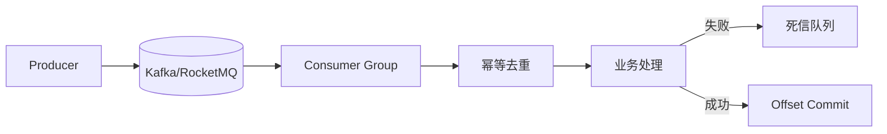

# 消息队列：至少一次、恰好一次、顺序性

## 30 秒版（开场）

> 分布式 MQ **真正常见的是至少一次（At-Least-Once）**；恰好一次（Exactly-Once）需 **幂等消费 + 事务/outbox** 在业务层实现；顺序性靠 **单分区单消费者** 或业务序号。生产关键词：**消费幂等、DLQ、consumer lag**。

## 3 分钟版（一面深度）

1. **是什么**：At-Most-Once 可能丢；At-Least-Once 可能重复；Exactly-Once 语义复杂，多为「效果上的恰好一次」。
2. **为什么**：网络、 rebalance、进程 crash 都会导致重复或丢失；顺序与吞吐矛盾。
3. **怎么做**：默认 At-Least-Once + 业务幂等；Kafka 幂等 producer + 事务；顺序消息用相同 partition key；失败进 DLQ 人工/自动重试。

## 10 分钟版（原理 + 图示）



**语义对照**

| 语义 | 行为 | 实现成本 | 典型 |
|------|------|----------|------|
| At-Most-Once | 可能丢 | 低 | 日志采集可丢 |
| At-Least-Once | 可能重复 | 中 | 默认，需幂等 |
| Exactly-Once | 不丢不重 | 高 | Kafka EOS + 幂等表 |
| 顺序 | 分区内有序 | 降并行 | 订单状态变更 |

**Kafka 要点**

- **幂等 Producer**：`enable.idempotence=true`，PID+序列号防 broker 重试重复。
- **事务**：跨分区 atomic write，消费-生产共存（read-process-write）。
- **Consumer**：先处理再 commit offset；crash 后重复消费 → **必须幂等**。

**容量估算**

- 订单 1 万 TPS，消息 1KB → 10 MB/s 吞吐，3 副本 Kafka 集群 3 节点足够。
- Consumer lag 目标 < 1000 条或 < 1s；lag 10 万需 **扩 consumer 或优化处理**（注意分区数上限）。

## 生产场景

- **订单创建 → 库存/积分/通知**：At-Least-Once + `order_id` 幂等。
- **Binlog CDC**：顺序性按表主键 hash 分区。
- **延迟消息**：RocketMQ 延迟级别或 Kafka 时间轮 + 内部 topic。

## 排查与工具

| 工具 | 用途 |
|------|------|
| `kafka-consumer-groups.sh --describe` | lag 监控 |
| DLQ 深度 | 失败堆积 |
| 幂等表重复率 | 消费重复是否正常 |
| trace 关联 message_id | 端到端 |

## 架构取舍

| 方案 | 适用 | 不适用 |
|------|------|--------|
| At-Least-Once + 幂等 | 绝大多数业务 | 无法去重的副作用 |
| Kafka 事务 | 流处理 exactly-once | 简单业务过重 |
| 单分区顺序 | 强顺序单实体 | 高吞吐全局顺序 |
| 内存队列 | 单进程 | 持久化、跨服务 |

## 追问链

1. **先 commit 还是先处理？** → 先处理再 commit（至少一次）；先 commit 可能丢（至多一次）。
2. **如何保证全局顺序？** → 单分区，吞吐受限；或业务层按 version 丢弃乱序。
3. **Rebalance 时重复消费？** → 正常，幂等兜底； cooperative sticky 减少 rebalance。
4. **Go 消费 Kafka 用什么？** → `segmentio/kafka-go`、`IBM/sarama`；注意 consumer group。
5. **DLQ 之后怎么办？** → 告警 + 人工修复 + 回放工具；根因分类（ poison message 跳过）。

## 反模式与事故

- 认为 MQ 保证 exactly-once，不做幂等，重复扣款。
- 分区数=1 追求全局顺序，吞吐瓶颈。
- 无 DLQ，失败消息无限重试阻塞队列。
- Consumer 处理 30s 未 ack，session timeout 反复 rebalance。

## 代码示例

```go
// 幂等消费骨架
func (h *Handler) Handle(ctx context.Context, msg *kafka.Message) error {
    bizID := extractBizID(msg)
    inserted, err := h.repo.TryInsertProcessed(ctx, bizID)
    if err != nil {
        return err // 可重试
    }
    if !inserted {
        return nil // 已处理，跳过
    }
    if err := h.process(ctx, msg); err != nil {
        _ = h.repo.DeleteProcessed(ctx, bizID) // 或标记 failed 供重试
        return err
    }
    return nil
}
```

## 延伸阅读

- [Kafka Semantics](https://kafka.apache.org/documentation/#semantics)
- [RocketMQ 设计文档](https://rocketmq.apache.org/docs/domainModel/02message/)
