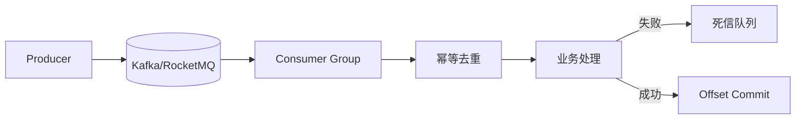

# 消息队列：至少一次、恰好一次、顺序性

<a id="oral-card"></a>

## 要点卡

[返回高频核心锚点](../../high-frequency-roadmap.md)

!!! abstract "30 秒回答"

    分布式 MQ 最常见的是至少一次：不丢的代价是故障恢复、重试和 rebalance 时可能重复。
    Kafka 的幂等 producer 和事务能在明确的 Kafka read-process-write 边界提供 EOS，但不会把
    外部数据库、支付 API 或链上交易自动纳入事务。业务上的 effect-once 仍依赖 inbox/outbox、
    本地事务、业务幂等和状态机；顺序通常只保证在同一分区或同一业务 key 内。

**3 分钟展开**

1. At-most-once 先提交后处理，可能丢；at-least-once 先处理后提交，可能重复。
2. Kafka producer 幂等消除 broker 重试导致的重复；事务可原子提交 Kafka 写入和消费 offset，
   但外部副作用仍在边界外。
3. 需要同一实体顺序时用稳定 partition key，并在事件中带 version/sequence；全局顺序意味着
   单分区或集中排序，吞吐和可用性代价很高。
4. 重试要分瞬时错误与 poison message，配置退避、上限、DLQ、告警和可审计回放。

| 记忆槽 | 内容 |
|--------|------|
| 三个不变量 | 至少一次必然要求消费幂等；顺序范围必须明确；exactly-once 必须声明提交边界 |
| 手画图 | `producer → partition(key) → consumer → local TX(inbox+business) → commit offset` |
| 项目落点 | 链事件到 K 线/风控流水按 token、account 或 order 分区；消费者稳定 ID upsert 并检测 sequence gap |
| 一个取舍 | 增加分区提高吞吐，却削弱跨 key 顺序并增加 rebalance、热点和运维复杂度 |

**错误表达**

- ❌ “Kafka 开启 EOS 后数据库不会重复写；同一个 topic 天然全局有序。”
- ✅ “EOS 只覆盖参与 Kafka 事务的边界；Kafka 的核心顺序保证是分区内顺序。”

**自测追问**：先处理还是先提交 offset？DLQ 为什么不能只是“把失败消息挪走”？

## 10 分钟版（原理 + 图示）


```mermaid
flowchart LR
  Prod[Producer] --> Broker[(Kafka/RocketMQ)]
  Broker --> Cons1[Consumer Group]
  Cons1 --> Dedup[幂等去重]
  Dedup --> Biz[业务处理]
  Biz -->|失败| DLQ[死信队列]
  Biz -->|成功| Commit[Offset Commit]
```

**语义对照**

| 语义 | 行为 | 实现成本 | 典型 |
|------|------|----------|------|
| At-Most-Once | 可能丢 | 低 | 日志采集可丢 |
| At-Least-Once | 可能重复 | 中 | 默认，需幂等 |
| Exactly-Once / Effectively-Once | 在明确边界内不重复产生可见效果 | 高 | Kafka EOS（Kafka 内）或业务事务 + 幂等 |
| 顺序 | 分区内有序 | 降并行 | 订单状态变更 |

**Kafka 要点**

- **幂等 Producer**：`enable.idempotence=true`，PID+序列号防 broker 重试重复。
- **事务**：可原子提交多个 Kafka 分区写入及消费 offset，适合 Kafka 内 read-process-write；外部 DB 写不在该事务中。
- **Consumer**：先处理再 commit offset；crash 后重复消费 → **必须幂等**。

**容量估算**

- 订单 1 万 TPS、消息 1KB 只给出约 10 MB/s 原始载荷；还需计算副本、保留期、压缩、峰值、磁盘 IOPS、故障冗余与分区并行度，不能据此断言“三节点足够”。
- Consumer lag 目标 < 1000 条或 < 1s；lag 10 万需 **扩 consumer 或优化处理**（注意分区数上限）。

## 生产场景

- **订单创建 → 库存/积分/通知**：At-Least-Once + `order_id` 幂等。
- **Binlog CDC**：源端通常按日志位置读取；重新按主键分区后只保同一 key 的顺序，可能失去跨 key/跨表事务顺序。
- **延迟消息**：RocketMQ 5.x 支持定时/延时消息；Kafka 没有通用的原生延时队列，通常用 delay topics、应用调度器或流处理状态实现。

## 排查与工具

| 工具 | 用途 |
|------|------|
| `kafka-consumer-groups.sh --describe` | lag 监控 |
| DLQ 深度 | 失败堆积 |
| 幂等表重复率 | 消费重复是否正常 |
| trace 关联 message_id | 端到端 |

## 架构取舍

| 方案 | 适用 | 不适用 |
|------|------|--------|
| At-Least-Once + 幂等 | 绝大多数业务 | 无法去重的副作用 |
| Kafka 事务 | 流处理 exactly-once | 简单业务过重 |
| 单分区顺序 | 强顺序单实体 | 高吞吐全局顺序 |
| 内存队列 | 单进程 | 持久化、跨服务 |

## 深挖问答

1. **先 commit 还是先处理？** → 先处理再 commit（至少一次）；先 commit 可能丢（至多一次）。
2. **如何保证全局顺序？** → 单分区，吞吐受限；或业务层按 version 丢弃乱序。
3. **Rebalance 时重复消费？** → 正常，幂等兜底； cooperative sticky 减少 rebalance。
4. **Go 消费 Kafka 用什么？** → `segmentio/kafka-go`、`IBM/sarama`；注意 consumer group。
5. **DLQ 之后怎么办？** → 告警 + 人工修复 + 回放工具；根因分类（ poison message 跳过）。

## 反模式与事故

- 认为 MQ 保证 exactly-once，不做幂等，重复扣款。
- 分区数=1 追求全局顺序，吞吐瓶颈。
- 无 DLQ，失败消息无限重试阻塞队列。
- Consumer 处理 30s 未 ack，session timeout 反复 rebalance。

## 代码示例

```go
// 幂等消费骨架
func (h *Handler) Handle(ctx context.Context, msg *kafka.Message) error {
    bizID := extractBizID(msg)
    return h.repo.WithTx(ctx, func(tx Tx) error {
        inserted, err := tx.TryInsertProcessed(bizID)
        if err != nil {
            return err
        }
        if !inserted {
            return nil
        }
        return h.processInTx(ctx, tx, msg)
    })
}
```

只有当去重记录和业务变更在同一本地事务中提交，才能关闭“标记成功但业务未做”与“业务已做但标记未写”的崩溃窗口。外部 HTTP/链上交易等副作用需继续传递业务幂等键并记录状态，不能由这张表单独兜底。

## 延伸阅读

- [Kafka Semantics](https://kafka.apache.org/documentation/#semantics)
- [RocketMQ 领域模型](https://rocketmq.apache.org/docs/domainModel/01main/)
