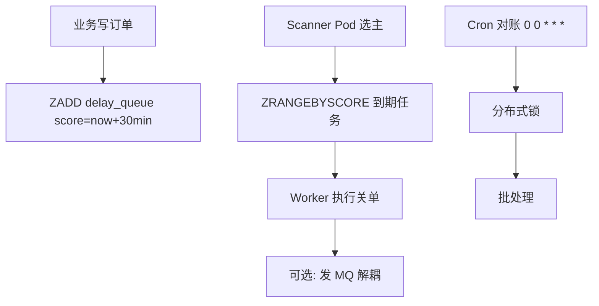

# 延迟任务与定时任务架构

## 30 秒版（开场）

> 延迟任务 = **在 T 时刻后执行一次**（订单超时关单）；定时任务 = **周期执行**（对账）。常见实现：**Redis ZSET 时间轮、MQ 延迟消息、DB 扫描 + 分布式锁**。生产关键词：**时间精度、重复执行、miss 补偿**。

## 3 分钟版（一面深度）

1. **是什么**：延迟队列在指定时间触发回调；Cron 按 cron 表达式周期跑批。
2. **为什么**：支付 30 分钟超时、优惠券到期提醒、日终对账——不能靠 `time.Sleep` 挂进程。
3. **怎么做**：高精确 + 海量 → Redis ZSET score=timestamp；RocketMQ 延迟级别；大规模调度 → Temporal/XXL-JOB；Go 内置 `robfig/cron` 只适合单实例或需选主。

## 10 分钟版（原理 + 图示）



**方案对比**

| 方案 | 精度 | 规模 | 持久化 |
|------|------|------|--------|
| Redis ZSET | ms~s | 百万级 | RDB/AOF |
| RocketMQ 延迟 | 固定级别 | 高吞吐 | 内置 |
| DB 轮询 | s~min | 简单 | 强 |
| Kafka 时间轮 | s | 中高 | 内置 |
| Temporal | 精确 | 工作流级 | 内置 |

**容量估算**

- 日订单 100 万，30min 超时 → 同时 pending 约 100万/48 ≈ **2 万** 延迟任务在队列。
- Scanner 1s 扫一次，每次取 1000 条 → 峰值取消 1000/s，足够。
- ZSET 100 万元素内存 ~100MB 量级。

**分布式 Cron 要点**

- 多 Pod 不能都跑：Redis SETNX / K8s Lease / DB 租约选主。
- 任务必须 **幂等**（关单 `UPDATE WHERE status=PENDING`）。
- 时钟漂移：用 NTP；score 用 UTC 毫秒。

## 生产场景

- **订单 30 分钟未支付自动关闭**：延迟 MQ 或 ZSET。
- **会员到期前 3 天提醒**：Cron 日批 + 用户分片并行。
- **Retry 退避**：1m、5m、30m 延迟重试链。

## 排查与工具

| 现象 | 排查 |
|------|------|
| 任务未执行 | Scanner 选主失败、ZSET score 错误 |
| 重复执行 | 未幂等、多 Scanner 无锁 |
| 堆积 | Worker 慢、Consumer lag |
| 时间不准 | 时区、cron 表达式错误 |

## 架构取舍

| 方案 | 适用 | 不适用 |
|------|------|--------|
| Redis ZSET | 灵活延迟、Go 生态 | Redis 持久化要求极高 |
| MQ 延迟 | 已有 MQ、固定档位 | 任意延迟时间 |
| XXL-JOB/Temporal | 复杂编排、可视化 | 简单超时关单 |
| time.AfterFunc | 单进程 demo | 生产分布式 |

## 追问链

1. **Redis ZSET 扫描会阻塞吗？** → 分批 ZRANGEBYSCORE + LIMIT；避免 ZRANGE 全量。
2. **任务执行失败？** → 重入队列 + 退避 + DLQ + 告警。
3. **Go cron 多实例？** → 必须分布式锁，否则重复跑批。
4. **和 MQ 延迟消息区别？** → ZSET 灵活时间；MQ 延迟级别固定（如 1s 5s 10s）。
5. **百万延迟任务如何删除？** → 执行后 ZREM；定期 ZREMRANGEBYSCORE 清理过期。

## 反模式与事故

- 单 Pod `time.Sleep`，发布滚动丢任务。
- Cron 无锁，对账跑 3 遍写 3 份报表。
- ZSET 无上限，历史任务未删内存爆。
- 用本地时区算延迟，夏令时出错。

## 代码示例

```go
// Redis 延迟队列 Scanner
func (s *DelayQueue) Scan(ctx context.Context) error {
    now := float64(time.Now().UnixMilli())
    ids, err := s.rdb.ZRangeByScore(ctx, "delay:queue", &redis.ZRangeBy{
        Min: "-inf", Max: fmt.Sprintf("%f", now), Count: 1000,
    }).Result()
    if err != nil {
        return err
    }
    for _, id := range ids {
        if removed, _ := s.rdb.ZRem(ctx, "delay:queue", id).Result(); removed == 0 {
            continue // 已被其他 worker 取走
        }
        _ = s.handler(ctx, id)
    }
    return nil
}

func (s *DelayQueue) Schedule(ctx context.Context, id string, at time.Time) error {
    return s.rdb.ZAdd(ctx, "delay:queue", redis.Z{
        Score:  float64(at.UnixMilli()),
        Member: id,
    }).Err()
}
```

## 延伸阅读

- [Redis Sorted Set 延迟队列](https://redis.io/docs/latest/commands/zadd/)
- [Temporal - Durable Timers](https://docs.temporal.io/workflows#timers)
- [robfig/cron v3](https://github.com/robfig/cron)
