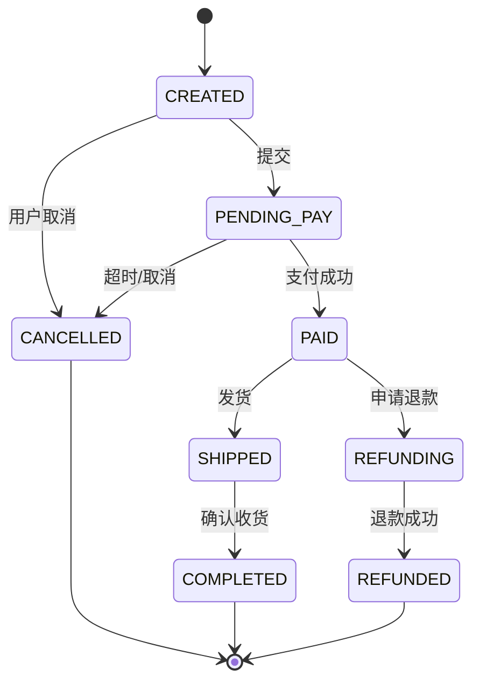

# 支付/订单状态机设计

## 30 秒版（开场）

> 订单/支付用 **有限状态机（FSM）** 约束合法迁移，配合 **乐观锁 version + 幂等回调** 防并发乱序。生产关键词：**PENDING→PAID→SHIPPED、非法迁移拒绝、补偿关单**。

## 3 分钟版（一面深度）

1. **是什么**：每个订单处于唯一状态；事件驱动状态迁移；非法 `(from, event)` 拒绝。
2. **为什么**：支付回调重复、MQ 乱序、用户取消与支付成功并发——无状态机会出现「已发货又取消」。
3. **怎么做**：表字段 `status` + `version`；`UPDATE ... WHERE id=? AND status=? AND version=?`；状态图文档化；Side effect（扣库存）在迁移成功后发 MQ。

## 10 分钟版（原理 + 图示）



**状态与事件表（示例）**

| 当前状态 | 事件 | 下一状态 | 副作用 |
|----------|------|----------|--------|
| CREATED | SUBMIT | PENDING_PAY | 锁库存 |
| PENDING_PAY | PAY_SUCCESS | PAID | 通知仓库 |
| PENDING_PAY | TIMEOUT | CANCELLED | 释库存 |
| PAID | SHIP | SHIPPED | 物流单号 |
| PAID | REFUND_REQ | REFUNDING | 冻结 |

**容量估算**

- 1 万 TPS 下单，状态更新单行 `UPDATE` ~1ms → 单库瓶颈 ~5000 TPS，需 **分库或异步写**。
- 状态变更日志表：1 万 TPS × 86400 ≈ **8.6 亿行/天**，需分表或采样归档。

**并发控制**

- **乐观锁**：`version` 自增，冲突返回业务错误重试。
- **悲观锁**：`SELECT FOR UPDATE` 低并发关单场景。
- **幂等**：支付 `transaction_id` UNIQUE，重复回调直接返回。

## 生产场景

- **电商订单全链路**：创建 → 支付 → 发货 → 完成 → 售后。
- **支付中台**：`INIT → PROCESSING → SUCCESS/FAILED`。
- **可观测**：各状态停留时长、卡单量（PENDING_PAY > 30min）、非法迁移告警。

## 排查与工具

| 现象 | 排查 |
|------|------|
| 卡单 | 回调丢失、状态未迁移 |
| 重复发货 | 缺少幂等、非法迁移未拦 |
| 库存不一致 | 迁移与副作用非原子 |
| 乱序 | MQ 无 partition key |

## 架构取舍

| 方案 | 适用 | 不适用 |
|------|------|--------|
| 表驱动 FSM | 清晰、可审计 | 状态爆炸（>20） |
| 代码 switch | 简单流程 | 频繁变更 |
| Temporal/Saga | 长流程、补偿 | 简单订单 |
| Event Sourcing | 完整审计 | 团队成熟度要求高 |

## 追问链

1. **支付成功和用户取消同时到？** → DB 条件更新谁先谁赢；失败方补偿（退款/释库存）。
2. **状态存在 Redis 还是 DB？** → SoT 在 DB；Redis 可缓存展示。
3. **如何做状态机可视化？** → 表 `state_transitions` + 管理后台；或 Mermaid 文档即代码。
4. **Go 怎么写 FSM？** → `looplab/fsm` 或自研 map[[2]string]string；核心仍是 DB CAS。
5. **部分发货怎么建模？** → 子订单/包裹级状态机，主订单聚合。

## 反模式与事故

- `if paid { ship }` 散落各处，漏分支。
- 无 version，并发覆盖状态。
- 副作用在状态更新前执行，更新失败难回滚。
- 用 int 魔法数字无枚举，运维看不懂。

## 代码示例

```go
type OrderStatus string

const (
    StatusPendingPay OrderStatus = "PENDING_PAY"
    StatusPaid       OrderStatus = "PAID"
    StatusCancelled  OrderStatus = "CANCELLED"
)

func (s *OrderService) PaySuccess(ctx context.Context, orderID int64, txnID string) error {
    return s.db.Transaction(func(tx *gorm.DB) error {
        res := tx.Model(&Order{}).
            Where("id = ? AND status = ?", orderID, StatusPendingPay).
            Updates(map[string]any{
                "status":     StatusPaid,
                "pay_txn_id": txnID,
                "version":    gorm.Expr("version + 1"),
            })
        if res.Error != nil {
            return res.Error
        }
        if res.RowsAffected == 0 {
            // 已支付或已取消 — 查现态幂等返回
            return s.idempotentReturn(ctx, orderID, txnID)
        }
        return s.outbox.Publish(tx, "order.paid", orderID)
    })
}
```

## 延伸阅读

- [Saga Pattern](https://microservices.io/patterns/data/saga.html)
- [looplab/fsm](https://github.com/looplab/fsm)
