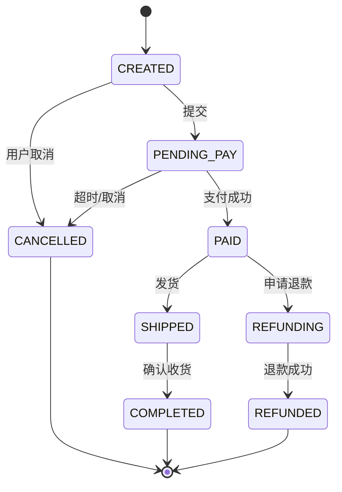

# 支付/订单状态机设计

<a id="oral-card"></a>

## 要点卡

[返回高频核心锚点](../../high-frequency-roadmap.md)

!!! abstract "30 秒回答"

    状态机用合法的 `(当前状态, 事件) → 下一状态` 约束订单或支付生命周期。并发回调通过数据库
    条件更新或 version CAS 决定唯一有效迁移，重复事件按业务 ID 幂等；状态变更与 outbox 在
    同一本地事务提交，再异步执行通知等副作用。状态机不能自动回滚已经发生的外部动作，失败时
    要设计新的补偿事件、对账和人工恢复。

**3 分钟展开**

1. 先区分事实状态、命令和事件；终态、可逆迁移和非法迁移必须文档化。
2. 用 `UPDATE ... WHERE status=? AND version=?` 防止支付成功、取消和超时任务互相覆盖。
3. 状态事实与 outbox 原子提交；worker 处理发货、退款、发布等外部副作用，结果再以新事件推进。
4. 记录迁移 actor、reason、event ID、前后状态和版本，监控卡单时长、非法迁移和补偿积压。

| 记忆槽 | 内容 |
|--------|------|
| 三个不变量 | 每次迁移必须验证 from-state；重复事件不能重复副作用；补偿是新动作而非时间倒流 |
| 手画图 | `PENDING --pay_success→ PAID --refund_req→ REFUNDING → REFUNDED`，并画 `timeout → CANCELLED` 竞争 |
| 项目落点 | Launchpad 类 DEX 的订单/返佣提现，或 Agent 的 draft→review→execute；明确哪个系统保存权威状态 |
| 一个取舍 | 代码 FSM 简单直接；工作流引擎擅长长流程与定时恢复，但增加运行时、版本和运维成本 |

**错误表达**

- ❌ “有了状态枚举就是状态机；Saga 能自动回滚所有外部操作。”
- ✅ “状态机必须约束迁移和并发；Saga 依赖显式、可能失败的补偿动作。”

**自测追问**：支付成功与用户取消同时到达怎么办？状态更新成功但 MQ 事件没发出去如何恢复？

## 10 分钟版（原理 + 图示）


```mermaid
stateDiagram-v2
  [*] --> CREATED
  CREATED --> PENDING_PAY: 提交
  CREATED --> CANCELLED: 用户取消
  PENDING_PAY --> PAID: 支付成功
  PENDING_PAY --> CANCELLED: 超时/取消
  PAID --> SHIPPED: 发货
  PAID --> REFUNDING: 申请退款
  SHIPPED --> COMPLETED: 确认收货
  REFUNDING --> REFUNDED: 退款成功
  CANCELLED --> [*]
  COMPLETED --> [*]
  REFUNDED --> [*]
```

**状态与事件表（示例）**

| 当前状态 | 事件 | 下一状态 | 副作用 |
|----------|------|----------|--------|
| CREATED | SUBMIT | PENDING_PAY | 锁库存 |
| PENDING_PAY | PAY_SUCCESS | PAID | 通知仓库 |
| PENDING_PAY | TIMEOUT | CANCELLED | 释库存 |
| PAID | SHIP | SHIPPED | 物流单号 |
| PAID | REFUND_REQ | REFUNDING | 冻结 |

**容量估算**

- 不能用“单条 `UPDATE` 约 1ms”直接推出固定的单库 TPS；并发事务、索引、日志刷盘、锁冲突、
  连接池、硬件和复制策略都会改变上限。应以真实事务组合压测，观察吞吐、P95/P99、锁等待、
  redo/binlog、复制延迟和故障余量后再决定分片或异步边界。
- 若状态事件峰值达到 1 万 TPS，理论原始量级约为 **8.64 亿条/天**，但这只是容量输入；
  还要带上峰谷、重试、保留期、压缩、索引和副本系数，不能直接变成生产结论。

**并发控制**

- **乐观锁**：`version` 自增，冲突返回业务错误重试。
- **悲观锁**：`SELECT FOR UPDATE` 低并发关单场景。
- **幂等**：支付 `transaction_id` UNIQUE，重复回调直接返回。

## 生产场景

- **电商订单全链路**：创建 → 支付 → 发货 → 完成 → 售后。
- **支付中台**：`INIT → PROCESSING → SUCCESS/FAILED`。
- **可观测**：各状态停留时长、卡单量（PENDING_PAY > 30min）、非法迁移告警。

## 排查与工具

| 现象 | 排查 |
|------|------|
| 卡单 | 回调丢失、状态未迁移 |
| 重复发货 | 缺少幂等、非法迁移未拦 |
| 库存不一致 | 迁移与副作用非原子 |
| 乱序 | MQ 无 partition key |

## 架构取舍

| 方案 | 适用 | 不适用 |
|------|------|--------|
| 表驱动 FSM | 清晰、可审计 | 状态爆炸（>20） |
| 代码 switch | 简单流程 | 频繁变更 |
| Temporal/Saga | 长流程、补偿 | 简单订单 |
| Event Sourcing | 完整审计 | 团队成熟度要求高 |

## 深挖问答

1. **支付成功和用户取消同时到？** → DB 条件更新谁先谁赢；失败方补偿（退款/释库存）。
2. **状态存在 Redis 还是 DB？** → SoT 在 DB；Redis 可缓存展示。
3. **如何做状态机可视化？** → 表 `state_transitions` + 管理后台；或 Mermaid 文档即代码。
4. **Go 怎么写 FSM？** → `looplab/fsm` 或自研 map[[2]string]string；核心仍是 DB CAS。
5. **部分发货怎么建模？** → 子订单/包裹级状态机，主订单聚合。

## 反模式与事故

- `if paid { ship }` 散落各处，漏分支。
- 无 version，并发覆盖状态。
- 副作用在状态更新前执行，更新失败难回滚。
- 用 int 魔法数字无枚举，运维看不懂。

## 代码示例

```go
type OrderStatus string

const (
    StatusPendingPay OrderStatus = "PENDING_PAY"
    StatusPaid       OrderStatus = "PAID"
    StatusCancelled  OrderStatus = "CANCELLED"
)

func (s *OrderService) PaySuccess(ctx context.Context, orderID int64, txnID string) error {
    return s.db.Transaction(func(tx *gorm.DB) error {
        res := tx.Model(&Order{}).
            Where("id = ? AND status = ?", orderID, StatusPendingPay).
            Updates(map[string]any{
                "status":     StatusPaid,
                "pay_txn_id": txnID,
                "version":    gorm.Expr("version + 1"),
            })
        if res.Error != nil {
            return res.Error
        }
        if res.RowsAffected == 0 {
            // 已支付或已取消 — 查现态幂等返回
            return s.idempotentReturn(ctx, orderID, txnID)
        }
        return s.outbox.Publish(tx, "order.paid", orderID)
    })
}
```

## 延伸阅读

- [Saga Pattern](https://microservices.io/patterns/data/saga.html)
- [looplab/fsm](https://github.com/looplab/fsm)
