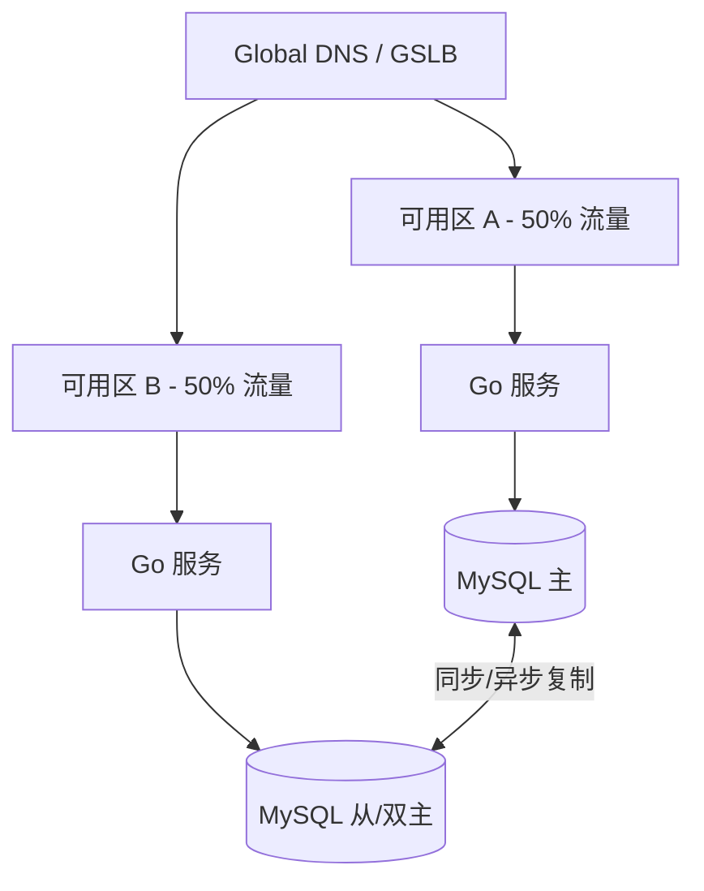

# 多活、异地容灾与 RPO/RTO

## 30 秒版（开场）

> **RPO** = 可丢多少数据（Recovery Point Objective）；**RTO** = 恢复要多久。多活是双城同时接流量；冷备 RTO 长、成本低。生产关键词：**同城双活、异地多活、单元化、数据复制 lag**。

## 3 分钟版（一面深度）

1. **是什么**：DR = 机房/地域故障后业务连续性；多活 = 多机房同时服务；RPO/RTO 是业务 SLA 指标。
2. **为什么**：单机房火灾、光缆切断、云区域故障——年度可用性 99.99% 仍可能宕数小时。
3. **怎么做**：同城双活（同步复制，RPO≈0）；异地多活（异步，RPO 秒~分钟）；单元化按 user_id 路由；DNS/GSLB 切流；定期演练。

## 10 分钟版（原理 + 图示）



**架构层级**

| 模式 | RPO | RTO | 成本 | 适用 |
|------|-----|-----|------|------|
| 冷备 | 小时~天 | 小时 | 低 | 非核心 |
| 温备 | 分钟 | 30min | 中 | 内部系统 |
| 热备（主从） | 秒~0 | 分钟 | 中高 | 核心交易 |
| 同城双活 | ≈0 | 秒（自动） | 高 | 金融同城 |
| 异地多活 | 秒~分钟 | 秒 | 很高 | 超大厂 |

**容量估算（双活）**

- 单城容量 10 万 QPS，双活每城常态 **5 万 QPS**，故障时单城扛 **10 万**（需 100% 冗余）。
- 跨城复制带宽：写 1 万 TPS × 2KB = **20 MB/s** 异步复制；同步则 RT 增加 20~40ms。

**单元化（Set 化）**

- 用户按 `user_id % N` 绑定单元，单元内闭环 DB+缓存，跨单元调用走 RPC。
- 故障切单元比切整城粒度更细。

## 生产场景

- **支付核心**：同城双活 + 异地冷备，RPO=0，RTO<5min。
- **内容 Feed**：异地多活，RPO 1min 可接受，CDN 兜底读。
- **可观测**：复制 lag、GSLB 健康检查、切流演练记录。

## 排查与工具

| 工具 | 用途 |
|------|------|
| `SHOW SLAVE STATUS` | 复制 lag |
| 混沌工程（机房隔离） | 验证 RTO |
| 对账任务 | 双活数据漂移 |
| 多活路由配置 | 流量比例 |

## 架构取舍

| 方案 | 适用 | 不适用 |
|------|------|--------|
| 同城双活 | 低延迟同步 | 跨地震带 |
| 异地多活 | 全局用户 | 强一致写 |
| 单元化 | 超大规模 | 小团队 |
| 冷备 | 成本敏感 | RTO<15min 要求 |

## 追问链

1. **双活写冲突？** → 单元化避免；或 LWW + 业务合并；金融用主备非双写。
2. **DNS 切流慢？** → TTL 调低 + GSLB 秒级；客户端多 endpoint 重试。
3. **Redis 多活？** → CRDT/异步复制，接受短暂不一致；或分片各城独立。
4. **Go 服务如何无状态多活？** → 会话 Redis；配置中心多活；对象存储跨区复制。
5. **如何量化 RPO？** → 复制 lag 秒数 × 写入 TPS = 可能丢失条数。

## 反模式与事故

- 备份从未恢复演练，真灾备磁盘损坏。
- 双活共用一个 Redis，机房隔离后脑裂。
- 异步复制 lag 10min 未告警，切城丢 10min 订单。
- 把「多副本 K8s」当异地 DR。

## 代码示例

```go
// 单元路由 — 按 user_id 选 DB 单元
func RouteUnit(userID int64, unitCount int) int {
    return int(userID % int64(unitCount))
}

func (p *DBPool) Get(ctx context.Context, userID int64) *sql.DB {
    unit := RouteUnit(userID, len(p.units))
    return p.units[unit]
}

// 健康检查 — GSLB 探活
func HealthHandler(w http.ResponseWriter, r *http.Request) {
    if err := checkLocalDB(r.Context()); err != nil {
        http.Error(w, "unhealthy", http.StatusServiceUnavailable)
        return
    }
    w.WriteHeader(http.StatusOK)
}
```

## 延伸阅读

- [AWS Disaster Recovery](https://aws.amazon.com/disaster-recovery/)
- [阿里云单元化架构实践（公开资料）](https://developer.aliyun.com/article/715043)
