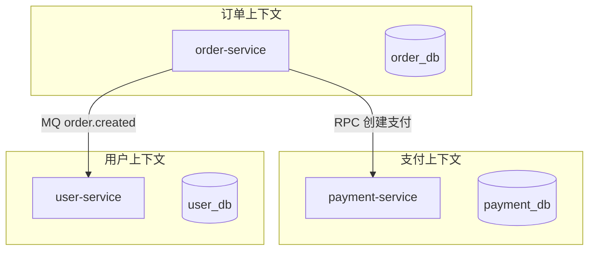

# 微服务拆分边界与何时不该拆

## 30 秒版（开场）

> 拆分边界按 **业务域（Bounded Context）+ 变更频率 + 团队 Conway 定律**，不是按表或按层。过早拆分带来 **分布式事务、链路延迟、运维爆炸**。生产关键词：**高内聚低耦合、数据所有权、API 契约**。

## 3 分钟版（一面深度）

1. **是什么**：每个服务拥有独立数据与发布周期，通过 API/MQ 协作。
2. **为什么**：单体过大时编译慢、部署牵一发动全身；但微服务不是银弹。
3. **怎么做**：识别核心域（订单、支付、用户）；一服务一 DB；同步调用少、异步多；共享库只放 proto/工具，不共享业务逻辑。

## 10 分钟版（原理 + 图示）



**拆分原则**

| 原则 | 说明 |
|------|------|
| 业务能力 | 按域而非技术层（auth-service 全栈） |
| 数据所有权 | 禁止跨库 JOIN，需 API 聚合 |
| 变更耦合 | 总是一起改的不拆 |
| 团队规模 | 两披萨团队 ~8 人一服务 |
| 性能边界 | 高频本地调用不拆 RPC |

**何时不该拆**

- 团队 < 10 人，运维无 K8s/可观测成熟度。
- 强一致跨表事务为主，无 Saga 能力。
- QPS < 1000，单体足够。
- 「先拆再说」无域建模，变成分布式单体。

**容量与成本**

- 单体 1 万 QPS，P99 10ms；拆 5 服务串行 RPC 各 5ms → P99 **25ms+**（含网络）。
- 5 服务 × 3 副本 = 15 部署单元，日志/trace 成本 ×5。

## 生产场景

- **电商**：订单、库存、支付、营销——库存与订单可拆，营销读多可独立扩。
- **错误拆分**：`user-service` + `user-db-service` + `user-cache-service` 过度碎片化。
- **可观测**：服务间调用拓扑、循环依赖检测。

## 排查与工具

| 工具 | 用途 |
|------|------|
| 依赖图 / service mesh | 调用链复杂度 |
| 变更共现分析 | Git 哪些模块总是一起改 |
| 领域事件风暴 | DDD 工作坊划界 |
| OpenAPI 契约测试 | 跨团队 API 稳定 |

## 架构取舍

| 方案 | 适用 | 不适用 |
|------|------|--------|
| 模块化单体 | 中小团队、快速迭代 | 多团队抢同一代码库 |
| 微服务 | 多团队、独立扩缩 | 小团队、强一致 |
| BFF 聚合 | 移动端多样 API | 简单 CRUD |
| 共享 DB 反模式 | — | 永远避免 |

## 追问链

1. **订单和库存拆不拆？** → 可拆，用 Saga/事件；秒杀期库存可独立扩。
2. **分布式单体是什么？** → 拆了很多服务但共享 DB、紧耦合 RPC，最糟组合。
3. **Go 微服务通信用什么？** → gRPC 内部、REST 对外；MQ 解耦。
4. **如何防止循环依赖？** → 单向依赖规则、MQ 事件、防腐层 ACL。
5. **何时从单体再合并？** → 调用 1:1、无独立扩缩需求、运维成本 > 收益。

## 反模式与事故

- 按「Controller/Service/DAO」三层拆三个服务。
- 服务 A 直接读服务 B 的数据库。
- 无 API 版本，改字段拖垮所有消费者。
- 20 个微服务，On-call 一人看不懂全局。

## 代码示例

```go
// 防腐层 — 订单域不依赖支付内部模型
type PaymentPort interface {
    CreatePayment(ctx context.Context, req CreatePaymentCmd) (PaymentRef, error)
}

type paymentACL struct {
    client payv1.PaymentServiceClient
}

func (a *paymentACL) CreatePayment(ctx context.Context, cmd CreatePaymentCmd) (PaymentRef, error) {
    resp, err := a.client.Create(ctx, &payv1.CreateRequest{
        OrderId: cmd.OrderID,
        Amount:  cmd.AmountCents,
    })
    if err != nil {
        return PaymentRef{}, err
    }
    return PaymentRef{ID: resp.PaymentId}, nil
}
```

## 延伸阅读

- [Microservices - Martin Fowler](https://martinfowler.com/articles/microservices.html)
- [Domain-Driven Design - Bounded Context](https://www.domainlanguage.com/ddd/)
