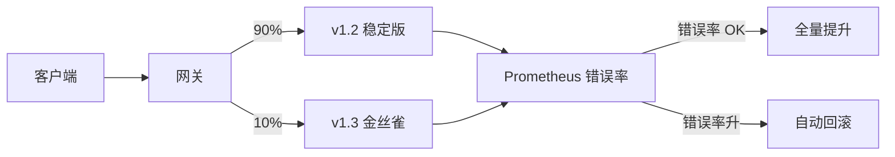

# API 版本、灰度发布与特性开关

## 30 秒版（开场）

> **API 版本**保兼容（URL `/v2` 或 Header）；**灰度**用小流量验证新版本；**Feature Flag** 在运行时开关行为无需发版。生产关键词：**向后兼容、可回滚、Flag 生命周期**。

## 3 分钟版（一面深度）

1. **是什么**：版本 = 契约演进；灰度 = 按比例/用户切新版本；Flag = 配置中心控制功能开闭。
2. **为什么**：大爆炸发布风险高；A/B 实验；紧急关功能比回滚镜像快。
3. **怎么做**：Additive 变更优先；双写/read fallback；K8s Argo Rollouts/ Istio 权重；LaunchDarkly/自研 Flag 服务 + 缓存。

## 10 分钟版（原理 + 图示）



**API  versioning 策略**

| 策略 | 优点 | 缺点 |
|------|------|------|
| URL `/v1/users` | 直观 | URL 膨胀 |
| Header `Accept-Version` | URL 干净 | 缓存/CDN 复杂 |
| 字段版本 | 细粒度 | 客户端解析复杂 |

**灰度维度**

- 流量比例：1% → 5% → 50% → 100%。
- 用户白名单：内部员工 → VIP → 全量。
- 地域：先单 AZ。

**Feature Flag 类型**

| 类型 | 生命周期 | 示例 |
|------|----------|------|
| Release | 短期，上线后删 | 新 checkout 流程 |
| Ops | 长期 | 降级开关 |
| Experiment | A/B 周期 | 推荐算法 B |
| Permission | 长期 | 企业版功能 |

**容量估算**

- 灰度 10% 到 100 Pod 集群 → 先 **10 Pod 新版本**，错误率采样需足够（至少 1 万请求/5min）。

## 生产场景

- **支付接口 v2**：v1 保留 6 个月，响应加 `deprecated` header。
- **大促新秒杀逻辑**：Flag 关闭时走旧路径，秒级回滚。
- **可观测**：金丝雀 vs 稳定版错误率、P99 对比；Flag 评估事件。

## 排查与工具

| 工具 | 用途 |
|------|------|
| Argo Rollouts / Flagger | 自动金丝雀 |
| Istio VirtualService | 流量权重 |
| 配置中心 / LaunchDarkly | Feature Flag |
| OpenAPI diff | 破坏性变更检测 |

## 架构取舍

| 方案 | 适用 | 不适用 |
|------|------|--------|
| URL 版本 | 公共 API | 超大量内部 RPC |
| 双栈并行 | 大改版 | 小 bugfix |
| Flag 降级 | 紧急关功能 | 数据 schema 变更 |
| 蓝绿 | 快速切换 | 双倍资源成本 |

## 追问链

1. **破坏性变更怎么发？** → 新版本 endpoint；旧版只增不删字段；deprecation 周期。
2. **灰度失败自动回滚条件？** → 5xx 率 > 基线 2 倍或 P99 > SLO。
3. **Flag 太多怎么办？** → 定期清理；技术债 sprint；Flag 默认 off。
4. **Go 如何读 Flag？** → 启动拉配置 + 长轮询/Watch；本地 atomic.Value 缓存。
5. **客户端版本和 API 版本？** → Mobile 强绑 App 版本；后端需多版本共存。

## 反模式与事故

- Flag 默认 on 上线，无法关。
- 删字段未升 major 版本，老 App 崩溃。
- 灰度无监控，全量后才发现内存泄漏。
- 1000 个永久 Flag，代码不可读。

## 代码示例

```go
type FeatureFlags struct {
    v atomic.Value // map[string]bool
}

func (f *FeatureFlags) Enabled(key string) bool {
    m, _ := f.v.Load().(map[string]bool)
    return m[key]
}

func (f *FeatureFlags) Watch(ctx context.Context, pull func() map[string]bool) {
    t := time.NewTicker(10 * time.Second)
    for {
        select {
        case <-ctx.Done():
            return
        case <-t.C:
            f.v.Store(pull())
        }
    }
}

// 路由版本
mux.Handle("/v1/order", v1Handler)
mux.Handle("/v2/order", v2Handler)
```

## 延伸阅读

- [Feature Toggles（Martin Fowler）](https://martinfowler.com/bliki/FeatureToggle.html)
- [Argo Rollouts 文档](https://argo-rollouts.readthedocs.io/)
