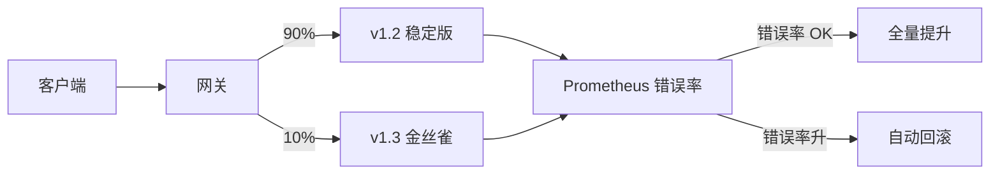

# API 版本、灰度发布与特性开关

<a id="oral-card"></a>

## 要点卡

[返回 P0 知识图谱](../_meta/p0-knowledge-graph.md)

!!! abstract "30 秒回答"

    API 版本隔离不兼容契约，不会自动保证兼容；灰度用可归因的小流量和稳定版基线验证；
    Feature Flag 把代码部署与功能启用解耦。真正可回滚必须同时覆盖应用、配置、消息和数据：
    schema 用 expand-migrate-contract，路由对有状态用户保持 sticky，指标除 5xx/P99 还比较业务不变量，
    Flag 要有安全默认、owner、expiry 和 last-known-good。

**3 分钟展开**

1. 优先做兼容演进并用 consumer-driven contract/OpenAPI diff 验证；不兼容变化进入新版本和明确迁移期。
2. 金丝雀按用户/tenant 稳定分桶，和 stable 同窗口对比技术指标、业务成功率与数据正确性；阈值和样本量来自基线/SLO。
3. 镜像回滚不会撤销已写数据或外部副作用；迁移要前后向兼容，必要时双读/双写并设计补偿。
4. Flag 配置失联使用缓存的已验证版本或逐 flag 安全默认；启用旧路径前也要确认旧 schema 和数据仍兼容。

| 记忆槽 | 内容 |
|--------|------|
| 三个不变量 | 契约兼容有测试证据；灰度可归因可止损；回滚覆盖数据与副作用 |
| 手画图 | `sticky router → stable/canary → tech+business guard → promote/abort` |
| 项目落点 | Agent 工作流讲 tool/prompt 版本灰度；Launchpad 类 DEX 讲写路径迁移与账务对账 |
| 一个取舍 | Feature Flag 止损快，但长期 flag 增加状态组合、测试矩阵和配置依赖 |

**错误表达**

- ❌ “加 `/v2` 就保证兼容；镜像回滚可以恢复所有状态；10% 灰度固定够用。”
- ✅ “版本只隔离契约，数据迁移和外部副作用另行设计；灰度样本按风险和基线计算。”

**自测追问**：新版本已经写入旧版本无法读取的数据后，为什么仅回滚 Pod 不安全？

## 10 分钟版（原理 + 图示）


```mermaid
flowchart LR
  Client[客户端] --> GW[网关]
  GW -->|90%| Stable[v1.2 稳定版]
  GW -->|10%| Canary[v1.3 金丝雀]
  Stable --> Metrics[Prometheus 错误率]
  Canary --> Metrics
  Metrics -->|错误率 OK| Promote[全量提升]
  Metrics -->|错误率升| Rollback[自动回滚]
```

**API  versioning 策略**

| 策略 | 优点 | 缺点 |
|------|------|------|
| URL `/v1/users` | 直观 | URL 膨胀 |
| Header `Accept-Version` | URL 干净 | 缓存/CDN 复杂 |
| 字段版本 | 细粒度 | 客户端解析复杂 |

**灰度维度**

- 流量比例：按风险分阶段提升；百分比只是路由配置，是否足够取决于样本量与暴露时长。
- 用户白名单：内部员工 → VIP → 全量。
- 地域：先单 AZ。
- 状态相关请求：按 user/tenant/业务 key 稳定分桶，避免同一会话在新旧行为间跳动。

**Feature Flag 类型**

| 类型 | 生命周期 | 示例 |
|------|----------|------|
| Release | 短期，上线后删 | 新 checkout 流程 |
| Ops | 长期 | 降级开关 |
| Experiment | A/B 周期 | 推荐算法 B |
| Permission | 长期 | 企业版功能 |

**容量估算**

- “10% 流量”不等于“恰好 10% Pod”：副本数由容量与故障冗余决定，路由权重由网关/mesh 控制。样本量应按基线错误率、允许回归幅度和统计置信度计算，不能固定背 1 万请求。

## 生产场景

- **支付接口 v2**：迁移期由客户端分布和合同决定；可用标准 `Deprecation` 响应头（RFC 9745）、
  `Sunset`（RFC 8594）与文档链接传达时间表，而不是自定义 `deprecated` header。
- **大促新秒杀逻辑**：Flag 关闭时走旧路径，秒级回滚。
- **可观测**：金丝雀 vs 稳定版错误率、P99 对比；Flag 评估事件。

## 排查与工具

| 工具 | 用途 |
|------|------|
| Argo Rollouts / Flagger | 自动金丝雀 |
| Istio VirtualService | 流量权重 |
| 配置中心 / LaunchDarkly | Feature Flag |
| OpenAPI diff | 破坏性变更检测 |

## 架构取舍

| 方案 | 适用 | 不适用 |
|------|------|--------|
| URL 版本 | 公共 API | 超大量内部 RPC |
| 双栈并行 | 大改版 | 小 bugfix |
| Flag 降级 | 紧急关功能 | 数据 schema 变更 |
| 蓝绿 | 快速切换 | 双倍资源成本 |

## 深挖问答

1. **破坏性变更怎么发？** → 新版本 endpoint；旧版只增不删字段；deprecation 周期。
2. **灰度失败自动回滚条件？** → 预先定义相对/绝对 guardrail，覆盖 5xx、延迟、饱和、
   业务成功率和关键不变量，并满足最小样本；不能固定背“基线两倍”。
3. **Flag 太多怎么办？** → 定期清理并设 owner/expiry；失败默认应回到已验证的安全行为，不是所有类型都机械地 default off。
4. **Go 如何读 Flag？** → 启动拉配置 + 长轮询/Watch；本地 atomic.Value 缓存。
5. **客户端版本和 API 版本？** → Mobile 强绑 App 版本；后端需多版本共存。

## 反模式与事故

- Flag 默认 on 上线，无法关。
- 删字段未升 major 版本，老 App 崩溃。
- 灰度无监控，全量后才发现内存泄漏。
- 1000 个永久 Flag，代码不可读。

## 代码示例

```go
type FeatureFlags struct {
    v atomic.Value // 存入后视为 immutable 的 map[string]bool
}

func (f *FeatureFlags) Enabled(key string) bool {
    m, _ := f.v.Load().(map[string]bool)
    return m[key]
}

func (f *FeatureFlags) Watch(ctx context.Context, pull func() map[string]bool) {
    t := time.NewTicker(10 * time.Second)
    defer t.Stop()
    for {
        select {
        case <-ctx.Done():
            return
        case <-t.C:
            next := maps.Clone(pull()) // 发布快照后禁止原地修改
            f.v.Store(next)
        }
    }
}

// 路由版本
mux.Handle("/v1/order", v1Handler)
mux.Handle("/v2/order", v2Handler)
```

实际实现还要在启动时写入已验证的默认快照；配置中心短暂不可用时保留 last-known-good，
并对敏感 flag 的变更做鉴权、审计和回滚。

## 延伸阅读

- [Feature Toggles（Martin Fowler）](https://martinfowler.com/bliki/FeatureToggle.html)
- [Argo Rollouts 文档](https://argo-rollouts.readthedocs.io/)
- [RFC 9745 Deprecation Header](https://www.rfc-editor.org/rfc/rfc9745)
