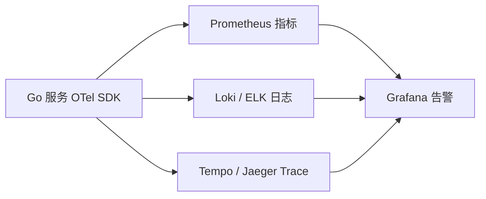

# 可观测性：日志、指标、链路

## 30 秒版（开场）

> 可观测性三板斧：**Metrics 告警、Logs 细节、Traces 因果**；Go 生产标配 **OpenTelemetry + Prometheus + 结构化 JSON 日志**。生产关键词：**RED/USE 方法、trace_id 贯通、采样**。

## 3 分钟版（一面深度）

1. **是什么**：Metrics = 聚合数值；Logs = 离散事件；Traces = 请求跨服务路径与耗时。
2. **为什么**：分布式下「哪个服务慢、哪条 SQL、是否重试」靠猜不行；MTTR 依赖可观测。
3. **怎么做**：每个请求生成 `trace_id` 写日志；HTTP/gRPC/DB/Redis 自动 span；Prometheus 暴露 `/metrics`；日志 ELK/Loki；Jaeger/Tempo 查链路。

## 10 分钟版（原理 + 图示）



**RED vs USE**

| 方法 | 适用 | 指标 |
|------|------|------|
| RED | 请求驱动服务 | Rate, Errors, Duration |
| USE | 资源 | Utilization, Saturation, Errors |

**Go 关键指标（示例）**

| 指标 | 类型 | 说明 |
|------|------|------|
| `http_request_duration_seconds` | Histogram | P50/P99 |
| `http_requests_total` | Counter | 按 status code |
| `go_goroutines` | Gauge | 泄漏检测 |
| `process_resident_memory_bytes` | Gauge | OOM 预警 |
| `db_pool_in_use` | Gauge | 连接池饱和 |

**容量估算**

- Trace 采样：100% 存储 10 万 QPS × 10 span × 1KB ≈ **1 GB/s** 不可承受 → **头部采样 1~10%** + 错误全采。
- 日志：10 万 QPS × 500B/条 ≈ **50 MB/s**，需异步写 + 采样 debug。

## 生产场景

- **P99 飙升**：Grafana 看 RED → Trace 找慢 span → 日志搜 trace_id 看参数。
- **间歇 502**：指标看 upstream 错误率 + 连接池。
- **Go GC 毛刺**：`go_gc_duration_seconds` + pprof heap。

## 排查与工具

| 工具 | 用途 |
|------|------|
| OpenTelemetry Go | Trace/Metric 统一 SDK |
| Prometheus + Alertmanager | 告警 |
| `go tool pprof` / trace | 进程内 |
| Grafana Explore | 日志+指标+Trace 关联 |
| `slog` / zap | 结构化日志 |

路径：**告警 → 指标定位服务 → Trace 定位 span → 日志定位参数 → pprof 定位代码**。

## 架构取舍

| 方案 | 适用 | 不适用 |
|------|------|--------|
| OTel 统一 | 新标准、多后端 | 极老系统 |
| 100% Trace | 低 QPS、支付核心 | 高 QPS 默认 |
| 同步写日志 | 开发 | 生产热路径 |
| 仅 Metrics | 资源监控 | 请求级根因 |

## 追问链

1. **Metrics 和 Logs 区别？** → Metrics 便宜聚合告警；Logs 贵但含上下文。
2. **trace_id 怎么传递？** → W3C `traceparent` Header；gRPC metadata；`context.Context`。
3. **Go 用什么日志库？** → Go 1.21+ `log/slog`；高性能 zap；避免 fmt 拼接。
4. **Histogram 分桶怎么设？** → 按 SLO（如 10ms,50ms,100ms,500ms,1s）。
5. **如何避免高 cardinality？** → 不要把 user_id 作 label；用 trace 查个体。

## 反模式与事故

- 日志无 trace_id，跨服务无法关联。
- Prometheus label 爆炸（URL 全路径），TSDB 宕机。
- 只 collect 不告警，故障用户先发现。
- Debug 日志生产全开，IO 打满。

## 代码示例

```go
import (
    "log/slog"
    "go.opentelemetry.io/otel"
    "go.opentelemetry.io/otel/attribute"
)

func HandleOrder(ctx context.Context, id int64) error {
    ctx, span := otel.Tracer("order").Start(ctx, "HandleOrder")
    defer span.End()
    span.SetAttributes(attribute.Int64("order.id", id))

    slog.InfoContext(ctx, "processing order",
        slog.Int64("order_id", id),
        // trace_id 由 slog OTel handler 自动注入
    )
    return process(ctx, id)
}
```

## 延伸阅读

- [OpenTelemetry Go](https://opentelemetry.io/docs/languages/go/)
- [Google SRE - Monitoring Distributed Systems](https://sre.google/sre-book/monitoring-distributed-systems/)
- [Prometheus Best Practices](https://prometheus.io/docs/practices/naming/)
