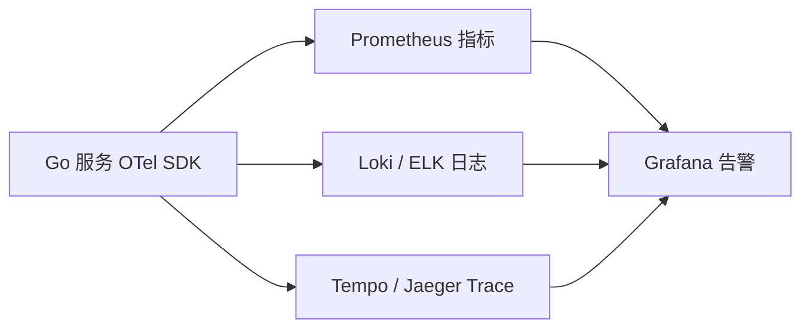

# 可观测性：日志、指标、链路

<a id="oral-card"></a>

## 要点卡

[返回 P0 知识图谱](../_meta/p0-knowledge-graph.md)

!!! abstract "30 秒回答"

    可观测性要从用户目标和故障问题反推信号：**Metrics 看趋势与告警、Logs 记录离散事实、
    Traces 还原跨服务因果，Profiles 定位代码级资源消耗**。OpenTelemetry 是采集与传输框架，
    不是存储后端；具体采用 Prometheus、Loki、Tempo 或商业平台取决于现有栈。设计时必须同时
    控制基数、采样、敏感数据和成本。

**3 分钟展开**

1. **是什么**：Metrics = 聚合数值；Logs = 离散事件；Traces = 请求跨服务路径与耗时。
2. **为什么**：分布式下「哪个服务慢、哪条 SQL、是否重试」靠猜不行；MTTR 依赖可观测。
3. **怎么做**：按 W3C Trace Context 等标准传播上下文，把 `trace_id/span_id` 关联到结构化日志；
   为 HTTP/gRPC/DB 等关键边界埋点，指标标签保持低基数；按 SLO、故障保留需求和成本选择头采样
   或尾采样，后端产品不是正确性的前提。

| 记忆槽 | 内容 |
|--------|------|
| 三个不变量 | 信号从用户问题反推；跨信号上下文要可关联；指标基数、采样、PII 和成本必须有界 |
| 手画图 | `request → metrics/logs/traces/profiles → collector → backends → SLO/diagnosis` |
| 项目落点 | 用实际实时风控、Agent 工作流或链路监听说明从告警到 trace、日志和 profile 的定位路径；只引用本人实际参与部分和可解释指标 |
| 一个取舍 | 头采样成本低但未知结果；尾采样可保错误/慢链路却需要缓存完整 trace 和更多资源 |

**错误表达**

- ❌ “OpenTelemetry 就是监控后端；所有请求 100% trace 最完整；user_id 可直接放 metric label。”
- ✅ “OTel 负责采集/传输而非存储；采样与低基数设计是生产正确性和成本的一部分。”

**自测追问**：什么时候用 metrics、logs、traces、profiles？为什么 trace_id 适合日志字段却通常不适合指标标签？

## 10 分钟版（原理 + 图示）


```mermaid
flowchart LR
  App[Go 服务 OTel SDK] --> Prom[Prometheus 指标]
  App --> Loki[Loki / ELK 日志]
  App --> Tempo[Tempo / Jaeger Trace]
  Prom --> Grafana[Grafana 告警]
  Loki --> Grafana
  Tempo --> Grafana
```

**RED vs USE**

| 方法 | 适用 | 指标 |
|------|------|------|
| RED | 请求驱动服务 | Rate, Errors, Duration |
| USE | 资源 | Utilization, Saturation, Errors |

**Go 关键指标（示例）**

| 指标 | 类型 | 说明 |
|------|------|------|
| `http_request_duration_seconds` | Histogram | 按 bucket 聚合并估算分位数/SLO 好事件比例 |
| `http_requests_total` | Counter | 按 status code |
| `go_goroutines` | Gauge | 泄漏检测 |
| `process_resident_memory_bytes` | Gauge | OOM 预警 |
| `db_pool_in_use` | Gauge | 连接池饱和 |

**容量估算（以下只用于演示量级，不能当产品默认值）**

- Trace 采样：假设 10 万 QPS、每请求 10 span、每 span 1KB，原始量级约 **1 GB/s**，
  尚未计索引、复制和协议开销，通常不能全量长期保留。头采样可在入口提前控成本，但当时还
  不知道最终是否错误；若要优先保留错误/慢链路，可在 Collector 或支持该能力的后端做尾采样，
  并为缓存完整 trace 的成本与丢弃策略做容量设计。
- 日志：10 万 QPS × 500B/条 ≈ **50 MB/s**，需异步写 + 采样 debug。

## 生产场景

- **P99 飙升**：Grafana 看 RED → Trace 找慢 span → 日志搜 trace_id 看参数。
- **间歇 502**：指标看 upstream 错误率 + 连接池。
- **Go GC/调度毛刺**：先看 runtime/metrics 中的 GC CPU、assist、heap goal、scheduler latency，
  再用 execution trace、CPU/heap profile 定位；只看 GC pause 单一指标可能漏掉并发标记与 assist 成本。

## 排查与工具

| 工具 | 用途 |
|------|------|
| OpenTelemetry Go | 按当前稳定性支持采集、传播与导出信号 |
| Prometheus + Alertmanager | 告警 |
| `go tool pprof` / trace | 进程内 |
| Grafana Explore | 日志+指标+Trace 关联 |
| `slog` / zap | 结构化日志 |

路径：**告警 → 指标定位服务 → Trace 定位 span → 日志定位参数 → pprof 定位代码**。

## 架构取舍

| 方案 | 适用 | 不适用 |
|------|------|--------|
| OTel 统一 | 新标准、多后端 | 极老系统 |
| 100% Trace | 短时诊断，或低 QPS 且容量/合规已验证 | 高 QPS 默认长期保留 |
| 同步写日志 | 开发 | 生产热路径 |
| 仅 Metrics | 资源监控 | 请求级根因 |

## 深挖问答

1. **Metrics 和 Logs 区别？** → Metrics 便宜聚合告警；Logs 贵但含上下文。
2. **trace_id 怎么传递？** → W3C `traceparent` Header；gRPC metadata；`context.Context`。
3. **Go 用什么日志库？** → Go 1.21+ `log/slog`；高性能 zap；避免 fmt 拼接。
4. **Histogram 分桶怎么设？** → 让 SLO 阈值成为明确边界，并结合真实延迟分布、可接受误差
   和后端成本设置；不能照抄一组通用 bucket。
5. **如何避免高 cardinality？** → 不要把 user_id 作 label；用 trace 查个体。

## 反模式与事故

- 日志无 trace_id，跨服务无法关联。
- Prometheus label 爆炸（URL 全路径），TSDB 宕机。
- 只 collect 不告警，故障用户先发现。
- Debug 日志生产全开，IO 打满。

## 代码示例

```go
import (
    "log/slog"
    "go.opentelemetry.io/otel"
    "go.opentelemetry.io/otel/attribute"
)

func HandleOrder(ctx context.Context, id int64) error {
    ctx, span := otel.Tracer("order").Start(ctx, "HandleOrder")
    defer span.End()
    span.SetAttributes(attribute.Int64("order.id", id))

    slog.InfoContext(ctx, "processing order",
        slog.Int64("order_id", id),
        // 标准 slog 不会自动注入 trace_id；
        // 需自定义/第三方 OTel-aware Handler 从 ctx 提取 SpanContext。
    )
    return process(ctx, id)
}
```

## 延伸阅读

- [OpenTelemetry Go](https://opentelemetry.io/docs/languages/go/)
- [Google SRE - Monitoring Distributed Systems](https://sre.google/sre-book/monitoring-distributed-systems/)
- [Prometheus Best Practices](https://prometheus.io/docs/practices/naming/)
