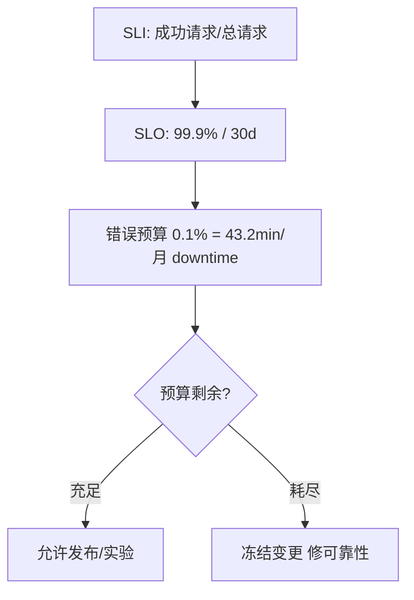

# SLO/SLI 与错误预算

## 30 秒版（开场）

> **SLI** 是可测量指标（如成功率）；**SLO** 是目标（99.9%）；**错误预算** = 1 - SLO，预算耗尽则停功能保稳定。生产关键词：**多窗口 burn rate、用户感知、发布门禁**。

## 3 分钟版（一面深度）

1. **是什么**：SLI 量化可靠性；SLO 对用户的承诺；错误预算允许「 planned 不可靠」换发布速度。
2. **为什么**：100% 可用不现实且昂贵；需要数据驱动「能否发版、能否做 risky 变更」。
3. **怎么做**：选关键路径 SLI（可用性、延迟）；28 天滚动窗口；Alert 用 burn rate 多窗口；预算 <20% 冻结非紧急发布。

## 10 分钟版（原理 + 图示）



**SLI 选型（API 服务）**

| SLI | 测量 | 典型 SLO |
|-----|------|----------|
| 可用性 | `2xx+3xx` / 总请求（或排除 4xx） | 99.9% |
| 延迟 | 请求 < 300ms 的比例 | 99% < 300ms |
| 正确性 | 业务成功 / 总请求 | 99.99% |

**错误预算计算**

- SLO 99.9% / 30 天 → 允许不可用 **0.1% × 30 × 24 × 60 ≈ 43.2 分钟**（或等价失败请求数）。
- 10 万 QPS × 30 天 ≈ 2.592×10¹¹ 请求 → 预算 **2.59×10⁸ 次失败**。

**Burn Rate 告警（Google SRE）**

| 窗口 | Burn Rate | 含义 |
|------|-----------|------|
| 1h | 14.4× | 1h 烧掉 30 天预算 2% → 紧急 |
| 6h | 6× | 6h 烧 5% → 高优 |
| 3d | 1× | 持续超 SLO → 低优 |

## 生产场景

- **大促前**：错误预算充足才批准 risky 变更；否则只容灾修复。
- **金丝雀**：新版本 burn rate 高于基线 2 倍自动回滚。
- **可观测**：SLI dashboard、预算剩余曲线、事故 postmortem 扣预算分析。

## 排查与工具

| 工具 | 用途 |
|------|------|
| Prometheus Recording Rules | SLI 预聚合 |
| Sloth / Pyrra | SLO 即代码 |
| Grafana SLO 面板 | 预算可视化 |
| Error Budget Policy 文档 | 团队共识 |

## 架构取舍

| 方案 | 适用 | 不适用 |
|------|------|--------|
| 请求成功率 SLI | HTTP API | 批处理作业 |
| 延迟 SLI | 用户体验 | 后台异步 |
| 多 SLO 组合 | 核心+非核心 | 指标过多无重点 |
| 99.99% SLO | 支付核心 | 内部工具 |

## 追问链

1. **SLA 和 SLO 区别？** → SLA 对外合同有赔偿；SLO 内部目标，通常严于 SLA。
2. **4xx 算不算错误？** → 客户端错误常排除；5xx 和超时算。
3. **依赖下游失败怎么算？** → 计入本服务 SLI，应用熔断/缓存保 SLO。
4. **Go 服务怎么埋 SLI？** → Prometheus histogram + counter；middleware 统一。
5. **预算耗尽团队做什么？** → 停发布、修 tech debt、加强测试、事故 review。

## 反模式与事故

- SLO 99999% 无法达成，团队麻木。
- SLI 选 CPU 利用率——与用户无关。
- 无预算政策，SLO 只是 dashboard 装饰。
- 排除所有 4xx/5xx「优化」SLO，自欺欺人。

## 代码示例

```go
// Prometheus SLI middleware 骨架
var (
    reqTotal = prometheus.NewCounterVec(
        prometheus.CounterOpts{Name: "http_requests_total"},
        []string{"method", "route", "status_class"},
    )
    reqDuration = prometheus.NewHistogramVec(
        prometheus.HistogramOpts{
            Name:    "http_request_duration_seconds",
            Buckets: []float64{.01, .05, .1, .3, 1, 3},
        },
        []string{"method", "route"},
    )
)

func statusClass(code int) string {
    switch {
    case code >= 500:
        return "5xx"
    case code >= 400:
        return "4xx"
    default:
        return "2xx"
    }
}
```

## 延伸阅读

- [Implementing SLOs - Google SRE Workbook](https://sre.google/workbook/implementing-slos/)
- [Sloth - SLO generator](https://github.com/slok/sloth)
