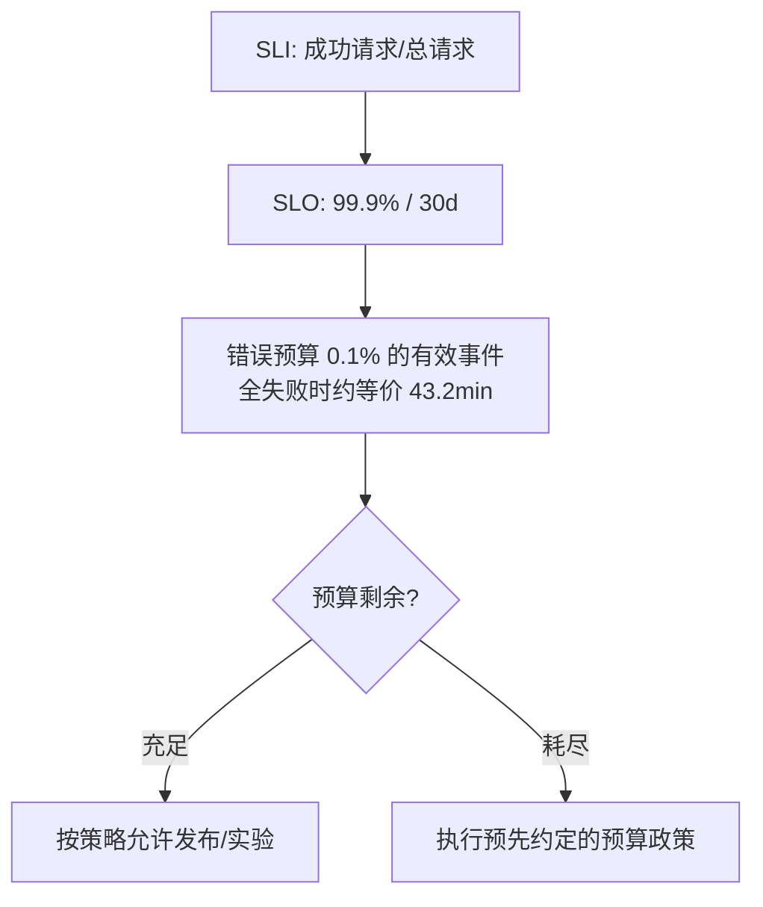

# SLO/SLI 与错误预算

<a id="oral-card"></a>

## 要点卡

[返回 P0 知识图谱](../_meta/p0-knowledge-graph.md)

!!! abstract "30 秒回答"

    **SLI** 是从用户视角定义的好事件比例或延迟分布，**SLO** 是在指定窗口内的目标；
    对比例型 SLO，允许错误率可写成 `1 - SLO`。错误预算用于平衡发布速度与可靠性，但“预算耗尽
    是否冻结发布”是团队策略，不是数学公式自动得出的动作。告警应使用多窗口、多 burn rate，
    同时控制发现速度和误报。

**3 分钟展开**

1. **是什么**：SLI 量化可靠性；SLO 是指定窗口内的内部目标；SLA 才通常涉及对外合同承诺。
   错误预算把“未达到 100% 目标的允许空间”转化为可靠性与变更速度的共同决策依据。
2. **为什么**：100% 可用不现实且昂贵；需要数据驱动「能否发版、能否做 risky 变更」。
3. **怎么做**：定义有效请求与好事件、测量位置和滚动窗口；延迟 SLI 用“低于阈值的好事件比例”
   而不是只看平均值；Alert 用长短窗口同时超过 burn-rate 阈值。冻结发布或只允许可靠性修复
   属于事先约定的 policy。

| 记忆槽 | 内容 |
|--------|------|
| 三个不变量 | 先定义 valid/good event 与窗口；错误预算和 SLI 同口径；告警要长短窗口同时判断 burn rate |
| 手画图 | `user events → SLI → rolling-window SLO → budget → multiwindow alerts → release policy` |
| 项目落点 | 用实际 API、链上确认或发布工作流说明成功、延迟、预期 4xx/限流如何分类；只引用本人实际参与部分和可解释指标 |
| 一个取舍 | 更高 SLO 减少预算并增加工程成本；较低 SLO 提高迭代空间但必须符合用户价值 |

**错误表达**

- ❌ “99.9% 就等于每月任意 43.2 分钟都可宕机；预算耗尽必然自动停止所有发布。”
- ✅ “43.2 分钟只是全失败的等价量；发布门禁是基于预算预先约定的组织策略。”

**自测追问**：为什么 1h/14.4× 还要配 5m 窗口？延迟 SLO 应用平均值还是好事件比例？

## 10 分钟版（原理 + 图示）


```mermaid
flowchart TB
  SLI[SLI: 成功请求/总请求] --> SLO[SLO: 99.9% / 30d]
  SLO --> Budget["错误预算 0.1% 的有效事件<br/>全失败时约等价 43.2min"]
  Budget --> Gate{预算剩余?}
  Gate -->|充足| Release[按策略允许发布/实验]
  Gate -->|耗尽| Freeze[执行预先约定的预算政策]
```

**SLI 选型（API 服务）**

| SLI | 测量 | 典型 SLO |
|-----|------|----------|
| 可用性 | 好事件 / 有效请求；按业务区分预期 4xx、限流和服务端失败 | 99.9% |
| 延迟 | 请求 < 300ms 的比例 | 99% < 300ms |
| 正确性 | 业务成功 / 总请求 | 99.99% |

**错误预算计算**

- SLO 99.9% / 30 天 → 错误预算是 0.1% 的有效事件；**43.2 分钟**只是“这段时间所有有效请求
  都失败”的等价连续不可用时长，不代表任何 43.2 分钟慢请求或部分失败都能直接这样换算。
- 10 万 QPS × 30 天 ≈ 2.592×10¹¹ 请求 → 预算 **2.59×10⁸ 次失败**。

**Burn Rate 告警（Google SRE 的 99.9% SLO 起始参数）**

| 窗口 | Burn Rate | 含义 |
|------|-----------|------|
| 1h | 14.4× | 1h 烧掉 30 天预算 2% → 紧急 |
| 6h | 6× | 6h 烧 5% → 高优 |
| 3d | 1× | 持续超 SLO → 低优 |

这些长窗口必须与更短窗口配对（例如 1h/5m、6h/30m、3d/6h）并同时超过阈值，不能只根据
单个窗口表格机械告警；具体参数应按 SLO 窗口、流量和 paging 成本调整。

## 生产场景

- **大促前**：错误预算充足才批准 risky 变更；否则只容灾修复。
- **金丝雀**：用新旧版本的 SLI、错误量与 burn rate 触发回滚；阈值和最小样本量按服务流量、
  SLO 与误报成本预先定义，不能统一背“高于基线 2 倍”。
- **可观测**：SLI dashboard、预算剩余曲线、事故 postmortem 扣预算分析。

## 排查与工具

| 工具 | 用途 |
|------|------|
| Prometheus Recording Rules | SLI 预聚合 |
| Sloth / Pyrra | SLO 即代码 |
| Grafana SLO 面板 | 预算可视化 |
| Error Budget Policy 文档 | 团队共识 |

## 架构取舍

| 方案 | 适用 | 不适用 |
|------|------|--------|
| 请求成功率 SLI | HTTP API | 批处理作业 |
| 延迟 SLI | 用户体验 | 后台异步 |
| 多 SLO 组合 | 核心+非核心 | 指标过多无重点 |
| 99.99% SLO | 支付核心 | 内部工具 |

## 深挖问答

1. **SLA 和 SLO 区别？** → SLA 通常是对外协议并可能包含后果；SLO 是内部工程目标，
   实践中常比 SLA 更严格，但不是定义上的必然关系。
2. **4xx 算不算错误？** → 按服务契约定义 valid/good event；无效客户端请求可能排除，
   但服务错误导致的 4xx、容量限流或关键业务拒绝不能机械排除。
3. **依赖下游失败怎么算？** → 若用户请求因此不满足 good event，通常仍计入端到端 SLI；
   是否另建依赖 SLI 用于归因，不改变用户视角事实。
4. **Go 服务怎么埋 SLI？** → Prometheus histogram + counter；middleware 统一。
5. **预算耗尽团队做什么？** → 执行预先约定的 error-budget policy，例如限制高风险发布、
   优先可靠性工作或要求额外审批；动作不是由公式自动决定。

## 反模式与事故

- 盲目设置 99.999% 等高目标却没有用户价值、依赖能力和成本证据，最终让团队对告警麻木。
- SLI 选 CPU 利用率——与用户无关。
- 无预算政策，SLO 只是 dashboard 装饰。
- 排除所有 4xx/5xx「优化」SLO，自欺欺人。

## 代码示例

```go
// Prometheus SLI middleware 骨架
var (
    reqTotal = prometheus.NewCounterVec(
        prometheus.CounterOpts{Name: "http_requests_total"},
        []string{"method", "route", "status_class"},
    )
    reqDuration = prometheus.NewHistogramVec(
        prometheus.HistogramOpts{
            Name:    "http_request_duration_seconds",
            Buckets: []float64{.01, .05, .1, .3, 1, 3},
        },
        []string{"method", "route"},
    )
)

func statusClass(code int) string {
    switch {
    case code >= 500:
        return "5xx"
    case code >= 400:
        return "4xx"
    case code >= 300:
        return "3xx"
    case code >= 200:
        return "2xx"
    default:
        return "other"
    }
}
```

## 延伸阅读

- [Implementing SLOs - Google SRE Workbook](https://sre.google/workbook/implementing-slos/)
- [Sloth - SLO generator](https://github.com/slok/sloth)
