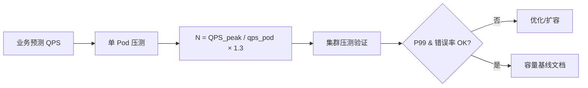

# 容量评估与压测方法论

## 30 秒版（开场）

> 容量规划 = **业务预测 × 单实例能力 × 冗余系数**；压测验证 **拐点 QPS、P99、资源饱和点**。生产关键词：**30% Headroom、阶梯加压、全链路、生产流量回放**。

## 3 分钟版（一面深度）

1. **是什么**：估算需要多少机器/DB/带宽；用压测证明设计在峰值下满足 SLO。
2. **为什么**：大促、增长、新功能上线前避免「上线即宕」；成本与可靠性平衡。
3. **怎么做**：Little 定律估并发；单实例 benchmark → 集群线性外推（打折扣）；k6/Vegeta 阶梯压测；监控 CPU/内存/连接池/GC 找瓶颈。

## 10 分钟版（原理 + 图示）



**Little 定律**

```
并发数 N = 到达率 λ × 平均响应时间 W
```

- 例：QPS=1000，P99=200ms → 并发 N ≈ 1000 × 0.2 = **200**（连接池、goroutine 需 >200）。

**容量估算模板**

| 项 | 公式/数值 |
|----|-----------|
| 峰值 QPS | 日常 × 3~10（大促 ×10~50） |
| 单 Pod QPS | 压测 P99<50ms 时最大稳定 QPS |
| Pod 数 | `ceil(QPS_peak / qps_pod × 1.3)` |
| DB 连接 | Pod数 × 每Pod连接 ≤ DB max_connections×0.7 |
| 带宽 | QPS × 响应字节 × 8 |
| Redis | QPS / 单分片能力(3~5万) |

**示例：10 万 QPS API**

- 单 Pod 5000 QPS → 100000/5000×1.3 = **26 Pod**
- 响应 2KB → 带宽 1.6 Gbps
- MySQL 回源 5% = 5000 QPS → 需读写分离 + 缓存

**压测类型**

| 类型 | 目的 |
|------|------|
| 基准 | 单接口最大 QPS |
| 负载 | 目标 QPS 下 SLO |
| 峰值 | 找到崩溃点 |
|  soak | 4~24h 内存泄漏 |
| 混沌 | 故障注入 |

## 生产场景

- **双 11 容量评审**：按去年峰值 1.5 倍预留，全链路压测含 MQ/DB。
- **Go 服务扩容**：HPA CPU 70% 触发，基于压测曲线设 maxReplicas。
- **可观测**：压测期间 RED、GC pause、DB slow query。

## 排查与工具

| 工具 | 用途 |
|------|------|
| k6 / Vegeta / wrk | HTTP 压测 |
| `go test -bench` | 微基准 |
| pprof / trace | 瓶颈分析 |
| 生产 shadow traffic | 真实流量形状 |

## 架构取舍

| 方案 | 适用 | 不适用 |
|------|------|--------|
| 线性外推 | 无状态水平扩展 | 有状态单点 |
| 生产压测 | 最真实 | 风险需隔离 |
| 独立压测环境 | 安全 | 数据/规模不一致 |
| 仅 CPU 扩容 | CPU bound | IO/DB bound |

## 追问链

1. **压测数据哪来？** → 生产采样脱敏；合成数据注意热点分布。
2. **为什么 ×1.3 冗余？** → 故障域、发布滚动、流量抖动；金融常 ×2。
3. **Go 压测看哪些？** → QPS、P99、GC、goroutine、heap、syscall。
4. **压测通过上线仍挂？** → 流量形状不同（热点 Key）、依赖未 mock、数据量不同。
5. **如何压 DB？** → 独立从库；限制连接；或用影子表。

## 反模式与事故

- 只压 HTTP 不压 MQ 消费者，lag 爆炸。
- 用 4 核笔记本压测推断 32 核生产。
- 无阶梯加压，瞬间打满触发 DDoS 防护。
- 压测账号打生产 DB 脏数据。

## 代码示例

```go
// Vegeta 目标函数示例 — 也可 go test benchmark
func BenchmarkHandler(b *testing.B) {
    h := NewHandler(testDeps)
    req := httptest.NewRequest(http.MethodGet, "/api/v1/item/1", nil)
    b.ResetTimer()
    for i := 0; i < b.N; i++ {
        rec := httptest.NewRecorder()
        h.ServeHTTP(rec, req)
        if rec.Code != http.StatusOK {
            b.Fatalf("status %d", rec.Code)
        }
    }
}

// 容量记录结构
type CapacityBaseline struct {
    Service     string
    PodSpec     string  // 8C16G
    MaxQPS      int     // P99<50ms
    MaxCPU      float64 // 0.7
    TestedAt    time.Time
}
```

## 延伸阅读

- [Google SRE - Handling Overload](https://sre.google/sre-book/handling-overload/)
- [k6 Load Testing](https://grafana.com/docs/k6/latest/)
- [Vegeta](https://github.com/tsenart/vegeta)
