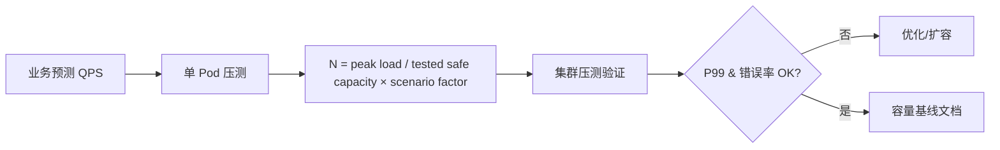

# 容量评估与压测方法论

<a id="oral-card"></a>

## 要点卡

[返回 P0 知识图谱](../_meta/p0-knowledge-graph.md)

!!! abstract "30 秒回答"

    容量规划把**业务负载模型、单元实测能力、故障场景和安全余量**连接起来；压测要找满足 SLO
    的最大稳定负载、排队拐点和资源饱和点，而不是只追峰值 QPS。Headroom 没有通用 30%：
    应由单可用区损失、滚动发布、增长误差和扩容时延反推，并通过阶梯、突发、耐久和故障压测验证。

**3 分钟展开**

1. **是什么**：估算需要多少机器/DB/带宽；用压测证明设计在峰值下满足 SLO。
2. **为什么**：大促、增长、新功能上线前避免「上线即宕」；成本与可靠性平衡。
3. **怎么做**：Little 定律估平均在途量；单实例测出 workload-specific 基线，再做集群压测验证
   共享依赖、热点和非线性效应；阶梯加压同时观察吞吐、P95/P99、错误、队列、连接池、GC 和下游。

| 记忆槽 | 内容 |
|--------|------|
| 三个不变量 | workload 必须可复现；容量取满足 SLO 的最大稳定负载；headroom 由故障/发布/扩容场景反推 |
| 手画图 | `forecast → unit load test → saturation knee → cluster/dependency test → scenario factor → verify` |
| 项目落点 | 用实际 API、索引器、行情或风控链路说明 payload、命中率、fan-out、持久化和 P99 口径；只引用本人实际参与部分和可解释指标 |
| 一个取舍 | 高利用率省成本但缩小故障余量；更多 headroom 提升韧性却增加成本，需由 SLO 与扩容时延决定 |

**错误表达**

- ❌ “CPU 没到 70% 就有容量；单 Pod 5000 QPS，20 Pod 必然线性到 10 万；统一预留 30%。”
- ✅ “吞吐会受共享 DB、热点、队列和负载均衡影响；比例和余量都必须由场景压测证明。”

**自测追问**：Little 定律为什么用平均系统时间而不是 P99？如何测试单 AZ 故障同时滚动发布？

## 10 分钟版（原理 + 图示）


```mermaid
flowchart LR
  Forecast[业务预测 QPS] --> Single[单 Pod 压测]
  Single --> Formula["N = peak load / tested safe capacity × scenario factor"]
  Formula --> Cluster[集群压测验证]
  Cluster --> SLO{P99 & 错误率 OK?}
  SLO -->|否| Tune[优化/扩容]
  SLO -->|是| Prod[容量基线文档]
```

**Little 定律**

```
并发数 N = 到达率 λ × 平均响应时间 W
```

- Little 定律使用的是**长期平均**在系统时间 W，不是 P99。例：到达率 1000/s、平均响应时间 200ms，则平均在途请求约 **200**；连接池和并发上限还要结合分布、排队、下游 fan-out 与目标分位单独压测。

**容量估算模板**

| 项 | 公式/数值 |
|----|-----------|
| 峰值 QPS | 业务预测 × 季节性/活动模型 × 预测误差；倍率来自历史或演练 |
| 单 Pod QPS | 满足该服务既定延迟/错误 SLO 时的最大稳定负载 |
| Pod 数 | `ceil(peak_load / tested_safe_capacity × scenario_factor)`；factor 覆盖故障域、发布与扩容时延 |
| DB 连接 | Pod 数 × 每 Pod 池上限 ≤ 数据库经压测确认的安全连接预算 |
| 带宽 | QPS × 响应字节 × 8 |
| Redis | 按命令类型、value 大小、pipeline、网络和持久化配置实测分片能力 |

**计算示例（变量来自实测或预测，不提供通用默认值）**

- 若预测峰值为 `Q_peak`、单 Pod 满足 SLO 的安全能力为 `Q_safe`，基础副本数是
  `ceil(Q_peak / Q_safe)`。
- 再按“损失一个故障域 + 滚动发布重叠 + 扩容生效前增长”分别验算场景；不要把这些风险
  不加区分地压成固定 `×1.3`。
- 带宽、数据库回源和缓存容量还要代入 payload 分布、命中率、fan-out、协议开销和重试，
  不能由 API QPS 单独推出“必须读写分离 + 缓存”。

**压测类型**

| 类型 | 目的 |
|------|------|
| 基准 | 建立单元能力与资源成本基线 |
| 负载 | 目标 QPS 下 SLO |
| 压力 | 找到 SLO 拐点、饱和点与失效模式 |
| 耐久（soak） | 观察随时间累积的泄漏、碎片、连接和队列问题；时长按风险决定 |
| 故障 | 在依赖降级、实例/AZ 损失、发布重叠下验证容量 |

## 生产场景

- **活动容量评审**：从历史同类活动、业务计划和预测误差得到峰值范围，再在 MQ/DB/缓存等
  共享依赖参与的情况下验证。
- **Go 服务扩容**：HPA 指标、target、min/max replicas 与 stabilization window 来自
  压测曲线和扩容时延；CPU 不是 I/O、连接池或队列饱和服务的充分信号。
- **可观测**：压测期间 RED、GC pause、DB slow query。

## 排查与工具

| 工具 | 用途 |
|------|------|
| k6 / Vegeta / wrk | HTTP 压测 |
| `go test -bench` | 微基准 |
| pprof / trace | 瓶颈分析 |
| 生产 shadow traffic | 真实流量形状 |

## 架构取舍

| 方案 | 适用 | 不适用 |
|------|------|--------|
| 线性外推 | 只用于形成待验证的初始估算 | 不能替代集群与共享依赖压测 |
| 生产压测 | 最真实 | 风险需隔离 |
| 独立压测环境 | 安全 | 数据/规模不一致 |
| 仅 CPU 扩容 | CPU bound | IO/DB bound |

## 深挖问答

1. **压测数据哪来？** → 生产采样脱敏；合成数据注意热点分布。
2. **安全余量如何定？** → 分别量化故障域损失、滚动发布、预测误差和扩容时延，再验证最坏
   组合；没有“互联网 ×1.3、金融 ×2”的通用常数。
3. **Go 压测看哪些？** → QPS、P99、GC、goroutine、heap、syscall。
4. **压测通过上线仍挂？** → 流量形状不同（热点 Key）、依赖未 mock、数据量不同。
5. **如何压 DB？** → 独立从库；限制连接；或用影子表。

## 反模式与事故

- 只压 HTTP 不压 MQ 消费者，lag 爆炸。
- 用 4 核笔记本压测推断 32 核生产。
- 无阶梯加压，瞬间打满触发 DDoS 防护。
- 压测账号打生产 DB 脏数据。

## 代码示例

```go
// Vegeta 目标函数示例 — 也可 go test benchmark
func BenchmarkHandler(b *testing.B) {
    h := NewHandler(testDeps)
    req := httptest.NewRequest(http.MethodGet, "/api/v1/item/1", nil)
    b.ResetTimer()
    for i := 0; i < b.N; i++ {
        rec := httptest.NewRecorder()
        h.ServeHTTP(rec, req)
        if rec.Code != http.StatusOK {
            b.Fatalf("status %d", rec.Code)
        }
    }
}

// 容量记录结构
type CapacityBaseline struct {
    Service     string
    PodSpec     string  // 8C16G
    WorkloadID  string  // payload/命中率/fan-out/数据分布版本
    SafeQPS     int     // 满足该服务既定 SLO 的最大稳定值
    Bottleneck  string  // 实测首个饱和资源或依赖
    TestedAt    time.Time
}
```

## 延伸阅读

- [Google SRE - Handling Overload](https://sre.google/sre-book/handling-overload/)
- [k6 Load Testing](https://grafana.com/docs/k6/latest/)
- [Vegeta](https://github.com/tsenart/vegeta)
