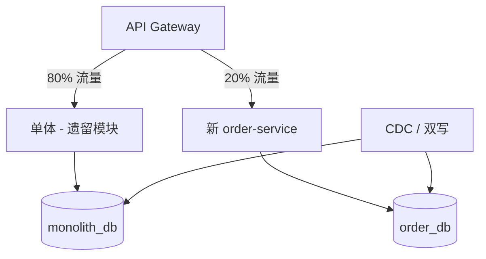

# 从单体到微服务的演进与回退

## 30 秒版（开场）

> 演进用 **绞杀者模式（Strangler Fig）**：新能力新服务，老模块逐步迁移；保留 **回退路径** 与 **数据双写对账**。生产关键词：**模块化单体先行、不是为拆而拆、可逆决策**。

## 3 分钟版（一面深度）

1. **是什么**：从单体仓库/部署逐步过渡到多服务；或微服务失败时合并回模块化单体。
2. **为什么**：团队扩大、独立扩缩、技术栈异构需求；但过早拆分成本 > 收益。
3. **怎么做**：单体内先模块化（package 边界）；API 网关路由新流量到新服务；CDC/双写同步数据；验证后下线老模块；回退 = Feature Flag + 路由切回 + 数据 reconcile。

## 10 分钟版（原理 + 图示）



**演进阶段**

| 阶段 | 状态 | 风险 |
|------|------|------|
| 0 | 单体 | 低 |
| 1 | 模块化单体（清晰 package） | 低 |
| 2 | 绞杀者：读走新服务 | 中（数据同步） |
| 3 | 写迁移 + 对账 | 高 |
| 4 | 下线单体模块 | 中 |
| 回退 | 路由回单体 | 需演练 |

**容量与成本变化**

- 单体 20 人团队 1 套 CI/CD；拆 5 服务 → **5 套流水线、5× 监控、5× On-call 认知**。
- RPC 增加：单体内存调用 ~μs → gRPC **1~3ms**，需合并读或 BFF。

**Go 单体模块化示例结构**

```
/cmd/monolith
/internal/order/    # 仅 order 域可 import
/internal/payment/
/internal/shared/   # 仅工具，无业务
```

## 生产场景

- **订单模块独立**：秒杀需独立扩缩，从电商单体绞杀出 `order-service`。
- **微服务回退**：拆分后延迟恶化、事故频发，合并回 modular monolith（Shopify 公开讨论过类似路径）。
- **可观测**：双写差异率、新旧 API 流量比、迁移里程碑。

## 排查与工具

| 工具 | 用途 |
|------|------|
| API Gateway 权重 | 流量切换 |
| Debezium / Canal | CDC |
| 对账 Job | 双写一致性 |
| 架构决策记录 ADR | 记录为何拆/合 |

## 架构取舍

| 方案 | 适用 | 不适用 |
|------|------|--------|
| Strangler | 渐进、可回退 | 大爆炸重写 |
| 模块化单体 | 中小团队长期 | 多团队抢仓库 |
| 大 bang 重写 | — | 几乎总是失败 |
| 合并回单体 | 拆分失败、团队缩小 | 已大规模单元化 |

## 追问链

1. **先拆读还是先拆写？** → 先读（绞杀者）；写迁移最后，双写+对账。
2. **数据怎么迁？** → 扩容新库 + CDC；或按 user_id 分批迁移。
3. **Go monolith 怎么防腐化？** → `internal` package + lint 禁止跨域 import + arch unit test。
4. **何时回退微服务？** → SLO 持续不达标、团队运维跟不上、无独立扩缩需求。
5. **和 S-ARCH-14 关系？** → 14 讲边界；19 讲迁移路径与时间线。

## 反模式与事故

- 第一天就拆 10 个空服务，只有 RPC 没有域。
- 双写无对账，静默丢数据 3 个月。
- 单体下线无回滚，新服务 bug 全站挂。
- 「微服务=先进」，忽视组织成熟度。

## 代码示例

```go
// 绞杀者路由 — 按 Feature Flag 切新服务
func (h *OrderHandler) Get(w http.ResponseWriter, r *http.Request) {
    id := chi.URLParam(r, "id")
    if h.flags.Enabled("order_service_read") {
        order, err := h.newClient.GetOrder(r.Context(), id)
        if err == nil {
            json.NewEncoder(w).Encode(order)
            return
        }
        slog.Warn("fallback to monolith", slog.String("err", err.Error()))
    }
    h.monolith.Get(w, r) // 回退路径
}
```

## 延伸阅读

- [Strangler Fig Application - Fowler](https://martinfowler.com/bliki/StranglerFigApplication.html)
- [MonolithFirst - Fowler](https://martinfowler.com/bliki/MonolithFirst.html)
- [Shopify 模块化单体（公开分享）](https://shopify.engineering/deconstructing-monolith-designing-software-maximizes-developer-productivity)
