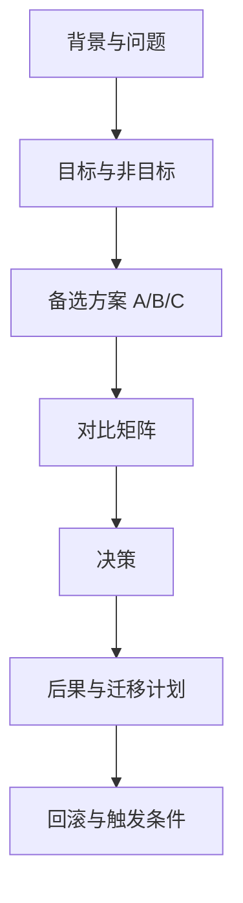

# 技术选型文档怎么写（Lead 面）

## 30 秒版（开场）

> Lead 面考察 **结构化决策能力**：ADR/技术选型文档讲清 **背景、目标、备选方案、权衡、决策、后果、回滚**。生产关键词：**可逆性、数据驱动、利益相关方对齐**。

## 3 分钟版（一面深度）

1. **是什么**：Architecture Decision Record（ADR）或 RFC，记录「为什么选 A 不选 B」。
2. **为什么**：避免「老板喜欢」；新人/审计可理解历史；面试展示 senior/lead 思维。
3. **怎么做**：模板固定；2~3 个备选；量化（QPS、成本、人天）；明确 owner 与 review 日期；Rejected 方案也要写。

## 10 分钟版（原理 + 图示）



**ADR 推荐结构（Lead 面试口述版）**

| 章节 | 内容 |
|------|------|
| Title | `[ADR-001] 订单存储选型 MySQL vs TiDB` |
| Status | Proposed / Accepted / Deprecated |
| Context | 业务背景、约束、为何现在决策 |
| Goals | 10 万 TPS 写、RPO<1min、团队熟悉度 |
| Non-Goals | 不解决分析型 OLAP |
| Options | 至少 2 个可行方案 |
| Comparison | 表格：性能、成本、运维、风险 |
| Decision | 选 B，理由 3 条 |
| Consequences | 正面 + 负面 + 缓解 |
| Migration | 阶段、里程碑、对账 |
| Rollback | 何时、如何切回 |

**对比矩阵示例（缓存选型）**

| 维度 | Redis | Memcached | 本地 Ristretto |
|------|-------|-----------|----------------|
| QPS | 10万+ | 10万+ | 100万/Pod |
| 持久化 | 有 | 无 | 无 |
| 数据结构 | 丰富 | KV | KV |
| 运维 | 中 | 低 | 无 |
| 一致性 | 最终 | 最终 | 进程内 |
| **结论** | **共享缓存首选** | 纯 KV 场景 | L1 补充 |

**容量与成本必须量化**

- 「Redis 更快」→ 改为「P99 从 80ms 降至 15ms，10 万 QPS 需 3 分片集群，月成本约 $X vs DB 只读扩容 $Y」。

## 生产场景

- **消息队列选型**：Kafka vs RocketMQ vs NATS——吞吐、顺序、运维、团队经验。
- **Go ORM**：GORM vs sqlc vs ent——类型安全、迁移、性能。
- **Lead 评审会**：RFC 评论 1 周，Accepted 后 ADR 入库 `docs/adr/`。

## 排查与工具

| 工具 | 用途 |
|------|------|
| ADR 模板 | [adr.github.io](https://adr.github.io/) |
| Mermaid / 架构图 | 沟通 |
| PoC + 压测数据 | 支撑决策 |
| RACI | 谁批准 |

## 架构取舍

| 做法 | 适用 | 不适用 |
|------|------|--------|
| 轻量 ADR 1 页 | 小决策 | 跨部门大项目 |
| 完整 RFC 10+ 页 | 核心架构 | 换 JSON 库 |
| 口头决策 | 紧急 hotfix | 持久技术债 |
| 投票民主 | — | 应用专家+数据 |

## 追问链

1. **两个方案差不多怎么选？** → 看 **可逆性**（Two-Way Door 先试）；看 **3 年后运维成本**。
2. **决策被推翻怎么办？** → ADR Status 改 Superseded，链到新 ADR，不删历史。
3. **如何说服非技术 stakeholder？** → 业务语言：可用性、上市时间、人力；少讲 Kafka 分区。
4. **PoC 要多深？** → 验证 **最大风险假设**（如 10 万 QPS 下 GC），非全功能。
5. **Lead 和 Senior 差别？** → Senior 给方案；Lead **对齐组织、写清 tradeoff、承担后果**。

## 反模式与事故

- 只有 Decision 没有 Options——像 post-rationalization。
- 复制厂商白皮书，无自家 QPS/团队约束。
- 决策永不 review，技术栈过时 5 年。
- 「我们永远用 X」禁止讨论，扼杀创新。

## 代码示例

```markdown
# ADR-007: 采用 Redis Cluster 作为共享缓存

## Status
Accepted (2025-03-01)

## Context
商品读 QPS 10 万，MySQL 只读副本 P99 120ms；需 P99<50ms。

## Decision
采用 Redis Cluster 3 主 3 从，Cache-Aside，TTL 5min + 变更删缓存。

## Consequences
- (+) P99 降至 20ms，DB QPS 降 95%
- (-) 需运维 Redis；缓存一致窗口
- 缓解: 对账 Job + 穿透治理（见 S-ARCH-06）

## Rollback
若 Cluster 故障 >2 次/月，回退只读副本 + 本地 Ristretto（Flag: cache_backend=local）
```

```go
// PoC 压测结论写入 ADR 附录
// go test -bench=BenchmarkCacheRead -benchmem ./poc/...
// Result: 单分片 52k ops/s, P99 0.8ms @ 8C16G
```

## 延伸阅读

- [Documenting Architecture Decisions - Nygard](https://cognitect.com/blog/2011/11/15/documenting-architecture-decisions)
- [ADR GitHub Organization](https://adr.github.io/)
- [Amazon Two-Way vs One-Way Doors](https://aws.amazon.com/blogs/enterprise-strategy/one-way-vs-two-way-door-decisions/)
