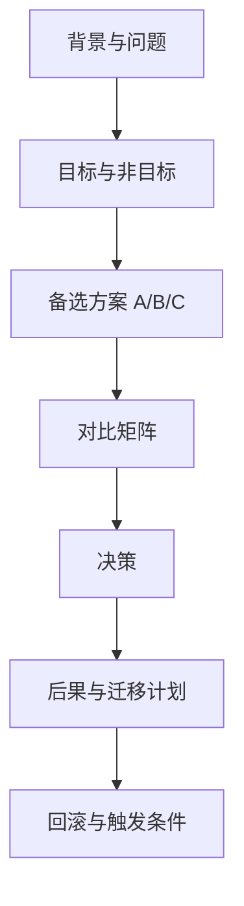

# 技术选型文档怎么写（Lead 面）

<a id="oral-card"></a>

## 要点卡

[返回 P0 知识图谱](../_meta/p0-knowledge-graph.md)

!!! abstract "30 秒回答"

    Lead 面考察 **结构化决策能力**：ADR/技术选型文档讲清 **背景、目标、备选方案、权衡、决策、后果、回滚**。生产关键词：**可逆性、数据驱动、利益相关方对齐**。

**3 分钟展开**

1. **是什么**：Architecture Decision Record（ADR）或 RFC，记录「为什么选 A 不选 B」。
2. **为什么**：避免「老板喜欢」；新人/审计可理解历史；展示 senior/lead 思维。
3. **怎么做**：模板固定；只比较真正可行的备选，不为凑数量制造稻草人；量化 workload、成本、
   人天和可靠性目标；明确 owner、review 日期、验证计划与回滚触发条件；Rejected 方案也记录理由。

| 记忆槽 | 内容 |
|--------|------|
| 三个不变量 | 背景/目标/非目标必须明确；只比较真实可行方案；决策要写负面后果、验证和回滚 |
| 手画图 | `context → constraints → viable options → evidence/experiment → decision → consequences → review` |
| 项目落点 | 用实际数据库、MQ、工作流或链适配器选型说明本人职责、数据证据和否决方案；只引用本人实际参与部分和可解释指标 |
| 一个取舍 | 可逆决策可快速试验；高不可逆的数据/协议决策要增加评审、双写对账和迁移门 |

**错误表达**

- ❌ “ADR 是为已经拍板的方案补理由；选最新、benchmark 最高的技术就是专业。”
- ✅ “ADR 要保留不确定性与反证条件；性能只是 workload、团队、迁移和风险矩阵的一部分。”

**自测追问**：什么情况下应该重新打开 Accepted ADR？怎样证明备选方案不是稻草人？

## 10 分钟版（原理 + 图示）


```mermaid
flowchart TB
  Context[背景与问题] --> Goals[目标与非目标]
  Goals --> Options[备选方案 A/B/C]
  Options --> Compare[对比矩阵]
  Compare --> Decision[决策]
  Decision --> Conseq[后果与迁移计划]
  Conseq --> Rollback[回滚与触发条件]
```

**ADR 推荐结构（Lead 讲解版）**

| 章节 | 内容 |
|------|------|
| Title | `[ADR-001] 订单存储选型 MySQL vs TiDB` |
| Status | Proposed / Accepted / Deprecated |
| Context | 业务背景、约束、为何现在决策 |
| Goals | 10 万 TPS 写、RPO<1min、团队熟悉度 |
| Non-Goals | 不解决分析型 OLAP |
| Options | 列出所有真实可行方案；若只剩一个，要记录其他候选为何不满足硬约束 |
| Comparison | 表格：性能、成本、运维、风险 |
| Decision | 选 B，理由 3 条 |
| Consequences | 正面 + 负面 + 缓解 |
| Migration | 阶段、里程碑、对账 |
| Rollback | 何时、如何切回 |

**对比矩阵示例（缓存选型）**

| 维度 | Redis | Memcached | 本地 Ristretto |
|------|-------|-----------|----------------|
| 吞吐 | 需按数据大小、命中率与部署压测 | 需按数据大小与网络压测 | 进程内延迟低，但每 Pod 容量独立 |
| 持久化 | 有 | 无 | 无 |
| 数据结构 | 丰富 | KV | KV |
| 运维 | 中 | 低 | 无 |
| 一致性 | 由 cache-aside/write-through/失效策略决定 | 同左 | 多实例间天然不共享，需额外失效/版本机制 |
| **结论** | **共享缓存首选** | 纯 KV 场景 | L1 补充 |

**容量与成本必须用可追溯证据量化**

- 「Redis 更快」→ 改为“在版本化 workload、硬件与数据集下，候选方案各自的吞吐、P99、
  故障行为和成本是多少”；文档中的数值必须链接到压测报告/账单估算，不能套用示例数字。

## 生产场景

- **消息队列选型**：Kafka vs RocketMQ vs NATS——吞吐、顺序、运维、团队经验。
- **Go ORM**：GORM vs sqlc vs ent——类型安全、迁移、性能。
- **Lead 评审会**：RFC 评论 1 周，Accepted 后 ADR 入库 `docs/adr/`。

## 排查与工具

| 工具 | 用途 |
|------|------|
| ADR 模板 | [architecture-decision-record](https://github.com/joelparkerhenderson/architecture-decision-record) |
| Mermaid / 架构图 | 沟通 |
| PoC + 压测数据 | 支撑决策 |
| RACI | 谁批准 |

## 架构取舍

| 做法 | 适用 | 不适用 |
|------|------|--------|
| 轻量 ADR 1 页 | 小决策 | 跨部门大项目 |
| 完整 RFC 10+ 页 | 核心架构 | 换 JSON 库 |
| 口头决策 | 紧急 hotfix | 持久技术债 |
| 投票民主 | — | 应用专家+数据 |

## 深挖问答

1. **两个方案差不多怎么选？** → 看 **可逆性**（Two-Way Door 先试）；看 **3 年后运维成本**。
2. **决策被推翻怎么办？** → ADR Status 改 Superseded，链到新 ADR，不删历史。
3. **如何说服非技术 stakeholder？** → 业务语言：可用性、上市时间、人力；少讲 Kafka 分区。
4. **PoC 要多深？** → 验证 **最大风险假设**（如 10 万 QPS 下 GC），非全功能。
5. **Lead 和 Senior 差别？** → Senior 给方案；Lead **对齐组织、写清 tradeoff、承担后果**。

## 反模式与事故

- 只有 Decision 没有 Options——像 post-rationalization。
- 复制厂商白皮书，无自家 QPS/团队约束。
- 决策永不 review，技术栈过时 5 年。
- 「我们永远用 X」禁止讨论，扼杀创新。

## 代码示例

```markdown
# ADR-007: 采用 Redis Cluster 作为共享缓存

## Status
Accepted (2025-03-01)

## Context
商品读 QPS 10 万，MySQL 只读副本 P99 120ms；需 P99<50ms。

## Decision
采用 Redis Cluster 3 主 3 从，Cache-Aside，TTL 5min + 变更删缓存。

## Consequences
- (+) P99 降至 20ms，DB QPS 降 95%
- (-) 需运维 Redis；缓存一致窗口
- 缓解: 对账 Job + 穿透治理（见 S-ARCH-06）

## Rollback
若缓存错误率/延迟超过约定阈值，先通过开关 bypass cache 回源受保护的只读路径；是否降级到本地缓存需单独评估多实例一致性语义
```

```go
// PoC 压测结论写入 ADR 附录
// go test -bench=BenchmarkCacheRead -benchmem ./poc/...
// Result: 把 benchstat/系统压测报告和运行环境链接写入 ADR；不要手填示意吞吐或 P99。
```

## 延伸阅读

- [Documenting Architecture Decisions - Nygard](https://cognitect.com/blog/2011/11/15/documenting-architecture-decisions)
- [ADR GitHub Organization](https://github.com/joelparkerhenderson/architecture-decision-record)
- [Bezos 2016 股东信（单向/双向门）](https://www.aboutamazon.com/news/company-news/2016-letter-to-shareholders)
