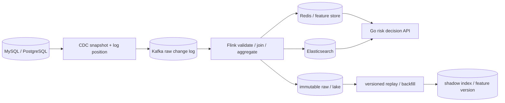
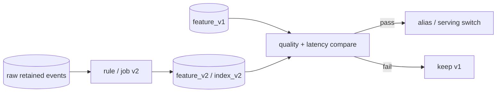

# 实时风控数据平台：CDC、Flink、ES 与可重放链路

<a id="oral-card"></a>

## 口述卡（高频必背）

[返回高频必背题单](../../high-frequency-roadmap.md)

!!! abstract "30 秒回答"

    实时风控链路要把 OLTP 事实、CDC 日志、Flink 状态、在线特征和 ES 检索投影分层。CDC 用
    一致性 snapshot 与 source position 衔接增量；Flink 处理 keyed state、event time、watermark
    和 checkpoint；sink 用稳定 event/document ID、版本或事务提交。Flink exactly-once 首先是
    故障恢复后每条事件只影响托管状态一次，不自动保证 ES 或外部动作端到端只发生一次。

**3 分钟展开**

1. 事件契约携带稳定 event ID、source position、主键、op、schema version 和 event time；
   `before/after` 完整性取决于数据库与 connector 配置。
2. Kafka/raw lake 保留可重放事实；Flink 用 watermark 处理乱序和迟到，watermark 是进度估计，
   不是“之后绝无迟到”。
3. 端到端 effect-once 需要可重放 source、checkpointed offset、确定性状态和事务或幂等 sink；
   ES bulk 还必须逐 item 检查结果。
4. 升级先回放到 shadow feature/index，对数量、内容、延迟和决策结果做对账后切 alias；回放数据
   不能再次触发封禁、通知、扣款等命令。

| 记忆槽 | 内容 |
|--------|------|
| 三个不变量 | OLTP/领域事件是事实，ES 是可重建投影；event ID 必须稳定；回放数据与外部命令隔离 |
| 手画图 | `OLTP → CDC → Kafka/raw → Flink → Redis/ES → Go risk API`，旁边画 `replay → shadow → compare → switch` |
| 项目落点 | 出行平台实时风控可讲真实数据契约、Go 服务、SLO 和排障边界；没写过 Flink 算子就不声称内核开发 |
| 一个取舍 | CDC 适合通用数据投影；领域 outbox 更能表达业务意图，但需要业务代码改造和 relay 运维 |

**错误表达**

- ❌ “开启 Flink EXACTLY_ONCE 后 ES 永不重复；watermark 到了就不会再有迟到事件。”
- ✅ “checkpoint 与 sink 语义必须分别说明；watermark 是可配置的事件时间进度估计。”

**自测追问**：snapshot 与增量如何避免中间漏数？为什么回放只能重建数据状态，不能重放外部命令？

## 10 分钟版（原理 + 图示）



### 事件契约

```json
{
  "event_id": "source-cluster/table/partition/position",
  "source": {"db": "risk", "table": "orders", "position": "..."},
  "op": "c|u|d|r",
  "key": {"order_id": "123"},
  "before": {},
  "after": {},
  "event_time": "2026-07-18T10:00:00Z",
  "schema_version": 7,
  "trace_id": "..."
}
```

- `event_id` 必须由稳定 source identity/position 或业务事件 ID 生成，不能由 consumer 每次随机生成。
- `before/after` 是否完整取决于 CDC 配置和数据库日志能力；消费者不能假设所有字段总会出现。
- delete、DDL、snapshot record 和 heartbeat 要显式建模。
- PII 字段在采集前就分级；topic、ES mapping、trace 和 DLQ 都属于数据治理范围。

### Snapshot 与增量衔接

一致性 CDC 的难点不是“先全表扫、再监听 binlog”这么简单，而是：

1. 获取可关联的 snapshot boundary/source position；
2. 扫描期间持续保留增量；
3. snapshot 与增量按 connector 语义合并；
4. failover 后从已提交 position 恢复；
5. DDL/schema change 有兼容策略。

如果自行用 `updated_at` 分页补数据，时钟、事务提交顺序和回写都可能造成漏数或重复。成熟 connector
能减少风险，但仍要验证目标数据库版本、权限、日志保留和 failover 行为。

### 时间语义与乱序

| 概念 | 用途 | 风险 |
|------|------|------|
| processing time | 低延迟在线处理 | 重放结果可能随执行时间变化 |
| event time | 按业务发生时间聚合 | 需要 watermark 与迟到策略 |
| watermark | 估计某时间之前事件基本到齐 | 是启发式边界，不代表再无迟到数据 |
| allowed lateness/side output | 处理迟到事件 | 需要修正下游特征或人工补偿 |

风控常同时需要：

- 近实时计数使用 processing/event time 的明确选择；
- 迟到交易到达后修正画像；
- 决策请求记录当时读到的 feature version 和 timestamp，便于解释与回放。

### Exactly-once 边界

Flink checkpoint 的 `EXACTLY_ONCE` 表示故障恢复后算子/用户状态像每条记录只影响一次，但记录可能在
网络和 sink 路径重放。端到端语义取决于：

```text
replayable source
+ checkpointed source position
+ deterministic/keyed state
+ transactional sink or idempotent versioned write
+ atomic/ordered publication of checkpoint result
```

ES bulk API 可能部分成功，因此要逐 item 检查结果；对 `feature_key + window + version` 使用稳定 document
ID 和外部版本/幂等 upsert。写 ES 成功但 checkpoint 未完成时，恢复后允许重写同一版本，而不是新增随机文档。

### 回放与升级



- raw log/lake 保留原始事件，衍生特征可重建；
- operator UID、state serializer 和 savepoint 兼容要纳入升级；
- 规则/model/schema version 随结果保存；
- backfill 写 shadow namespace/index，完成对账后切 alias；
- 回放只能重建数据状态，不能再次触发封禁、通知、扣款等外部命令。

## 生产场景

- **账号风险画像**：登录、设备、订单、支付事件按 account/device 聚合，Redis 服务低延迟特征，
  ES 支持调查检索。
- **交易风控**：Go API 读取近 5 分钟失败次数、设备关联数、历史等级；feature stale 时按策略
  fail-open、fail-closed 或进入人工审核。
- **索引重建**：新 mapping/index 通过 raw log 回放并和旧索引对比数量、抽样内容和查询结果，再切 alias。
- **规则发布**：新规则 shadow 计算，不影响线上 decision；评估误杀/漏放和延迟后再灰度。

## 排查与工具

四层指标：

| 层 | 指标 |
|----|------|
| CDC | source position lag、snapshot progress、schema/DDL error、log retention headroom |
| Kafka | partition lag、skew、retention、ISR/producer error |
| Flink | watermark lag、checkpoint duration/failure、backpressure、state size、restart |
| Sink/Serving | ES bulk partial reject、feature freshness、Redis/ES P95/P99、stale read、decision fallback |

排障先问“源端位置到哪、checkpoint 提交到哪、sink 最大版本到哪”，再区分数据没产生、没采到、积压、
计算错误还是落地失败。

## 架构取舍

| 方案 | 适用 | 代价 |
|------|------|------|
| Canal/Debezium + MQ | 通用 CDC 解耦 | connector、schema 和 failover 运维 |
| Flink CDC/Pipeline | 采集与计算一体化 | 版本兼容和状态升级复杂 |
| 应用 Outbox | 需要明确领域事件 | 业务改造、表清理和 relay 运维 |
| 双写 DB + ES | 原型 | 一致性窗口、失败补偿，禁止宣称原子 |

数据库行变更适合构建数据投影；需要表达“订单已支付”“账户被封禁”等领域语义时，优先由业务事务写
outbox/domain event，而不是让下游从字段变化猜业务意图。

## 追问链

1. **Flink exactly-once 是否代表 ES 只写一次？** → 不代表；要看 sink 是否事务提交或用稳定 ID/版本幂等。
2. **watermark 到了为什么还有迟到数据？** → watermark 是进度估计；分区空闲、网络延迟和回放都会产生 late event。
3. **CDC 能替代领域事件吗？** → 不能完全替代；CDC 描述行变化，领域事件描述业务意图。
4. **如何避免 snapshot 与 binlog 中间漏数？** → 使用 connector 的一致性 snapshot/offset 协议并实测 failover，不能自己拼两个无关联步骤。
5. **ES 为什么不是事实源？** → 索引是可重建投影，refresh、mapping、bulk partial failure 和更新语义不适合作为资金/订单权威状态。
6. **Flink 是 Java，Go 候选人怎么讲？** → 明确自己负责数据契约、Go 在线服务、SLO/容量、幂等/回放和跨组件故障边界；没有写过算子就不要声称 Flink 内核开发。

## 反模式与事故

- 把 checkpoint mode 写成“整个链路严格一次”，忽略外部 sink。
- 用随机 ES document ID，恢复重放后产生重复画像。
- bulk 请求只看 HTTP 200，不检查单条 item failure。
- 用 `updated_at` 全表轮询冒充可靠 CDC，事务边界和时钟导致漏数。
- 回放历史事件时再次发送封禁通知或触发扣款。
- 新 job 直接覆盖线上 index，没有 shadow 对账、alias 切换和回滚。
- 特征没有 timestamp/version，Go 风控 API 无法判断 stale data。

## 延伸阅读

- [Debezium MySQL Connector](https://debezium.io/documentation/reference/stable/connectors/mysql.html)
- [Apache Flink Checkpointing](https://nightlies.apache.org/flink/flink-docs-stable/docs/dev/datastream/fault-tolerance/checkpointing/)
- [Apache Flink Data Sinks](https://nightlies.apache.org/flink/flink-docs-stable/docs/dev/datastream/sinks/)
- [Apache Flink Time and Watermarks](https://nightlies.apache.org/flink/flink-docs-stable/docs/concepts/time/)
- [Elasticsearch Bulk API](https://www.elastic.co/guide/en/elasticsearch/reference/current/docs-bulk.html)
- 关联：[S-ARCH-10 消息语义](./S-ARCH-10-mq-semantics.md)、
  [S-ES-03 MySQL 与 Elasticsearch 同步](../middleware/elasticsearch/S-ES-03-sync-ops.md)
