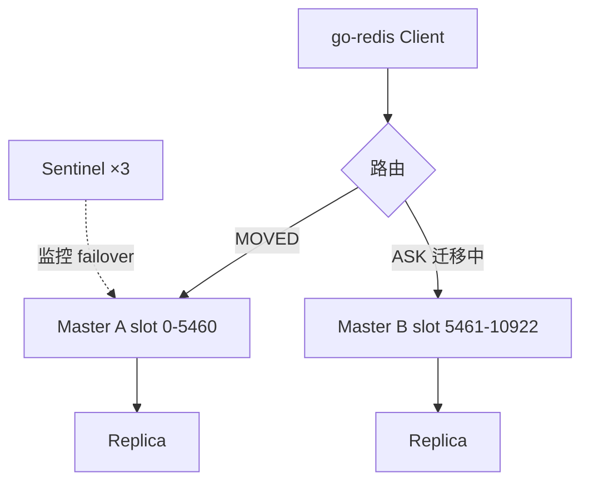

# Redis 集群模式与选型

## 30 秒版（开场）

> Redis 部署分 **单机、主从、Sentinel、Cluster** 四档：读多写少用主从+Sentinel 保 HA；数据量/吞吐超单机用 **Cluster 16384 slot 分片**。Go 侧用 `go-redis`，Cluster 客户端需感知 MOVED/ASK 重定向。生产关键词：**slot 迁移、脑裂、连接池、Pipeline 跨 slot 限制**。

## 3 分钟版（一面深度）

1. **是什么**：Redis 提供多种拓扑——主从复制同步数据，Sentinel 监控主节点故障并自动 failover，Cluster 将 key 按 CRC16 mod 16384 映射到 slot 再分配到节点。
2. **为什么**：单机有内存与 QPS 上限；主从解决读扩展但不自动切主；Sentinel 补 HA；Cluster 同时解决水平扩展与高可用（每个 master 可挂 slave）。
3. **怎么做**：<10GB、QPS<10 万、可接受分钟级 RTO → Sentinel；>10GB 或需线性扩展 → Cluster；强一致跨 key 事务用 Hash Tag `{user:123}:profile` 同 slot。

## 10 分钟版（原理 + 图示）

**模式对比**

| 模式 | 扩展 | HA | 复杂度 | 典型场景 |
|------|------|-----|--------|----------|
| 单机 | 否 | 否 | 低 | 开发/小缓存 |
| 主从 | 读扩展 | 手动切主 | 低 | 读多写少 |
| Sentinel | 读扩展 | 自动 failover | 中 | 中小生产 |
| Cluster | 读写扩展 | 分片+副本 | 高 | 大数据量/高 QPS |



**Cluster 要点**：Gossip 传播拓扑；`CLUSTER NODES` 看 slot 分布；扩缩容时 slot migrate 产生 ASK；多 key 事务/`MGET` 需同 slot。Sentinel：quorum 过半同意才 failover，注意 **down-after-milliseconds** 与 **min-replicas-to-write** 防脑裂丢写。

**Go 客户端**：`redis.NewClusterClient` 维护 slot→node 缓存；`ForEachShard` 做全节点扫描；Pipeline 默认单节点，跨 slot 需拆分。

## 生产场景

- **缓存层 50GB+**：单机 OOM → 迁 Cluster，按业务 prefix 设计 key 避免 big key 单 slot 热点。
- **秒杀库存**：单 key 热点 → 本地缓存 + Redis 分片 key（`stock:{sku}:0..N`）而非强上 Cluster。
- **跨 AZ 部署**：Cluster 跨机房 RTT 放大，考虑同城双活 + Proxy（Codis/Twemproxy 已过时，现多用 Cluster 原生或 Redis Enterprise）。

## 排查与工具

| 工具 | 用途 |
|------|------|
| `redis-cli --cluster check` | slot 覆盖、迁移状态 |
| `INFO replication` | 主从 lag、连接数 |
| `redis-cli --latency` | 网络/慢命令 |
| `SLOWLOG GET` | 热 key、大 value |
| Prometheus redis_exporter | 内存、命中率、evicted |

路径：超时飙升 → 看是否 MOVED 风暴（拓扑变更）→ `CLIENT LIST` 连接数 → 慢日志定位大 key / `KEYS *`。

## 架构取舍

| 方案 | 适用 | 不适用 |
|------|------|--------|
| Sentinel + 主从 | <32GB，团队运维能力一般 | 需水平写扩展 |
| Redis Cluster | 大数据量、可接受 slot 规划 | 强跨 slot 多 key 原子 |
| 托管 Redis（云） | 快速上线、免运维 | 成本敏感、定制协议 |
| 本地缓存 + Redis | 极热读 | 一致性要求高 |

## 追问链

1. **Cluster 如何算 slot？** → `CRC16(key) mod 16384`；Hash Tag 只对 `{}` 内部分哈希。
2. **MOVED 和 ASK 区别？** → MOVED 永久迁移完成；ASK 临时重定向，迁移窗口内。
3. **Sentinel 脑裂怎么办？** → `min-replicas-to-write`、奇数节点、同 AZ 部署；旧主恢复后变 slave。
4. **go-redis 连接池参数？** → `PoolSize`、`MinIdleConns`、`ReadTimeout`；Cluster 每节点独立池。
5. **RDB 还是 AOF？** → 缓存可 RDB+短 AOF；持久化队列倾向 AOF everysec。

## 反模式与事故

- 生产 `KEYS *` 或 `FLUSHALL` 无 alias 保护——曾致全站缓存穿透 DB。
- Cluster 下用 `MULTI` 跨 slot——直接报错或逻辑错误。
- Sentinel quorum=1 或两节点「伪 HA」——网络分区双主写。
- 不设 `maxmemory-policy`，OOM 后写拒绝或随机 evict 打穿 DB。

## 代码示例

```go
import "github.com/redis/go-redis/v9"

func newCluster() *redis.ClusterClient {
    return redis.NewClusterClient(&redis.ClusterOptions{
        Addrs:        []string{"10.0.0.1:6379", "10.0.0.2:6379"},
        PoolSize:     100,
        MinIdleConns: 10,
        ReadTimeout:  200 * time.Millisecond,
    })
}

// Hash Tag：profile 与 orders 同 slot
const userProfileKey = "{user:42}:profile"
const userOrdersKey  = "{user:42}:orders"
```

## 延伸阅读

- [Redis Scaling](https://redis.io/docs/latest/operate/oss_and_stack/management/scaling/)
- [Redis Sentinel](https://redis.io/docs/latest/operate/oss_and_stack/management/sentinel/)
- [go-redis Cluster 文档](https://redis.uptrace.dev/guide/go-redis-cluster.html)
