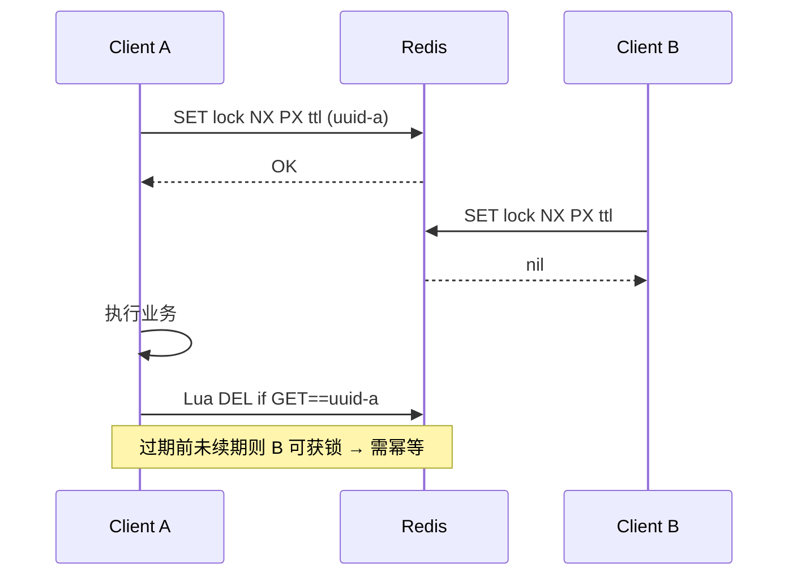

# 分布式锁与 Redlock 争议

## 30 秒版（开场）

> 分布式锁解决 **多进程/多机互斥**；Redis 单节点 `SET key NX PX` + Lua 续期/释放是主流；**Redlock 多主 quorum** 被 Kleppmann 质疑在时钟与 GC 下不安全。生产关键词：**锁粒度、TTL、 fencing token、可重入与死锁**。

## 3 分钟版（一面深度）

1. **是什么**：在 Redis/etcd/ZooKeeper 上实现的跨实例互斥原语，保证同一时刻只有一个持有者执行临界区。
2. **为什么**：数据库行锁无法覆盖跨服务资源（如定时任务、库存扣减前的全局序列）；进程内 `sync.Mutex` 无法跨 Pod。
3. **怎么做**：Redis 单主：`SET lock:order:123 uuid NX PX 30000`；释放用 Lua 比对 value；续期用 watchdog goroutine；强一致场景用 **etcd lease + txn** 或 DB `SELECT FOR UPDATE`。

## 10 分钟版（原理 + 图示）

**Redis 单节点锁流程**



**Redlock**：向 N 个独立 Redis master 依次加锁，过半成功且总耗时 < TTL 视为成功；释放向所有节点发 Lua。争议点：进程 STW/GC 超过 TTL 后仍以为自己持锁；各节点时钟漂移；**无 fencing** 时旧持有者写可能覆盖新持有者。

**etcd 对比**：基于 Raft 的 `concurrency.Mutex`，session lease 过期自动释放；线性一致读，但 RTT 与运维成本更高。

## 生产场景

- **定时任务单跑**：Cron 多副本同时触发 → `lock:job:daily-settle` TTL=任务最大耗时+缓冲。
- **订单号生成**：非锁方案更优（雪花/号段）；若用锁，粒度到 `user_id` 而非全局。
- **库存扣减**：应用层锁 + DB 乐观锁/Redis Lua 原子扣减组合，避免锁持有时间过长。

## 排查与工具

| 工具 | 用途 |
|------|------|
| `redis-cli GET lock:*` | 当前 holder、是否过期 |
| `TTL lock:*` | 是否泄漏未释放 |
| 业务日志 uuid | 追踪谁持锁 |
| redsync / go-redis 指标 | 加锁失败率、等待时间 |

路径：任务重复执行 → 查锁 key 是否存在、TTL 是否过短 → GC pause 日志 → 考虑 etcd 或 DB 唯一约束替代。

## 架构取舍

| 方案 | 适用 | 不适用 |
|------|------|--------|
| Redis SET NX + Lua | 低延迟、可接受极端边界 | 金融级强一致 |
| Redlock 多主 | 历史方案，新系统慎用 | Kleppmann 指出的场景 |
| etcd Mutex | 强一致、lease 清晰 | 高 QPS 短锁 |
| DB 唯一索引 / 乐观锁 | 与事务一体 | 纯缓存层互斥 |
| 消息分区单消费者 | 顺序消费即互斥 | 需即时互斥 |

## 追问链

1. **为什么释放要用 Lua？** → GET+DEL 非原子，可能删掉别人的锁。
2. **TTL 设多少？** → 大于 P99 业务耗时，配合续期；过短重复获锁，过长故障恢复慢。
3. **Redlock 问题本质？** → 锁过期与进程暂停不同步；缺少 fencing token 保护下游存储。
4. **什么是 fencing token？** → 单调递增 token，存储拒绝旧 token 写。
5. **可重入怎么做？** → Hash 结构 `HINCRBY lock holder count`，或 redsync 内置。

## 反模式与事故

- 加锁后 panic 未释放且无 TTL——死锁至 TTL（若忘记 TTL 则永久）。
- 锁内调外部 HTTP 无超时——持锁时间不可控。
- 用 Redlock 当「银弹」忽视业务幂等——双写仍可能发生。
- `DEL lock` 不校验 owner——误删他人锁导致双写。

## 代码示例

```go
// Redis 单节点：加锁 + 安全释放（go-redis v9）
var unlockScript = redis.NewScript(`
  if redis.call("GET", KEYS[1]) == ARGV[1] then
    return redis.call("DEL", KEYS[1])
  else
    return 0
  end`)

func tryLock(ctx context.Context, rdb *redis.Client, key, token string, ttl time.Duration) (bool, error) {
    ok, err := rdb.SetNX(ctx, key, token, ttl).Result()
    return ok, err
}

func unlock(ctx context.Context, rdb *redis.Client, key, token string) error {
    return unlockScript.Run(ctx, rdb, []string{key}, token).Err()
}
```

生产推荐 [redsync](https://github.com/go-redsync/redsync) 或业务层 **幂等 + 唯一约束** 替代纯锁。

## 延伸阅读

- [Redis Distributed Locks](https://redis.io/docs/latest/develop/use/patterns/distributed-locks/)
- [How to do distributed locking (Kleppmann)](https://martin.kleppmann.com/2016/02/08/how-to-do-distributed-locking.html)
- [Is Redlock safe?](https://antirez.com/news/101)
