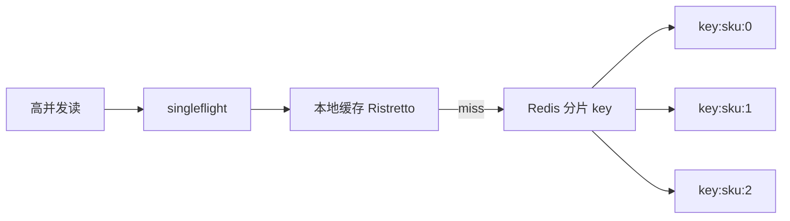

# 热点 Key 发现与治理

## 30 秒版（开场）

> **热点 Key** 是 QPS 远超平均的单个或少量 key，打满单 Redis 节点/单 CPU。治理：**发现（monitor/hotkeys 采样）→ 拆分（logical shard）→ 本地缓存 + 单飞（singleflight）→ 限流降级**。生产关键词：**大促 SKU、明星用户、配置中心全局 key**。

## 3 分钟版（一面深度）

1. **是什么**：访问高度倾斜的 key，在 Cluster 中仍落单 slot/单节点，成为瓶颈；表现为一节点 CPU 100%、延迟尖刺、其他 slot 空闲。
2. **为什么**：业务天然热点（秒杀库存、热搜榜、全站开关）；缓存设计未打散；Pipeline 放大单 key 压力。
3. **怎么做**：写扩散 `key:{id}:{0..N}` 随机读；读热点用 **local cache + TTL jitter**；写热点用 **MQ 串行化** 或 Redis Lua 单 key 原子；前置 **SDK 采样** 上报 TopN。

## 10 分钟版（原理 + 图示）

**发现手段**

| 方法 | 原理 | 局限 |
|------|------|------|
| `redis-cli --hotkeys` | 内部 LFU 采样 | 需 `maxmemory-policy` 含 LFU |
| Monitor 抓包 | 全量命令 | 生产禁用，性能杀手 |
| Client 侧采样 | 拦截 GET/SET 计数 | 需统一 SDK |
| Proxy 层统计 | Codis/自研网关 | 依赖架构 |
| 业务日志 | 按 SKU/user 聚合 | 滞后 |



**读热点**：本地缓存（100ms~1s TTL）挡 90% 流量；`singleflight.Group` 合并回源；分片 key 轮询或随机读再汇总（适用于计数类可近似场景）。

**写热点**：避免多 client 争同一 key——库存用 **预扣 + 异步**；计数用 **Redis INCR + 定时 flush DB** 或 **Kafka 分区单线程聚合**。

## 生产场景

- **秒杀库存 key**：`stock:sku:1001` QPS 20 万 → 拆 `stock:sku:1001:{0..15}` 启动时 `INCRBY` 分配配额，Lua 随机槽扣减。
- **全站配置 `config:global`**：改本地 cache + Pub/Sub 失效；读走 `sync.Map` 每 Pod 一份。
- **热搜 ZSET**：分片多个 ZSET 再合并 TopK，或用 RedisTimeSeries / 流式 TopK 算法。

## 排查与工具

| 工具 | 用途 |
|------|------|
| `redis-cli --hotkeys -i 0.1` | 采样热点 |
| `INFO commandstats` | 命令分布 |
| `LATENCY DOCTOR` | 延迟诊断 |
| 自研 hotkey SDK + Grafana | Top key 排行 |
| `go tool pprof` | 本地 cache 命中率 |

路径：单节点 CPU 高 → `CLUSTER SLOTS` 看是否 slot 倾斜 → hotkeys → 对照业务活动/大 V 上线时间。

## 架构取舍

| 方案 | 适用 | 不适用 |
|------|------|--------|
| 本地缓存 | 读多、可短暂不一致 | 写后立即读一致 |
| Key 分片 | 库存、计数 | 需强一致全局序 |
| 单飞回源 | 缓存 miss 风暴 | 写路径 |
| 限流/排队 | 保护下游 | 用户体验下降 |
| 多级缓存 | 读-heavy API | 失效复杂度 |

## 追问链

1. **hotkeys 原理？** → 扫描采样 key 访问频率，非精确全量。
2. **分片后如何保证不超卖？** → 启动时总库存分配到各 shard，Lua 内 shard 内原子扣，总和≤真实库存。
3. **本地缓存如何失效？** → Redis Pub/Sub、etcd watch、短 TTL + jitter。
4. **singleflight 坑？** → 第一个请求失败会拖垮同批；需 `Forget` 或包装错误。
5. **Cluster 热点迁不走？** → 只能拆 key 或加本地层，slot 迁移不治本。

## 反模式与事故

- 大促前未压测热点 key——单 key 打满 10 万 QPS 节点宕机。
- 本地缓存无上限——OOM Kill Pod 连锁故障。
- 用 `KEYS` 找热点——阻塞 Redis 主线程。
- 分片读汇总用 `MGET` 跨 slot——Cluster 报错或客户端多次 RTT 未优化。

## 代码示例

```go
import "golang.org/x/sync/singleflight"

var (
    g       singleflight.Group
    local   = cache.New(5*time.Minute, 10*time.Minute) // 如 go-cache
)

func GetProduct(ctx context.Context, rdb *redis.Client, id string) (Product, error) {
    if v, ok := local.Get(id); ok {
        return v.(Product), nil
    }
    v, err, _ := g.Do(id, func() (any, error) {
        shard := fmt.Sprintf("product:%s:%d", id, rand.Intn(8))
        return fetchFromRedis(ctx, rdb, shard)
    })
    if err != nil {
        return Product{}, err
    }
    p := v.(Product)
    local.Set(id, p, time.Second)
    return p, nil
}
```

## 延伸阅读

- [Redis Latency Optimization](https://redis.io/docs/latest/operate/oss_and_stack/management/optimization/latency/)
- [singleflight 包文档](https://pkg.go.dev/golang.org/x/sync/singleflight)
- [大厂热点 Key 治理实践（掘金）](https://juejin.cn/post/6844903818319745032)
