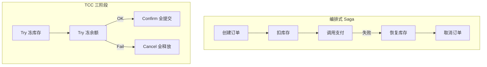

# 分布式事务 TCC vs Saga

## 30 秒版（开场）

> 跨服务/跨库无法用单机 ACID，常用 **Saga（长事务 + 补偿）** 或 **TCC（Try-Confirm-Cancel 资源预留）**；2PC/XA 强一致但阻塞、不适合高并发微服务。生产关键词：**最终一致、幂等、空补偿、悬挂、业务可补偿性**。

## 3 分钟版（一面深度）

1. **是什么**：Saga 把全局事务拆为本地事务链，失败执行逆向补偿；TCC 每参与者实现 Try 预留、Confirm 提交、Cancel 释放。
2. **为什么**：微服务各管一库，XA 锁跨库时间长、协调者单点；消息最终一致对业务侵入大时需显式编排。
3. **怎么做**：可补偿业务（订单/支付）优先 **Saga + 状态机**；强隔离资源（库存、余额）用 **TCC**；简单场景 **本地消息表 / Outbox** 即可，不必上重型框架。

## 10 分钟版（原理 + 图示）

**对比**

| 维度 | TCC | Saga |
|------|-----|------|
| 一致性 | 接近强一致（预留期隔离） | 最终一致 |
| 侵入性 | 高（三接口） | 中（补偿逻辑） |
| 并发 | Try 阶段占资源 | 无预留，可能脏读 |
| 失败 | Cancel 释放 | 反向补偿 |
| 典型 | 扣库存、冻余额 | 订单多步流程 |



**Saga 模式**：**编排（Orchestrator）** 中心状态机发命令；**编舞（Choreography）** 各服务监听事件。补偿必须 **幂等**，注意 **空补偿**（未 Try 却 Cancel）、**悬挂**（Cancel 比 Try 先到）。

**TCC 要点**：Try 成功才 Confirm；Cancel 需处理 Try 未到达；Confirm/Cancel 均需幂等；与 Seata、DTM 等框架集成时理解 retry 语义。

## 生产场景

- **下单扣库存调支付**：Saga——订单 `PENDING` → 库存服务扣减 → 支付成功 `PAID`，任一步失败发补偿消息恢复库存。
- **秒杀冻库存**：TCC Try 冻结 1 件，支付 Confirm，超时 Cancel 释放。
- **仅两服务**：Outbox 写本地表 + MQ 同步另一库，不必 TCC 全套。

## 排查与工具

| 工具 | 用途 |
|------|------|
| Saga 状态机 DB | 每步 status、retry 次数 |
| DTM/Seata 控制台 | 全局事务状态 |
| 业务对账任务 | 发现悬挂/不一致 |
| 链路 trace | 定位卡在哪一步 |

路径：用户投诉重复扣款 → 查全局 tx id → Confirm 是否重试 → 幂等键是否生效 → 补偿是否执行。

## 架构取舍

| 方案 | 适用 | 不适用 |
|------|------|--------|
| Saga + 补偿 | 长流程、可业务回滚 | 不可补偿（发短信） |
| TCC | 资源需预留隔离 | 只读、无资源争用 |
| 本地消息表 | 两库同步 | 三步以上复杂流 |
| XA/2PC | 遗留单体 | 高并发互联网 |
| 放弃跨库事务 | 单库聚合 | 已拆微服务 |

## 追问链

1. **Saga 和 2PC 区别？** → Saga 无全局锁，异步补偿；2PC prepare 阻塞。
2. **TCC Try 做什么？** → 检查并预留资源（冻库存），不最终扣减。
3. **空补偿？** → Cancel 先于 Try 到达，应识别无 Try 记录则 no-op。
4. **悬挂？** → Try 迟到于 Cancel，Try 应拒绝或记录告警。
5. **Go 实践？** → [dtm-labs/dtm](https://github.com/dtm-labs/dtm) 支持 Saga/TCC；或自研状态机 + MQ。

## 反模式与事故

- 补偿逻辑未幂等——重试导致多补一次库存。
- 用 Saga 做实时强一致读——中间态被用户看到异常 UI。
- TCC Try 占资源不设超时——大量冻结导致可用库存为 0。
- 所有微服务交互都上分布式事务——应合并边界或异步化。

## 代码示例

```go
// 简化的 Saga 步骤定义（编排器伪代码）
type Step struct {
    Name       string
    Forward    func(ctx context.Context) error
    Compensate func(ctx context.Context) error
}

func RunSaga(ctx context.Context, steps []Step) error {
    done := make([]Step, 0, len(steps))
    for _, s := range steps {
        if err := s.Forward(ctx); err != nil {
            for i := len(done) - 1; i >= 0; i-- {
                _ = done[i].Compensate(ctx) // 必须幂等
            }
            return err
        }
        done = append(done, s)
    }
    return nil
}
```

## 延伸阅读

- [Saga Pattern (microservices.io)](https://microservices.io/patterns/data/saga.html)
- [DTM 文档](https://dtm.pub/app/practice.html)
- [分布式事务解决方案（InfoQ）](https://www.infoq.cn/article/solution-of-distributed-transaction)
