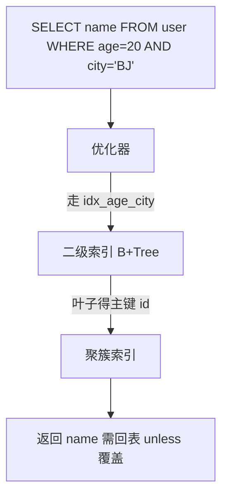

# MySQL 索引原理与最左前缀

## 30 秒版（开场）

> InnoDB 默认 **B+Tree 聚簇索引**（主键即数据）；二级索引叶子存主键值需 **回表**。**联合索引 (a,b,c) 遵循最左前缀**：能用到 a、ab、abc 条件，跳过 b 直接用 c 往往失效。生产关键词：**覆盖索引、索引下推 ICP、选择性、前缀索引**。

## 3 分钟版（一面深度）

1. **是什么**：索引是有序数据结构，加速 WHERE/JOIN/ORDER BY；InnoDB 表数据按主键 B+Tree 组织，二级索引是独立 B+Tree。
2. **为什么**：全表扫描 O(n)；合适索引将查找降为 O(log n)；错误索引导致写放大与优化器选错计划。
3. **怎么做**：WHERE/ORDER BY 高频列建联合索引；高选择性列放左；避免 `SELECT *` 促回表；用 `EXPLAIN` 看 `type/key/rows/Extra`。

## 10 分钟版（原理 + 图示）

**B+Tree 要点**

| 概念 | 说明 |
|------|------|
| 聚簇索引 | 叶子存完整行，一张表一个 |
| 二级索引 | 叶子存索引列 + 主键 |
| 回表 | 二级索引查主键再查聚簇 |
| 覆盖索引 | 查询列全在索引中，Extra: Using index |
| ICP | 5.6+ 存储引擎层过滤，减少回表 |



**最左前缀**：索引 `(age, city, status)` — `WHERE age=20` ✓；`WHERE age=20 AND city='BJ'` ✓；`WHERE city='BJ'` ✗（除非优化器 index skip scan 8.0.13+ 特定场景）；`WHERE age=20 ORDER BY city` ✓ 可利用索引排序。

**失效常见**：对列函数/隐式类型转换 `phone=13800138000`（phone varchar）；`LIKE '%abc'`；OR 跨不同索引；不等于 `!=` 大数据集；联合索引中间列范围后右侧失效。

## 生产场景

- **用户列表 `WHERE tenant_id=? ORDER BY created_at DESC`**：联合索引 `(tenant_id, created_at)` 覆盖过滤+排序。
- **登录 `WHERE email=?`**：唯一索引；邮箱过长用前缀索引需控制选择性。
- **慢查询 `LIKE 'prefix%'`**：可走索引；`%suffix` 只能全文或 ES。

## 排查与工具

| 工具 | 用途 |
|------|------|
| `EXPLAIN FORMAT=TREE` | 8.0 执行计划树 |
| `SHOW INDEX FROM t` | Cardinality 是否过期 |
| `pt-query-digest` | 慢 SQL 聚合 |
| Performance Schema | 未使用索引扫描 |

路径：慢查询 → EXPLAIN → type=ALL/rows 巨大 → 调整联合索引顺序或覆盖列 → 验证 `Using index`。

## 架构取舍

| 方案 | 适用 | 不适用 |
|------|------|--------|
| 联合索引 | 多条件组合查询 | 每列单独低选择性 |
| 覆盖索引 | 读多报表 | 索引过宽写慢 |
| 前缀索引 | 长字符串 | 无法 ORDER BY 该列 |
| 冗余索引合并 | 维护成本 | 已有左前缀覆盖 |
| ES/OLAP | 复杂搜索分析 | 强一致点查 |

## 追问链

1. **为什么用 B+Tree 不用 B-Tree？** → 叶子链表便于范围扫描；非叶子不存数据，扇出大。
2. **主键为何推荐自增？** → 顺序插入减少页分裂；随机 UUID 致碎片。
3. **一个表多少索引？** → 写多读少慎加；通常 3~5 个联合索引覆盖 80% SQL。
4. **Hash 索引？** → Memory 引擎支持；InnoDB 自适应 Hash 内部用，无用户 Hash 索引。
5. **Change Buffer？** → 二级索引非唯一、页不在 buffer 时延迟合并，写优化。

## 反模式与事故

- 每个 WHERE 列各建单列索引——优化器 merge 效率差、占空间。
- `SELECT *` 导致必回表——覆盖索引失效。
- 上线大表加索引未 `ALGORITHM=INPLACE` 评估——锁表数小时。
- 凭直觉建 `(created_at, user_id)` 而查询总是先 `user_id`——最左原则用反。

## 代码示例

```sql
-- 联合索引 + 覆盖查询
CREATE INDEX idx_tenant_created ON orders (tenant_id, created_at DESC);

EXPLAIN SELECT id, created_at FROM orders
  WHERE tenant_id = 1001
  ORDER BY created_at DESC
  LIMIT 20;
-- Extra: Using index 表示覆盖，无回表
```

Go/GORM 侧确保 `Where("tenant_id = ?", id).Order("created_at desc")` 与索引列顺序一致。

## 延伸阅读

- [MySQL Index Optimization](https://dev.mysql.com/doc/refman/8.0/en/optimization-indexes.html)
- [EXPLAIN Output](https://dev.mysql.com/doc/refman/8.0/en/explain-output.html)
- [高性能 MySQL 索引章节](https://www.oreilly.com/library/view/high-performance-mysql/9780596101718/)
