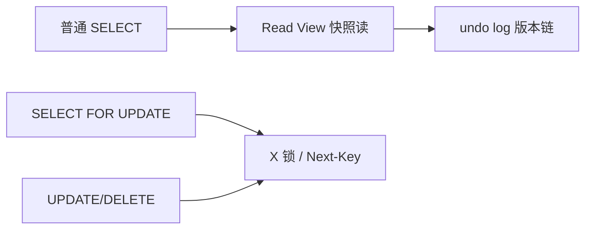

# 事务隔离级别与 MVCC

## 30 秒版（开场）

> InnoDB 默认 **REPEATABLE READ + MVCC**，快照读不加锁；当前读（`SELECT FOR UPDATE`）走锁。**四种隔离级别**权衡脏读/不可重复读/幻读；RR 下 InnoDB 用 **next-key lock（记录+间隙）** 防幻读。生产关键词：**长事务、undo 链、间隙锁死锁**。

## 3 分钟版（一面深度）

1. **是什么**：事务 ACID 中 I（隔离）由隔离级别定义；MVCC 用 undo log 多版本 + Read View 实现非锁定一致性读。
2. **为什么**：读写互斥锁吞吐低；快照读提高并发；写仍需锁保证正确性。
3. **怎么做**：默认 RR 满足多数 OLTP；银行类强一致可 RC + 显式锁；避免长事务撑大 undo；应用层接受 **幻读** 的业务用 RC 减间隙锁。

## 10 分钟版（原理 + 图示）

**隔离级别现象**

| 级别 | 脏读 | 不可重复读 | 幻读 |
|------|------|------------|------|
| READ UNCOMMITTED | 可能 | 可能 | 可能 |
| READ COMMITTED | 否 | 可能 | 可能 |
| REPEATABLE READ | 否 | 否 | InnoDB 基本防 |
| SERIALIZABLE | 否 | 否 | 否 |



**MVCC**：每行隐藏列 `DB_TRX_ID`、`DB_ROLL_PTR`；Read View 判定版本可见性；RR 事务内第一次 SELECT 建立 Read View 复用；RC 每次 SELECT 新建。

**当前读与锁**：`FOR UPDATE`、`LOCK IN SHARE MODE`、纯 DML；**Record Lock** 精确行；**Gap Lock** 间隙；**Next-Key** = 记录+前间隙，防 RR 幻读。RC 通常无 Gap Lock（除外键/唯一检查）。

## 生产场景

- **余额扣减**：`BEGIN; SELECT balance FROM account WHERE id=1 FOR UPDATE; UPDATE ...` 当前读防并发超扣。
- **报表统计**：普通 SELECT 快照读，可能读到启动后其他事务已提交数据（RC）或一致性快照（RR）。
- **批量删 `WHERE status=0 LIMIT 1000`**：RR 下可能 gap lock 相邻范围，与插入死锁——改 RC 或小批次。

## 排查与工具

| 工具 | 用途 |
|------|------|
| `SHOW ENGINE INNODB STATUS` | 死锁、锁等待 |
| `information_schema.innodb_trx` | 长事务 trx_started |
| `performance_schema.data_locks` | 8.0 锁详情 |
| `SELECT @@transaction_isolation` | 当前级别 |

路径：死锁日志 → 两事务 next-key 冲突 → 是否 RR + 范围更新 → 改索引精确行或降 RC。

## 架构取舍

| 方案 | 适用 | 不适用 |
|------|------|--------|
| RR 默认 | 通用 OLTP | 高并发插入+范围查 |
| RC | 减少间隙锁、Oracle 习惯 | 需防不可重复读 |
| 乐观锁 version | 读多冲突少 | 高冲突扣库存 |
| 悲观锁 FOR UPDATE | 强一致扣减 | 长临界区 |
| 分库分表 | 锁粒度缩小 | 跨库无 MVCC |

## 追问链

1. **快照读和当前读？** → 普通 SELECT vs 锁定读/DML。
2. **RR 如何避免幻读？** → 快照读 MVCC；当前读 next-key lock。
3. **undo log 作用？** → 回滚、MVCC 旧版本；长事务阻止 purge 致空间膨胀。
4. **幻读例子？** → 事务 A 两次 `SELECT COUNT(*)` 之间 B 插入满足条件行。
5. **Go sql.Tx 隔离？** → `db.BeginTx(ctx, &sql.TxOptions{Isolation: sql.LevelRepeatableRead})`。

## 反模式与事故

- 事务内调 HTTP 30s——锁/Read View 持有，阻塞 purge 与别的事务。
- 无索引 `UPDATE`——锁全表/next-key 扩大。
- 以为 RR 完全无幻读——快照读仍可能「看到」新提交若用 RC；当前读才严格。
- GORM 默认隐式事务每请求——未控制隔离级别与超时。

## 代码示例

```go
tx, err := db.BeginTx(ctx, &sql.TxOptions{Isolation: sql.LevelReadCommitted})
if err != nil {
    return err
}
defer tx.Rollback()

var balance int64
err = tx.QueryRowContext(ctx,
    "SELECT balance FROM account WHERE id = ? FOR UPDATE", id).Scan(&balance)
// 检查余额后 UPDATE，Commit
```

## 延伸阅读

- [InnoDB Isolation Levels](https://dev.mysql.com/doc/refman/8.0/en/innodb-transaction-isolation-levels.html)
- [InnoDB MVCC](https://dev.mysql.com/doc/refman/8.0/en/innodb-mvcc.html)
- [MySQL 锁与 MVCC（极客时间摘要）](https://time.geekbang.org/column/article/696613)
