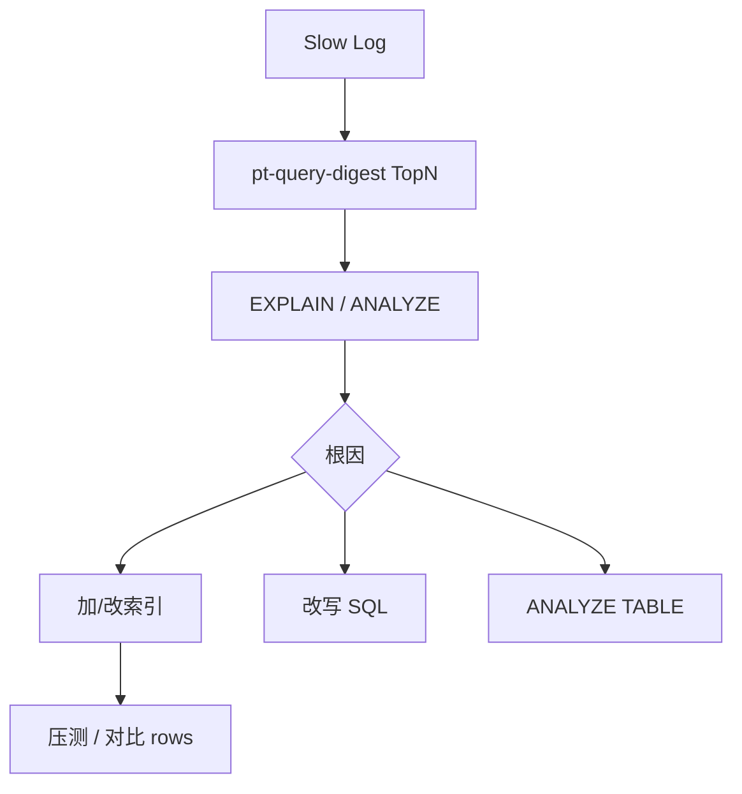

# 慢查询排查与 EXPLAIN

## 30 秒版（开场）

> 慢 SQL 治理链路：**slow log 发现 → EXPLAIN 看计划 → 索引/改写 SQL → 验证 rows 与 latency**。重点字段：`type`（访问方式）、`key`（实际索引）、`rows`（估算扫描行）、`Extra`（Using filesort/temporary）。生产关键词：**回表、深分页、隐式转换、统计信息过期**。

## 3 分钟版（一面深度）

1. **是什么**：执行时间超过 `long_query_time` 的 SQL 记入 slow log；EXPLAIN 展示优化器选择的访问路径，不执行真实查询。
2. **为什么**：单条慢 SQL 可拖垮连接池，引发雪崩；80% 性能问题来自 20% SQL。
3. **怎么做**：开 slow log + `log_queries_not_using_indexes`（谨慎）；`pt-query-digest` 聚合；EXPLAIN 后加索引或改写法；8.0 用 `EXPLAIN ANALYZE` 看真实耗时。

## 10 分钟版（原理 + 图示）

**EXPLAIN 核心列**

| 列 | 关注 |
|----|------|
| type | system>const>eq_ref>ref>range>index>ALL，至少 ref |
| key | NULL 表示未走期望索引 |
| rows | 估算行数，乘 join 数爆炸 |
| filtered | 8.0 过滤百分比 |
| Extra | Using filesort/temporary/index condition 预警 |



**高频慢因**：缺索引全表扫；联合索引不符合最左；`OFFSET 100000 LIMIT 10` 深分页；子查询物化；`OR` 导致 index merge 差；数据倾斜致优化器选错；Buffer pool 不足致大量磁盘读。

**EXPLAIN ANALYZE（8.0.18+）**：真实执行+计时，适合验证优化效果；注意会在从库或低峰跑。

## 生产场景

- **后台列表分页**：`ORDER BY id DESC LIMIT 100000,20` 扫 10 万行 → 改 `WHERE id < ? ORDER BY id DESC LIMIT 20` 游标分页。
- **JOIN 三表**：中间表无索引 `type=ALL` → 在 ON/WHERE 列补索引。
- **GORM 生成 `IN (?,?,...)` 上千**：分批或临时表 join。

## 排查与工具

| 工具 | 用途 |
|------|------|
| slow_query_log | 原始慢 SQL |
| pt-query-digest | 聚合相似 SQL |
| EXPLAIN FORMAT=JSON/TREE | 详细计划 |
| Performance Schema | statement 汇总 |
| mysqldumpslow | 简易统计 |

路径：P99 飙高 → APM 定位 DB → slow log 匹配 → EXPLAIN → 改索引 → 灰度观察 `Threads_running`。

## 架构取舍

| 方案 | 适用 | 不适用 |
|------|------|--------|
| 索引优化 | 大部分 OLTP 慢查 | 分析型全表扫 |
| 读写分离 | 报表拖主库 | 强一致读 |
| 归档冷数据 | 历史表过大 | 实时查全量 |
| ES/ClickHouse | 复杂检索聚合 | 简单 PK 查 |
| 缓存 | 读重复高 | 一致性敏感 |

## 追问链

1. **type=index 和 ALL？** → index 扫整棵二级索引树；ALL 全表，通常更差。
2. **Using filesort 一定慢？** → 内存 sort buffer 小则磁盘；可看 `max_length_for_sort_data`。
3. **rows 很大但很快？** → 估算偏差，用 ANALYZE 或 ANALYZE TABLE。
4. **如何查正在跑的慢 SQL？** → `SHOW PROCESSLIST` / `sys.session`。
5. **Go database/sql 慢？** → 查连接池、N+1、未用 context 超时。

## 反模式与事故

- 只在测试库 EXPLAIN，数据量差 1000 倍——上线仍全表扫。
- 加索引不监控写 RT——插入 TPS 腰斩。
- 打开 `log_queries_not_using_indexes` 磁盘打满。
- 用 `FORCE INDEX` 硬怼——统计变化后又慢。

## 代码示例

```sql
-- 深分页改写：游标
SELECT id, title FROM posts
  WHERE tenant_id = 1 AND id < 99887766
  ORDER BY id DESC
  LIMIT 20;

-- 8.0 真实耗时
EXPLAIN ANALYZE
  SELECT * FROM orders WHERE user_id = 42 AND status = 1;
```

```go
// Go：带超时的查询，避免慢 SQL 占满连接
ctx, cancel := context.WithTimeout(ctx, 2*time.Second)
defer cancel()
rows, err := db.QueryContext(ctx, sql, args...)
```

## 延伸阅读

- [Slow Query Log](https://dev.mysql.com/doc/refman/8.0/en/slow-query-log.html)
- [EXPLAIN Output](https://dev.mysql.com/doc/refman/8.0/en/explain-output.html)
- [Percona Toolkit pt-query-digest](https://docs.percona.com/percona-toolkit/pt-query-digest.html)
