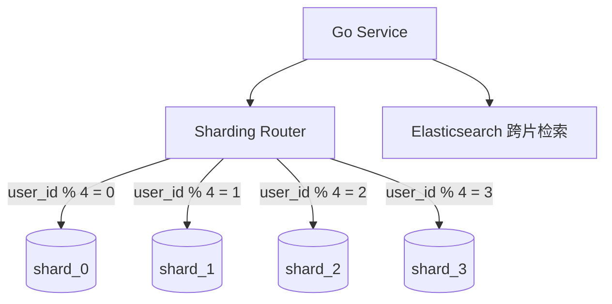

# 分库分表策略与跨库查询

## 30 秒版（开场）

> 单库瓶颈时 **垂直拆库**（按业务）或 **水平分片**（按 shard key 取模/范围）。核心：**选对 shard key**（高基数、查询必带）、避免跨片事务与 join。生产关键词：**扩容 rebalance、全局 ID、跨库分页、双写迁移**。

## 3 分钟版（一面深度）

1. **是什么**：垂直拆分把用户/订单/商品分库；水平拆分把同表数据按规则散到多库多表 `orders_0..15`。
2. **为什么**：单机连接数、磁盘、备份、锁竞争上限；单表亿级行索引维护成本陡增。
3. **怎么做**：优先 **垂直 + 读写分离 + 归档**；必须分时选 **user_id/order_id** 等查询必现字段；跨片用 **应用层聚合、ES 宽表、CQRS**；扩容用 **一致性哈希或翻倍迁移**。

## 10 分钟版（原理 + 图示）

**拆分策略**

| 策略 | 规则 | 优点 | 缺点 |
|------|------|------|------|
| 取模 | `hash(key) % N` | 简单 | 扩容要迁移 |
| 范围 | user_id 1-1M → shard0 | 范围查方便 | 热点尾部 |
| 一致性哈希 | 虚拟节点 | 扩缩容迁移少 | 实现复杂 |
| 目录表 | 映射表查 shard | 灵活 | 目录成瓶颈 |



**跨库难题**：无跨片 ACID join——**禁止**跨库 join，改两次查询或冗余；**分页** `ORDER BY created_at` 需各片 TopK 再归并；**全局唯一** 雪花/号段；**扩容** 双写 + 校验 + 切读 + 停双写。

**中间件**：ShardingSphere、Vitess、自研 GORM plugin；Go 常 **dbresolver** 或手写 `Shard(userID)` 选 `*gorm.DB`。

## 生产场景

- **订单表 5 亿行**：按 `user_id` 分 64 库，查询带 user_id；后台按 order_id 查需 **order_id 嵌入 shard hint** 或全局二级索引表。
- **多租户 SaaS**：`tenant_id` 分片，大租户可 **独立 shard**（Silo）。
- **从单库迁移**：双写新旧、Binlog 校验、按片灰度切流。

## 排查与工具

| 工具 | 用途 |
|------|------|
| 自研路由 metrics | 各 shard QPS/lag |
| pt-table-checksum | 双写一致性 |
| Vitess VTGate | 跨片查询计划 |
| 慢查询 per shard | 热点片 |

路径：某 shard CPU 高 → 是否 shard key 倾斜（大 V）→ 重分片或 silo；跨片慢 → 是否误做 fan-out 全片扫。

## 架构取舍

| 方案 | 适用 | 不适用 |
|------|------|--------|
| 垂直拆库 | 业务边界清晰 | 单表仍亿级 |
| 水平分片 | 单表海量 | 频繁跨片 join |
| 归档 | 历史冷数据 | 实时查三年全量 |
| TiDB/Cockroach | 要分布式 SQL | 运维/成本 |
| ES 宽表 | 复杂列表筛选 | 强一致交易 |

## 追问链

1. **shard key 怎么选？** → 查询 90% 带它、高基数、业务均匀；避免时间单一分片。
2. **取模扩容 4→8？** → 翻倍迁移：key%8 中一半留原库一半迁新库。
3. **跨库事务？** → Saga/最终一致，避免 XA。
4. **全局 order by？** → 各片 limit N 归并，或同步 ES。
5. **GORM 分片？** → 多 DB 实例 + 路由层，或 sharding plugin。

## 反模式与事故

- 用 `created_at` 分片——当月热点，历史片闲置。
- 跨 16 片 `SELECT * WHERE mobile=?` 无 shard key——16 倍 RT。
- 扩容不停写直接改模——丢数据。
- 分片过早——单库 MySQL 仍可容纳 5000 万行良好索引。

## 代码示例

```go
const shardCount = 16

func shardDB(userID uint64, dbs []*gorm.DB) *gorm.DB {
    return dbs[userID%shardCount]
}

func GetOrder(ctx context.Context, userID, orderID uint64, dbs []*gorm.DB) (Order, error) {
    db := shardDB(userID, dbs)
    var o Order
    err := db.WithContext(ctx).
        Where("user_id = ? AND id = ?", userID, orderID).
        First(&o).Error
    return o, err
}
```

## 延伸阅读

- [Vitess Sharding](https://vitess.io/docs/20.0/reference/features/sharding/)
- [Apache ShardingSphere](https://shardingsphere.apache.org/document/current/en/overview/)
- [美团分库分表实践](https://tech.meituan.com/2016/11/18/dianping-order-db-sharding.html)
