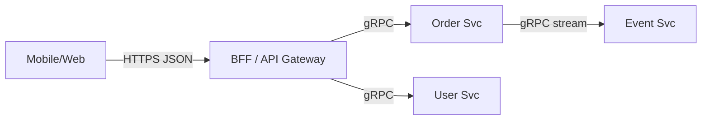

# gRPC vs HTTP/REST 选型

## 30 秒版（开场）

> **gRPC**：HTTP/2 + Protobuf，强类型、双向流、多路复用，适合 **内部微服务**。**REST/JSON**：人类可读、浏览器友好、生态广，适合 **对外 API/BFF**。Go 用 `google.golang.org/grpc` 或 **Connect**（兼容 gRPC/gRPC-Web）。生产关键词：**超时、重试幂等、负载均衡、TLS/mTLS**。

## 3 分钟版（一面深度）

1. **是什么**：gRPC 是 RPC 框架，IDL 定义 service/method，二进制 Protobuf 序列化；REST 以资源为中心，HTTP 动词 + JSON，常 OpenAPI 描述。
2. **为什么**：内网高 QPS、低延迟、流式推送选 gRPC；公网开放平台、调试成本、CDN 缓存选 REST。
3. **怎么做**：服务间 gRPC + **keepalive** + **client-side LB（K8s headless/etcd）**；边缘 REST；需要浏览器直调时用 gRPC-Web 或 Connect；统一 **context 超时、metadata 传 trace id**。

## 10 分钟版（原理 + 图示）

**对比**

| 维度 | gRPC | REST/JSON |
|------|------|-----------|
| 协议 | HTTP/2 | HTTP/1.1 或 2 |
| 载荷 | Protobuf 小 | JSON 大 |
| 契约 | .proto 强类型 | OpenAPI 可选 |
| 流 | 双向流 | SSE/WebSocket 补充 |
| 调试 | grpcurl/反射 | curl/Postman |
| 缓存 | 不友好 | HTTP 缓存语义 |



**gRPC Go 要点**：`context.WithTimeout` 每次调用；`grpc.WithKeepaliveParams` 防 NAT 断连；**Unary interceptor** 做 auth/metrics/recovery；重试只对 **幂等** 方法；错误用 `status.Error(codes.NotFound, ...)` 映射 HTTP。

**REST 要点**：版本 `/v1/`；Problem Details 错误体；`ETag` 缓存；HSTS；限流在网关。

## 生产场景

- **订单调支付/库存**：内网 gRPC，P99 < 10ms，Protobuf 省带宽。
- **开放平台给第三方**：REST + OAuth2 + Webhook（JSON）。
- **实时推送**：gRPC server stream 或独立 WebSocket 网关。

## 排查与工具

| 工具 | 用途 |
|------|------|
| grpcurl | 无客户端调 RPC |
| grpc-go stats/prometheus | 延迟、错误码 |
| OpenTelemetry | 跨协议 trace |
| wireshark/http2 | 帧级调试 |

路径：超时增多 → 查 client deadline vs server 处理时间 → keepalive 是否触发 GOAWAY → LB 是否长连接亲和。

## 架构取舍

| 方案 | 适用 | 不适用 |
|------|------|--------|
| gRPC 内网 | 微服务主力 | 浏览器直连 |
| REST 公网 | 开放 API | 超高频二进制 |
| Connect | 一套 handler 多协议 | 纯 legacy |
| GraphQL BFF | 聚合多源 | 简单 CRUD |
| 消息异步 | 解耦峰值 | 同步查询 |

## 追问链

1. **HTTP/2 好处？** → 多路复用、头部压缩、单连接并发 stream。
2. **gRPC 负载均衡？** → 客户端 LB（K8s + custom resolver）或 L7 proxy（Envoy）。
3. **Protobuf 向前兼容？** → 字段编号不变，新字段 optional，勿改类型。
4. **REST 如何实现幂等？** → Idempotency-Key header + 服务端去重。
5. **mTLS？** → 双向证书，零信任内网。

## 反模式与事故

- 公网暴露 gRPC 无 TLS——明文与反射信息泄露。
- 重试非幂等 CreateOrder——重复下单。
- proto 改字段编号——线上解码错乱。
- REST 返回 200 包 error 字段——监控无法按状态码告警。

## 代码示例

```go
// gRPC 客户端：超时 + 拦截器
conn, err := grpc.Dial("order-svc:50051",
    grpc.WithTransportCredentials(credentials.NewTLS(tlsConfig)),
    grpc.WithUnaryInterceptor(otelgrpc.UnaryClientInterceptor()),
)
client := pb.NewOrderClient(conn)
ctx, cancel := context.WithTimeout(ctx, 3*time.Second)
defer cancel()
resp, err := client.GetOrder(ctx, &pb.GetOrderRequest{Id: id})
```

## 延伸阅读

- [gRPC Go Quick Start](https://grpc.io/docs/languages/go/quickstart/)
- [Connect Go](https://connectrpc.com/docs/go/getting-started)
- [Google API Design Guide](https://cloud.google.com/apis/design)
