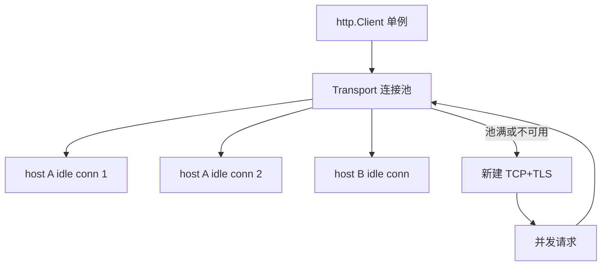

# HTTP 连接池与 Keep-Alive

## 30 秒版（开场）

> Go `http.Client` 默认 **`Transport` 连接池**：`MaxIdleConnsPerHost` 默认 2 易成瓶颈；**Keep-Alive** 复用 TCP 减握手。生产须 **共享一个 Client/Transport**，设 `MaxIdleConns`、`IdleConnTimeout`、`ResponseHeaderTimeout`。关键词：**TIME_WAIT、FD 耗尽、HTTP/2 单连接多路复用**。

## 3 分钟版（一面深度）

1. **是什么**：`http.Transport` 维护 idle 连接缓存；请求完连接放回池供复用；Keep-Alive 是 HTTP/1.1 默认持久连接。
2. **为什么**：每次新建 TCP+TLS 握手毫秒级；高 QPS 出站调用若 `MaxIdleConnsPerHost=2` 会频繁建连，CPU 与 latency 上升。
3. **怎么做**：进程级单例 `http.Client`；调 `MaxIdleConns=100`、`MaxIdleConnsPerHost=20~100`；设 `Timeout` 与 `context`；HTTPS 注意 `TLSClientConfig`；监控 `netstat`/prometheus 出站连接数。

## 10 分钟版（原理 + 图示）

**Transport 关键字段**

| 字段 | 默认 | 建议 |
|------|------|------|
| MaxIdleConns | 100 | 按总 outbound 调 |
| MaxIdleConnsPerHost | **2** | 20~100 |
| IdleConnTimeout | 90s | 对齐 LB idle |
| TLSHandshakeTimeout | 10s | 防挂死 |
| ExpectContinueTimeout | 1s | 大 body 上传 |



**HTTP/1.1 vs HTTP/2**：HTTP/2 通常 **单连接多 stream**（`ForceAttemptHTTP2: true` 默认）；HTTP/1.1 每 host 需多条 idle 连接并行；服务端 `Keep-Alive: timeout=5` 过短会导致客户端用已关连接 → `connection reset`。

**陷阱**：`http.Get` 每次略过自定义 Transport（仍用 DefaultTransport 但无 Client 级 Timeout）；**Body 必须读完并 Close** 才能复用连接；短链 `defer resp.Body.Close()` 未读 body 会断复用。

## 生产场景

- **调用支付网关 5000 QPS**：默认 `PerHost=2` → 连接风暴；调 PerHost=50 后 P99 降 40%。
- **K8s 滚动发布**：旧 Pod 连接仍被 client 池持有 → 502；缩短 `IdleConnTimeout` + 优雅 drain。
- **Sidecar Envoy**：客户端 HTTP/2 单连接，注意 max concurrent streams。

## 排查与工具

| 工具 | 用途 |
|------|------|
| `ss -s` / `lsof -p` | FD 与连接状态 |
| pprof goroutine | 阻塞在 dial |
| APM outbound span | 连接 vs TTFB |
| `GODEBUG=http2debug=2` | HTTP/2 帧调试 |

路径：出站 RT 周期性尖刺 → 是否每请求 NewClient → TIME_WAIT 堆积 → 调池参数与 LB idle 对齐。

## 架构取舍

| 方案 | 适用 | 不适用 |
|------|------|--------|
| 共享 Transport | 所有出站 HTTP | 完全不同 TLS 需求 |
| 连接池调优 | 高 QPS 固定下游 | 单次调用 |
| HTTP/2 | 同 host 高并发 | 老中间盒不兼容 |
| 短连接 | 极低频 | 性能敏感 |
| 专用 proxy | 统一 mTLS/限流 | 简单两服务 |

## 追问链

1. **为什么必须读 Body？** → 连接复用需消费完响应或主动 CancelRequest。
2. **Client.Timeout 包含什么？** → 从 Dial 到读完 body 的总时间。
3. **MaxConnsPerHost？** → Go 1.11+ 限制总连接，防打爆下游。
4. **Keep-Alive 谁关？** → 空闲超时任一侧可关；下次请求重建。
5. **和数据库连接池区别？** → 语义类似；HTTP 还有 TLS 会话复用。

## 反模式与事故

- 循环里 `http.Client{}` 或 `&http.Client{}` 无共享 Transport——仍可能用 DefaultTransport 但 Timeout 不一致。
- 忽略 `resp.Body.Close()`——泄漏 FD。
- `MaxIdleConnsPerHost=2` 调下游 8 核服务——客户端成为瓶颈。
- LB idle 60s、客户端 idle 90s——用半开连接 RST。

## 代码示例

```go
var defaultHTTPClient = &http.Client{
    Timeout: 10 * time.Second,
    Transport: &http.Transport{
        MaxIdleConns:        200,
        MaxIdleConnsPerHost: 50,
        IdleConnTimeout:     60 * time.Second,
        TLSHandshakeTimeout: 5 * time.Second,
        ResponseHeaderTimeout: 5 * time.Second,
    },
}

func callAPI(ctx context.Context, url string) error {
    req, _ := http.NewRequestWithContext(ctx, http.MethodGet, url, nil)
    resp, err := defaultHTTPClient.Do(req)
    if err != nil {
        return err
    }
    defer resp.Body.Close()
    _, _ = io.Copy(io.Discard, resp.Body) // 确保连接复用
    return nil
}
```

## 延伸阅读

- [net/http Transport](https://pkg.go.dev/net/http#Transport)
- [Go HTTP Client 最佳实践](https://blog.cloudflare.com/the-complete-guide-to-golang-net-http-timeouts/)
- [Effective Go](https://go.dev/doc/effective_go)
