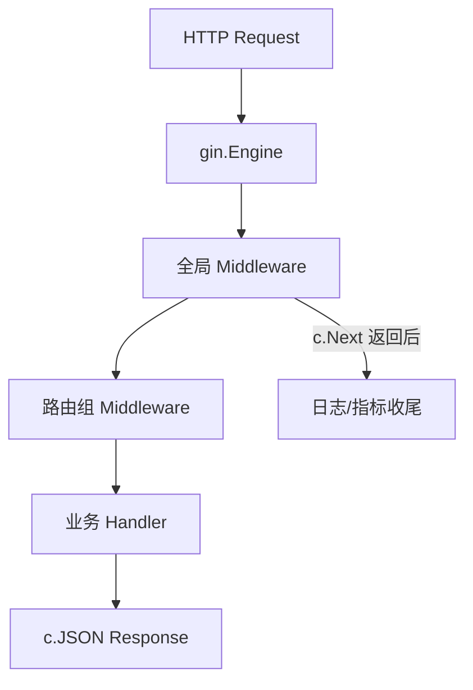

# Gin 中间件链与请求生命周期

## 30 秒版（开场）

> Gin 请求走 **Engine → Router → Middleware 链 → Handler**；中间件通过 **`c.Next()`** 驱动后续执行，可在前后插入逻辑。`c.Abort()` 跳过剩余 handler。生产关键词：**Recovery、Auth、TraceID、Timeout、Request-scoped 值**。

## 3 分钟版（一面深度）

1. **是什么**：`HandlerFunc` 组成的洋葱模型；`router.Use()` 注册全局中间件；路由组 `Group` 可挂局部中间件；`*gin.Context` 封装 request/response 与 key-value。
2. **为什么**：横切关注点（日志、鉴权、限流）与业务解耦；统一 panic 恢复与 metrics。
3. **怎么做**：`gin.New()` + 显式 `Recovery()`/`Logger()`；Auth 中间件校验 JWT 写 `c.Set("userID")`；超时用 `http.TimeoutHandler` 或 context cancel；绑定验证见 `ShouldBind` + validator tags。

## 10 分钟版（原理 + 图示）

**生命周期**



**执行顺序**：注册顺序即洋葱外层→内层；`c.Next()` 进入内层，返回后执行 `Next()` 之后代码（如耗时统计）。`c.AbortWithStatus(401)` 阻止后续 handler 但 **不阻止当前中间件 Next 之后的代码**——需在 Abort 后 `return` 或判断 `c.IsAborted()`。

**Context 要点**：`c.Set/Get` 非线程安全跨 goroutine——异步需传值副本；`c.Request.Context()` 可挂 trace；`c.Copy()` 供 goroutine 使用。

## 生产场景

- **全链路 Trace**：最外层中间件从 header 取/生成 trace id，注入 `context`，传给 gRPC/DB。
- **JWT 鉴权**：Auth 中间件解析 token，`c.Set("claims")`；业务 `c.MustGet`；失败 `Abort`。
- **自定义验证**：如 [`gin-example/example_12/main.go`](https://github.com/twodog-tt/Golang-development-manual/blob/master/gin-example/example_12/main.go) 注册 `bookabledate` validator，在 Handler 内 `ShouldBindWith` 触发校验链。

## 排查与工具

| 工具 | 用途 |
|------|------|
| Gin debug 路由表 | `gin.DebugPrintRouteFunc` |
| pprof | handler 阻塞 |
| middleware 单测 | httptest + recorder |
| zap 访问日志 | status/latency |

路径：401 误伤 → 中间件顺序 Auth 是否在 Logger 前 → `Abort` 后是否仍写 body；panic 未 Recovery → 确认 `gin.New()` 是否挂了 Recovery。

## 架构取舍

| 方案 | 适用 | 不适用 |
|------|------|--------|
| 全局 Middleware | 日志/Recovery/Trace | 重量级 per-route 逻辑 |
| 路由组 Middleware | 管理端鉴权 | 重复注册 |
| 纯 Handler 内联 | 极简 API | 多路由复用 |
| 标准库 mux | 零依赖 | 需自研生态 |
| Chi/Fiber | 同类模型 | 团队已标准化 Gin |

## 追问链

1. **`gin.Default()` 和 `gin.New()`？** → Default = New + Logger + Recovery。
2. **中间件如何传值？** → `c.Set`；类型断言需 ok 模式。
3. **Handler 里开 goroutine？** → 用 `c.Copy()`，勿用原 Context 写响应。
4. **路由优先级？** → 静态 > 参数 > 通配；注册顺序影响冲突。
5. **和 net/http Handler 关系？** → Gin 实现 `http.Handler`，可挂 `http.Server`。

## 反模式与事故

- 中间件 `c.Next()` 后仍写响应——双写 broken pipe。
- 异步 goroutine 用原 `*gin.Context` 写 JSON——race。
- 未 Recovery——单 panic 杀进程。
- 鉴权失败仍 `c.Next()`——未 Abort 泄露接口。

## 代码示例

```go
// 典型 Logger 中间件（见 gin-example/example_11/main.go）
func Logger() gin.HandlerFunc {
    return func(c *gin.Context) {
        start := time.Now()
        c.Next()
        log.Printf("%s %s %d %v",
            c.Request.Method, c.Request.URL.Path,
            c.Writer.Status(), time.Since(start))
    }
}

func main() {
    r := gin.New()
    r.Use(gin.Recovery(), Logger())
    r.GET("/ping", func(c *gin.Context) {
        c.JSON(200, gin.H{"ok": true})
    })
    r.Run(":8080")
}
```

绑定与自定义 validator 见 [`gin-example/example_12/main.go`](https://github.com/twodog-tt/Golang-development-manual/blob/master/gin-example/example_12/main.go)；中间件 `Use` 模式见 [`gin-example/example_11/main.go`](https://github.com/twodog-tt/Golang-development-manual/blob/master/gin-example/example_11/main.go)。

## 延伸阅读

- [Gin Custom Middleware（pkg.go.dev）](https://pkg.go.dev/github.com/gin-gonic/gin#hdr-Custom_Middleware)
- [Gin 官方文档](https://github.com/gin-gonic/gin/blob/master/docs/doc.md)
- [Gin Context API](https://pkg.go.dev/github.com/gin-gonic/gin#Context)
