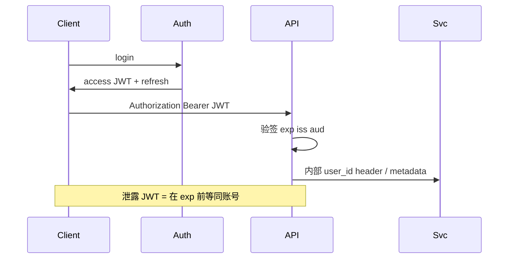

# JWT 认证与安全边界

## 30 秒版（开场）

> **JWT** 是自包含声明（Header.Payload.Signature），服务端用密钥验签即可无状态鉴权。**边界**：JWT 适合 **传递身份与权限声明**，不是 session 存储；无法主动吊销（除非短 TTL + 黑名单/版本号）。生产关键词：**HS256 vs RS256、exp/nbf、aud/iss、密钥轮换、勿放敏感数据**。

## 3 分钟版（一面深度）

1. **是什么**：Base64URL 编码的三段 token；Payload 含 `sub/exp/iat/custom claims`；Signature 防篡改。
2. **为什么**：水平扩展无 sticky session；跨服务传递用户身份；移动端/SPA 常见 Bearer token。
3. **怎么做**：Access token 短（15m~2h）+ Refresh token 长（HttpOnly Cookie 或安全存储）；RS256 私钥签发公钥验；网关验签后传内部 header；敏感操作 **二次验证**；logout 用 token 版本或 Redis 黑名单。

## 10 分钟版（原理 + 图示）

**结构**

| 部分 | 内容 |
|------|------|
| Header | alg typ |
| Payload | sub, exp, roles, tenant_id |
| Signature | HMAC/RSA 签名 |



**安全边界**

- **不该做**：在 JWT 存密码、信用卡；无 exp；alg=none；密钥硬编码仓库。
- **该做**：`Validate` 校验签名+exp+nbf+iss+aud；时钟 skew 容忍；密钥 KMS/轮换；HTTPS only；CSRF 对 Cookie 型 refresh 用 SameSite。
- **与 Session**：Session 可服务端立即失效；JWT 需补充机制（短 TTL、refresh rotation、token family 检测重放）。

## 生产场景

- **微服务**：Auth 签发 RS256，各服务只持公钥 `jwt.Parse` 验签，claims 传 `tenant_id` 做多租隔离。
- **强制下线**：用户改密后 `token_version++`，JWT 带 `ver` claim，不匹配拒绝。
- **BFF**：浏览器 HttpOnly refresh，SPA 内存持 access，减少 XSS 窃取窗口。

## 排查与工具

| 工具 | 用途 |
|------|------|
| jwt.io | 解码调试（勿贴生产 token） |
| golang-jwt/jwt | 解析验证 |
| OWASP ZAP | 认证测试 |
| 审计日志 | 异常 iss/alg |

路径：401 突发 → 是否密钥轮换不同步 → exp 时钟漂移 → 中间件是否校验 alg 白名单。

## 架构取舍

| 方案 | 适用 | 不适用 |
|------|------|--------|
| JWT 无状态 | 多实例 API | 需即时全量吊销 |
| Session + Redis | 可控失效 | 扩展/redis 依赖 |
| OAuth2/OIDC | 第三方登录 | 纯内部简单场景 |
| mTLS 服务间 | 零信任内网 | 移动端 |
| API Key | 机器对机器 | 用户登录 |

## 追问链

1. **JWT 和 Session 区别？** → JWT 客户端持票自证；Session 服务端存状态。
2. **如何吊销？** → 短 TTL、黑名单、refresh rotation、ver claim。
3. **HS256 vs RS256？** → 对称 vs 非对称；微服务用 RS256 公钥分发。
4. **XSS 偷 token？** → HttpOnly refresh + CSP；access 放内存缩短窗口。
5. **Go 怎么验？** → `jwt.ParseWithClaims` + `Valid()` + 自定义 `Claims`。

## 反模式与事故

- 接受 `alg: none`——伪造任意用户（库需 `jwt.WithValidMethods`）。
- Payload 存 `isAdmin: true` 可客户端改——有签名改不了，但误用未验签的中间层。
- Refresh token 无限续期无 rotation——被盗永久有效。
- 日志打印完整 Authorization header——token 泄露进 ELK。

## 代码示例

```go
import "github.com/golang-jwt/jwt/v5"

type Claims struct {
    UserID   uint64 `json:"uid"`
    TenantID uint64 `json:"tid"`
    jwt.RegisteredClaims
}

func parseToken(tokenStr string, key any) (*Claims, error) {
    token, err := jwt.ParseWithClaims(tokenStr, &Claims{}, func(t *jwt.Token) (any, error) {
        if t.Method.Alg() != jwt.SigningMethodRS256.Alg() {
            return nil, fmt.Errorf("unexpected alg")
        }
        return key, nil
    })
    if err != nil {
        return nil, err
    }
    return token.Claims.(*Claims), nil
}
```

Gin 中间件在 `c.Set("claims", claims)` 后 `c.Next()`，失败则 `AbortWithStatusJSON(401, ...)`。

## 延伸阅读

- [RFC 7519 JWT](https://datatracker.ietf.org/doc/html/rfc7519)
- [golang-jwt/jwt](https://github.com/golang-jwt/jwt)
- [OWASP JWT Cheat Sheet](https://cheatsheetseries.owasp.org/cheatsheets/JSON_Web_Token_for_Java_Cheat_Sheet.html)
