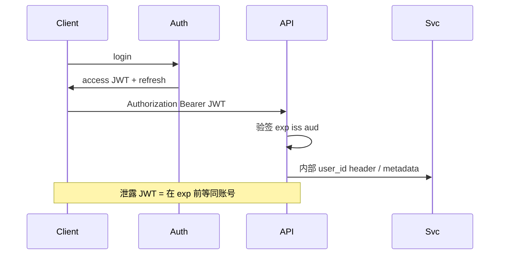

# JWT 认证与安全边界

<a id="oral-card"></a>

## 要点卡

[返回 P0 知识图谱](../_meta/p0-knowledge-graph.md)

!!! abstract "30 秒回答"

    JWT 是 claims 的令牌格式，不是登录协议；OAuth 2.0 是授权框架，OIDC 才在其上定义身份层。
    常见三段 compact JWT 是签名 JWS，payload 仅 Base64URL 编码并不保密。资源服务必须固定允许的
    算法和 token profile，校验签名、`iss/aud/exp/nbf`、必要的 `typ` 与可信 `kid`；
    claims 只表达签发时事实，实时权限和高风险操作仍需服务端授权。

**3 分钟展开**

1. Access token 短期化并绑定目标资源 audience/scope；refresh token 只交给授权服务器，并按能力使用 rotation/reuse detection。
2. JWKS 从受信 issuer 配置获取并缓存，未知 `kid` 可受控刷新但要防攻击者制造刷新风暴；轮换期允许新旧 key 重叠。
3. 不同 token 类型使用互斥校验规则，避免把 ID token、access token 或其他 issuer 的 JWT 互换使用。
4. 浏览器优先 Authorization Code + PKCE/BFF 等当前安全模式；不把 refresh token 暴露给无保护存储，Cookie 场景另做 CSRF 防护。

| 记忆槽 | 内容 |
|--------|------|
| 三个不变量 | JWT 不是协议；payload 不保密；验签成功不等于当前有业务权限 |
| 手画图 | `AS signs → client presents access token → resource server validates profile → authz` |
| 项目落点 | Agent Platform 讲 tenant/audience/scope；内部身份 header 必须由可信网关重建并保护服务间这一跳 |
| 一个取舍 | 本地验签低延迟、少依赖，但即时吊销和实时权限需短 TTL、状态检查或不透明 token/introspection |

**错误表达**

- ❌ “能解码 JWT 就认证成功；OAuth 就是 JWT；微服务统一用 RS256 一定最安全。”
- ✅ “算法与 token profile 由部署明确固定；验签后仍校验 issuer、audience、时效、类型与业务授权。”

**自测追问**：为什么 ID token 不能直接当 access token？未知 `kid` 到来时如何安全刷新 JWKS？

## 10 分钟版（原理 + 图示）

**结构**

| 部分 | 内容 |
|------|------|
| Header | alg、kid、可选 typ 等；只能按服务端受信策略解释 |
| Payload | sub, exp, roles, tenant_id |
| Signature | HMAC/RSA 签名 |


```mermaid
sequenceDiagram
  Client->>Auth: login
  Auth->>Client: access JWT + refresh
  Client->>API: Authorization Bearer JWT
  API->>API: 验签 exp iss aud
  API->>Svc: 内部 user_id header / metadata
  Note over Client,API: 泄露 JWT = 在 exp 前等同账号
```

**安全边界**

- **不该做**：在未加密 JWT 中存密码、银行卡或不必要 PII；无 exp；把 token 中的 `alg/jku/x5u`
  当可信配置；密钥硬编码仓库。
- **该做**：算法/key/token-type 白名单 + 完整签名 + exp/nbf/iss/aud 校验；设置有限 clock skew；
  密钥放 KMS/HSM 或受控 key service 并支持重叠轮换；TLS。Cookie 型凭证除
  `HttpOnly/Secure/SameSite` 外，还要按场景校验 Origin 或使用 CSRF token。
- **与 Session**：Session 可服务端立即失效；JWT 需补充机制（短 TTL、refresh rotation、token family 检测重放）。

## 生产场景

- **微服务**：授权服务器按固定 profile 签发，各资源服务从受信 issuer/JWKS 获取验证 key，
  校验 audience/scope；`tenant_id` 只是授权输入，仍要验证 membership 与资源所有权。
- **强制下线**：用户改密后 `token_version++`，JWT 带 `ver` claim，不匹配拒绝。
- **BFF**：浏览器 HttpOnly refresh，SPA 内存持 access，减少 XSS 窃取窗口。

## 排查与工具

| 工具 | 用途 |
|------|------|
| jwt.io | 解码调试（勿贴生产 token） |
| golang-jwt/jwt | 解析验证 |
| OWASP ZAP | 认证测试 |
| 审计日志 | 异常 iss/alg |

路径：401 突发 → 是否密钥轮换不同步 → exp 时钟漂移 → 中间件是否校验 alg 白名单。

## 架构取舍

| 方案 | 适用 | 不适用 |
|------|------|--------|
| 本地验证 JWT | 多实例、低延迟资源服务 | 需即时全量吊销或每次读取实时权限 |
| Session + Redis | 可控失效 | 扩展/redis 依赖 |
| OAuth2/OIDC | 第三方登录 | 纯内部简单场景 |
| mTLS 服务间 | 零信任内网 | 移动端 |
| API Key | 机器对机器 | 用户登录 |

## 深挖问答

1. **JWT 和 Session 区别？** → JWT 客户端持票自证；Session 服务端存状态。
2. **如何吊销？** → 短 TTL、黑名单、refresh rotation、ver claim。
3. **HS256 vs 非对称 JWS？** → HMAC 的签发与验证方共享 secret，验证方也有伪造能力；
   非对称方案可只分发公钥。具体算法按协议 profile、库支持和密钥治理选择，不能只背 RS256。
4. **XSS 偷 token？** → HttpOnly refresh + CSP；access 放内存缩短窗口。
5. **Go 怎么验？** → `jwt.ParseWithClaims` 同时固定算法、issuer、audience、expiration 等规则，
   再做 token type、subject 与业务授权校验；不能只调用 `Valid()`。
6. **`kid` 怎么用？** → 只在本地受信 key set/JWKS 中查找；不要按 token 中任意 `jku/x5u` URL 下载密钥。

## 反模式与事故

- 接受 `alg: none`——伪造任意用户（库需 `jwt.WithValidMethods`）。
- Payload 存 `isAdmin: true` 可客户端改——有签名改不了，但误用未验签的中间层。
- Refresh token 无限续期无 rotation——被盗永久有效。
- 日志打印完整 Authorization header——token 泄露进 ELK。

## 代码示例

```go
import "github.com/golang-jwt/jwt/v5"

type Claims struct {
    UserID   uint64 `json:"uid"`
    TenantID uint64 `json:"tid"`
    jwt.RegisteredClaims
}

func parseToken(tokenStr string, key *rsa.PublicKey) (*Claims, error) {
    claims := &Claims{}
    token, err := jwt.ParseWithClaims(
        tokenStr,
        claims,
        func(t *jwt.Token) (any, error) { return key, nil },
        jwt.WithValidMethods([]string{jwt.SigningMethodRS256.Alg()}),
        jwt.WithIssuer("https://auth.example.com"),
        jwt.WithAudience("orders-api"),
        jwt.WithExpirationRequired(),
        jwt.WithLeeway(30*time.Second),
    )
    if err != nil {
        return nil, err
    }
    if !token.Valid {
        return nil, errors.New("invalid token")
    }
    return claims, nil
}
```

Gin 中间件在 `c.Set("claims", claims)` 后 `c.Next()`，失败则 `AbortWithStatusJSON(401, ...)`。

## 延伸阅读

- [RFC 7519 JWT](https://datatracker.ietf.org/doc/html/rfc7519)
- [RFC 8725 JWT Best Current Practices](https://www.rfc-editor.org/rfc/rfc8725)
- [RFC 9700 OAuth 2.0 Security Best Current Practice](https://www.rfc-editor.org/rfc/rfc9700)
- [golang-jwt/jwt](https://github.com/golang-jwt/jwt)
- [OWASP JSON Web Token Cheat Sheet](https://cheatsheetseries.owasp.org/cheatsheets/JSON_Web_Token_Cheat_Sheet.html)
