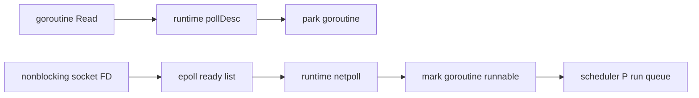

# Linux 进程、文件描述符、epoll 与 Go netpoll

## 30 秒版（开场）

> 文件描述符是进程内的小整数，指向内核维护的打开文件描述/对象；socket、pipe、普通文件都可用 FD 表示。`epoll` 是 readiness 通知：告诉你某 FD 现在可能可读/可写，不代表一次 read/write 必然完成全部数据。Go runtime 用 netpoll 把可轮询网络 FD 的就绪事件转换为 goroutine 可运行状态，所以大量网络连接不需要一连接一 OS 线程，但普通文件 I/O、CGO 或不可轮询阻塞 syscall 仍可能占用线程。

## 3 分钟版（一面深度）

1. **进程/线程**：进程拥有地址空间和 FD 表；线程共享它们，但有独立调度状态和栈。
2. **FD**：`dup`/fork 后多个 FD 可指向共享的 open file description，因此文件偏移/状态可能共享。
3. **epoll**：interest list + ready list；支持 level-triggered 和 edge-triggered。
4. **Go netpoll**：goroutine 在网络 I/O 上 park，runtime poller 收到 readiness 后唤醒，不是“goroutine 自己调用 epoll”。

## 10 分钟版（原理 + 图示）



**Level-triggered 与 edge-triggered**

| 模式 | 通知语义 | 编程要求 |
|------|----------|----------|
| LT | 条件仍成立时可重复通知 | 较易使用 |
| ET | 状态边沿变化时通知 | 非阻塞 FD，循环读/写到 `EAGAIN` |

Go `net` 包封装了这些细节；面试不应说“Go 所有 I/O 都是 epoll”。不同操作系统使用不同后端，普通磁盘文件通常不具备 socket 那样的 readiness 语义，阻塞文件调用可能由额外线程承载。

**三个不同上限**

- `RLIMIT_NOFILE`：进程可打开 FD 上限。
- 系统级 file table/内存：整机资源。
- 地址与端口四元组：客户端短连接还可能先耗尽 ephemeral ports。

这些现象都可能表现为“连接失败”，必须分别定位。

## 生产场景

- 连接数上涨但 goroutine 正常：查 FD、socket 状态、accept 速度和内存。
- 大量阻塞 CGO 调用：M 数量上升，调度和退出受影响。
- 日志/文件 I/O 抖动：即使网络 netpoll 正常，也可能因磁盘和线程阻塞拉高 P99。

## 排查与工具

```bash
ulimit -n
ls /proc/$PID/fd | wc -l
cat /proc/$PID/limits
ss -s
lsof -p $PID
strace -f -tt -p $PID
```

Go 侧结合 goroutine profile、threadcreate profile、execution trace 和 runtime 指标。`EMFILE` 是进程 FD 上限，`ENFILE` 更偏系统级打开文件资源，不要混为一谈。

## 架构取舍

提高 FD limit 只能解除上限，不能修复连接泄漏、没有 read/write deadline、accept 不及时或下游长期不读。先确定连接生命周期和容量模型，再调内核与进程参数。

## 追问链

1. **readable 是否保证读到业务完整包？** → 否；TCP 是字节流，read 还可能短读，应用层必须 framing。
2. **writable 是否表示对端收到？** → 否；通常只表示本地发送缓冲有空间。
3. **ET 为什么读到 EAGAIN？** → 否则剩余数据可能没有新的边沿通知。
4. **一个 goroutine 一个线程吗？** → 否；runtime 在 M/P 上调度，阻塞与 syscall 情况会影响线程使用。
5. **FD 关闭后数字会怎样？** → 可被快速复用，因此异步日志只记 FD 数字不足以标识连接。

## 反模式与事故

- 只把 `ulimit -n` 调大，连接泄漏继续增长直到 OOM。
- 把 epoll 说成异步 I/O 完成通知；它主要是 readiness API。
- 无 deadline 的连接永久占 FD 和 goroutine。
- 认为 Go netpoll 能让任意阻塞 CGO/磁盘操作自动非阻塞。

## 延伸阅读

- [`epoll(7)`](https://man7.org/linux/man-pages/man7/epoll.7.html)
- [`open(2)` 与 open file descriptions](https://man7.org/linux/man-pages/man2/open.2.html)
- [Go runtime netpoll source](https://go.dev/src/runtime/netpoll.go)

