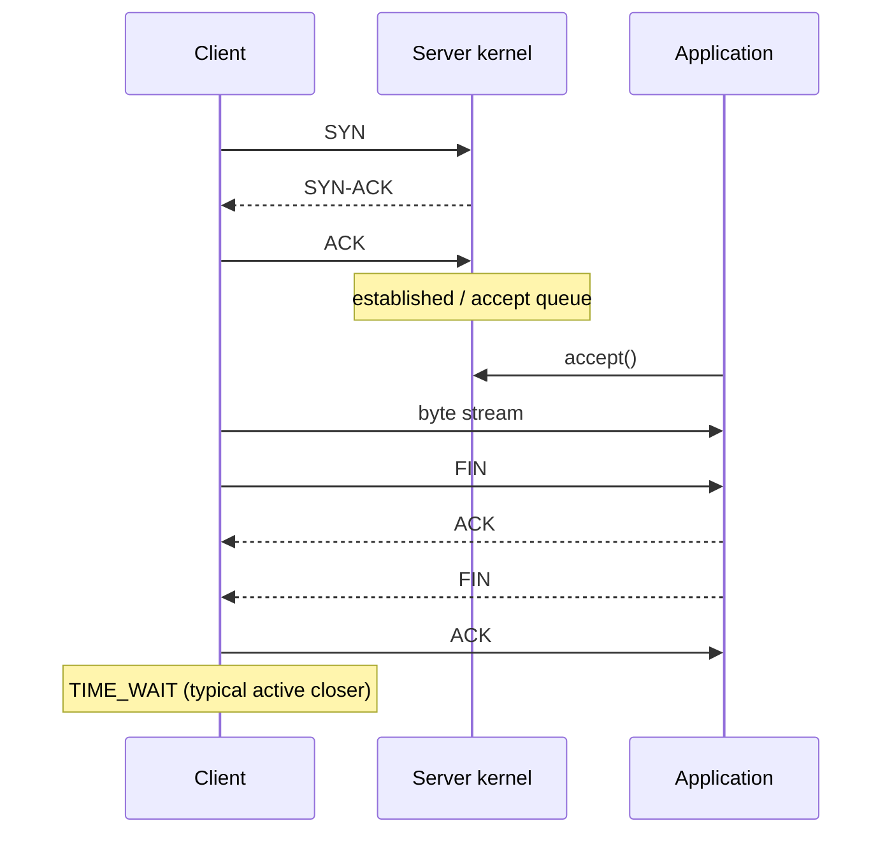

# TCP 建连、队列、TIME_WAIT 与故障排查

<a id="oral-card"></a>

## 口述卡（高频必背）

[返回高频必背题单](../../high-frequency-roadmap.md)

!!! abstract "30 秒回答"

    TCP 故障不能只看一个 timeout。建连要结合 SYN 处理、已完成握手但尚未 accept 的队列、
    `listen(backlog)`、内核参数和应用 accept/处理速度；连接成功也不代表 TLS 和应用响应正常。
    `TIME_WAIT` 通常在主动关闭方，用于重发最终 ACK 和隔离旧报文，数量多不等于故障，应先看
    连接复用、临时端口、NAT/conntrack 和实际错误率。

**3 分钟展开**

1. 三次握手交换并确认双方初始序列号；Linux 未完成握手和等待 accept 的连接受不同机制约束。
2. 把延迟拆成 DNS、connect、TLS、写请求、TTFB 和读响应，分别设置 timeout 和指标。
3. 重传保证可靠性但增加时延；结合 RTT、重传、队列溢出、FD、端口和应用 P99 交叉定位。
4. 大量短连接优先连接池与 keep-alive；不要为了减少 TIME_WAIT 先改危险复用参数。

| 记忆槽 | 内容 |
|--------|------|
| 三个不变量 | connect 成功不等于请求成功；backlog 不是唯一容量；TIME_WAIT 可能出现在任一主动关闭方 |
| 手画图 | `SYN → SYN-ACK → ACK → accept queue → handler → FIN/ACK → TIME_WAIT` |
| 项目落点 | RPC/WebSocket 网关分别记录 connect、TLS、首包和业务 P99，结合 `ss`、内核统计和抓包定位 |
| 一个取舍 | 长连接减少握手和端口压力，但引入连接保活、负载均衡、重连风暴和资源治理 |

**错误表达**

- ❌ “backlog 就是半连接队列；TIME_WAIT 永远在客户端，调小就能提升性能。”
- ✅ “现代 Linux 的 listen backlog 主要约束等待 accept 队列；TIME_WAIT 由主动关闭角色决定。”

**自测追问**：为什么两次握手不够？TCP keepalive 与 HTTP keep-alive 有什么区别？

## 10 分钟版（原理 + 图示）



**为什么连接成功但请求仍慢**

- accept queue 有空间只说明内核接收连接；应用 event loop/goroutine 可能拥塞。
- connect 成功不代表 TLS、应用鉴权、下游 DB 或响应读取正常。
- writable 只表示本地缓冲可写，不表示对端应用已消费。

**TIME_WAIT**

它保护连接四元组不被旧延迟报文污染，并允许对端重传 FIN 时再次发送最终 ACK。大量短连接会增加 TIME_WAIT 与 ephemeral port 压力，首选连接复用、合理 keep-alive 和下游池化，而不是先改危险内核参数。服务端也可能成为主动关闭方，因此不能背“TIME_WAIT 永远在客户端”。

**Keepalive 两层含义**

- TCP keepalive：通常在长时间空闲后探测死连接，默认周期往往不适合秒级业务故障发现。
- 应用层 heartbeat/deadline：理解协议语义，能更快判定请求是否超时。

## 生产场景

- SYN flood/突发流量：SYN 处理异常，握手失败率上升。
- accept 不及时：已建立队列溢出，客户端 connect 超时或重试。
- 客户端短连接：TIME_WAIT、端口和 NAT conntrack 压力。
- 丢包/拥塞：重传和 RTT 上升，吞吐下降但 CPU 可能不高。

## 排查与工具

```bash
ss -lnt
ss -s
ss -ant state time-wait
netstat -s
cat /proc/net/netstat
tcpdump -nn -i any host <ip> and port <port>
```

Go 客户端拆分 `Dialer.Timeout`、TLS handshake timeout、response header timeout 和总 request context；服务端设置 read header、read/write/idle timeout，并监控 accept error、active connections、request queue 与 handler latency。

## 架构取舍

| 症状 | 先查 | 不要先做 |
|------|------|----------|
| connect timeout | 路由、丢包、SYN/accept 队列、端口 | 无限重试 |
| 大量 TIME_WAIT | 谁主动关、连接复用、端口范围 | 粗暴复用四元组 |
| reset | 对端关闭、进程重启、LB/NAT idle | 只怪网络 |
| retransmission 高 | 丢包、拥塞、MTU、链路 | 单纯加 goroutine |

## 追问链

1. **backlog 是半连接队列长度吗？** → 在现代 Linux 上 `listen` backlog 主要约束已完成等待 accept 队列；SYN 队列另受内核参数影响。
2. **TIME_WAIT 多就是故障吗？** → 不一定；要看端口耗尽、内存、连接复用和错误率。
3. **为什么两次握手不够？** → 服务端需要确认客户端收到了自己的初始序列号，避免旧连接报文造成错误状态。
4. **TCP keepalive 等于 HTTP keep-alive？** → 否；前者是连接探测，后者是应用协议连接复用。
5. **如何确认重传？** → 内核统计 + 抓包 + RTT/丢包指标交叉验证。

## 反模式与事故

- 所有阶段只用一个模糊“timeout”，无法定位慢在哪。
- connect 失败立即多层重试，放大 SYN 和下游压力。
- 未限制响应体/无 read deadline，慢对端长期占连接。
- 为减少 TIME_WAIT 关闭连接安全机制，却没有先做池化。

## 延伸阅读

- [`tcp(7)`](https://man7.org/linux/man-pages/man7/tcp.7.html)
- [`listen(2)`](https://man7.org/linux/man-pages/man2/listen.2.html)
- [RFC 9293: TCP](https://www.rfc-editor.org/rfc/rfc9293)
