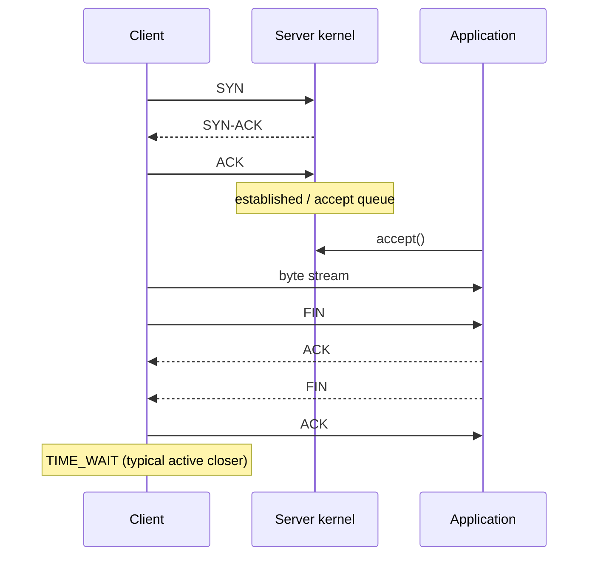

# TCP 建连、队列、TIME_WAIT 与故障排查

## 30 秒版（开场）

> TCP 建连要同时看半连接/SYN 处理、已完成但尚未被应用 accept 的队列，以及应用自身处理速度；`listen(backlog)` 不是唯一容量参数。`TIME_WAIT` 通常出现在主动关闭方，用于处理最后 ACK 丢失和隔离旧报文，不应见到就粗暴消灭。线上超时要按 DNS、connect、TLS、请求写入、首字节、读响应拆阶段，并结合重传、队列、FD、端口和应用指标定位。

## 3 分钟版（一面深度）

1. **三次握手**：SYN → SYN-ACK → ACK，建立双方初始序列号和能力。
2. **服务端队列**：Linux 分别维护未完成握手状态与已建立等待 accept 的队列，实际行为受 backlog、sysctl、syncookies 和负载影响。
3. **四次关闭**：双方方向独立关闭；主动关闭、先发 FIN 的一侧通常在发送最终 ACK 后进入 TIME_WAIT。
4. **重传**：可靠性来自序列号、ACK、重传和拥塞控制，不等于低延迟。

## 10 分钟版（原理 + 图示）



**为什么连接成功但请求仍慢**

- accept queue 有空间只说明内核接收连接；应用 event loop/goroutine 可能拥塞。
- connect 成功不代表 TLS、应用鉴权、下游 DB 或响应读取正常。
- writable 只表示本地缓冲可写，不表示对端应用已消费。

**TIME_WAIT**

它保护连接四元组不被旧延迟报文污染，并允许对端重传 FIN 时再次发送最终 ACK。大量短连接会增加 TIME_WAIT 与 ephemeral port 压力，首选连接复用、合理 keep-alive 和下游池化，而不是先改危险内核参数。服务端也可能成为主动关闭方，因此不能背“TIME_WAIT 永远在客户端”。

**Keepalive 两层含义**

- TCP keepalive：通常在长时间空闲后探测死连接，默认周期往往不适合秒级业务故障发现。
- 应用层 heartbeat/deadline：理解协议语义，能更快判定请求是否超时。

## 生产场景

- SYN flood/突发流量：SYN 处理异常，握手失败率上升。
- accept 不及时：已建立队列溢出，客户端 connect 超时或重试。
- 客户端短连接：TIME_WAIT、端口和 NAT conntrack 压力。
- 丢包/拥塞：重传和 RTT 上升，吞吐下降但 CPU 可能不高。

## 排查与工具

```bash
ss -lnt
ss -s
ss -ant state time-wait
netstat -s
cat /proc/net/netstat
tcpdump -nn -i any host <ip> and port <port>
```

Go 客户端拆分 `Dialer.Timeout`、TLS handshake timeout、response header timeout 和总 request context；服务端设置 read header、read/write/idle timeout，并监控 accept error、active connections、request queue 与 handler latency。

## 架构取舍

| 症状 | 先查 | 不要先做 |
|------|------|----------|
| connect timeout | 路由、丢包、SYN/accept 队列、端口 | 无限重试 |
| 大量 TIME_WAIT | 谁主动关、连接复用、端口范围 | 粗暴复用四元组 |
| reset | 对端关闭、进程重启、LB/NAT idle | 只怪网络 |
| retransmission 高 | 丢包、拥塞、MTU、链路 | 单纯加 goroutine |

## 追问链

1. **backlog 是半连接队列长度吗？** → 在现代 Linux 上 `listen` backlog 主要约束已完成等待 accept 队列；SYN 队列另受内核参数影响。
2. **TIME_WAIT 多就是故障吗？** → 不一定；要看端口耗尽、内存、连接复用和错误率。
3. **为什么两次握手不够？** → 服务端需要确认客户端收到了自己的初始序列号，避免旧连接报文造成错误状态。
4. **TCP keepalive 等于 HTTP keep-alive？** → 否；前者是连接探测，后者是应用协议连接复用。
5. **如何确认重传？** → 内核统计 + 抓包 + RTT/丢包指标交叉验证。

## 反模式与事故

- 所有阶段只用一个模糊“timeout”，无法定位慢在哪。
- connect 失败立即多层重试，放大 SYN 和下游压力。
- 未限制响应体/无 read deadline，慢对端长期占连接。
- 为减少 TIME_WAIT 关闭连接安全机制，却没有先做池化。

## 延伸阅读

- [`tcp(7)`](https://man7.org/linux/man-pages/man7/tcp.7.html)
- [`listen(2)`](https://man7.org/linux/man-pages/man2/listen.2.html)
- [RFC 9293: TCP](https://www.rfc-editor.org/rfc/rfc9293)
